## Recurring transfer resets the allowance each period — PASS

> after a full period elapses, the amount pulled resets and Bob can pull again

### Stage: Alice's authority and a recurring delegation to Bob

**InitSubscriptionAuthority: structured CPI tree**

```text

Transaction  signers=[alice]
└── subscriptions::InitSubscriptionAuthority [1] ✓ 6242cu  signer=alice
    ├── System [2] ✓ (no cu)
    └── Token [2] ✓ 126cu
Compute Units (this run): 6242
Fee: 5000 lamports
Legend (2):
  alice         = FXddRd8CdAC8SWKT3Ataasn69R7rbTfQZcKg8ejyrUbF
  subscriptions = De1egAFMkMWZSN5rYXRj9CAdheBamobVNubTsi9avR44
```

**InitSubscriptionAuthority: sequence diagram**

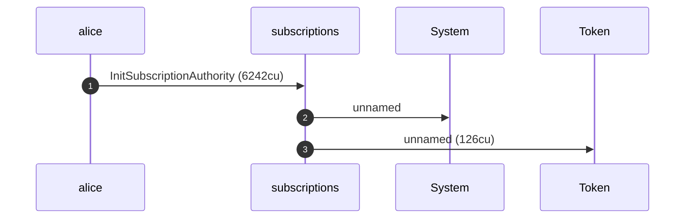

**InitSubscriptionAuthority: sequence diagram, with lifelines**

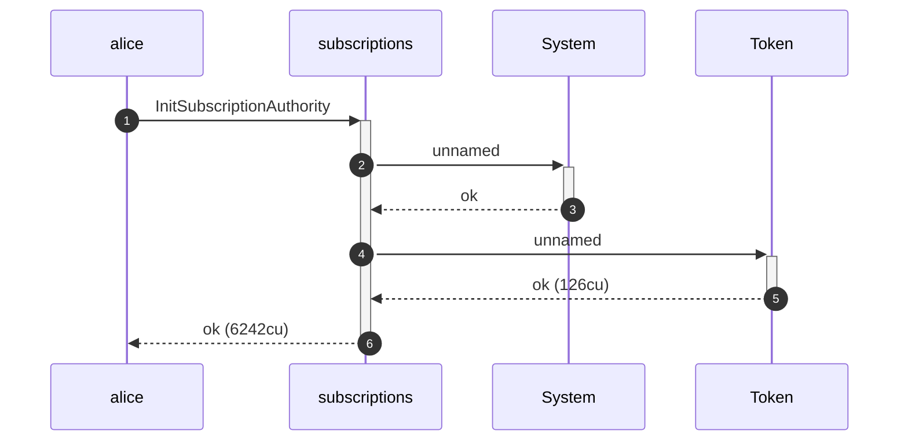

**InitSubscriptionAuthority: authority graph**

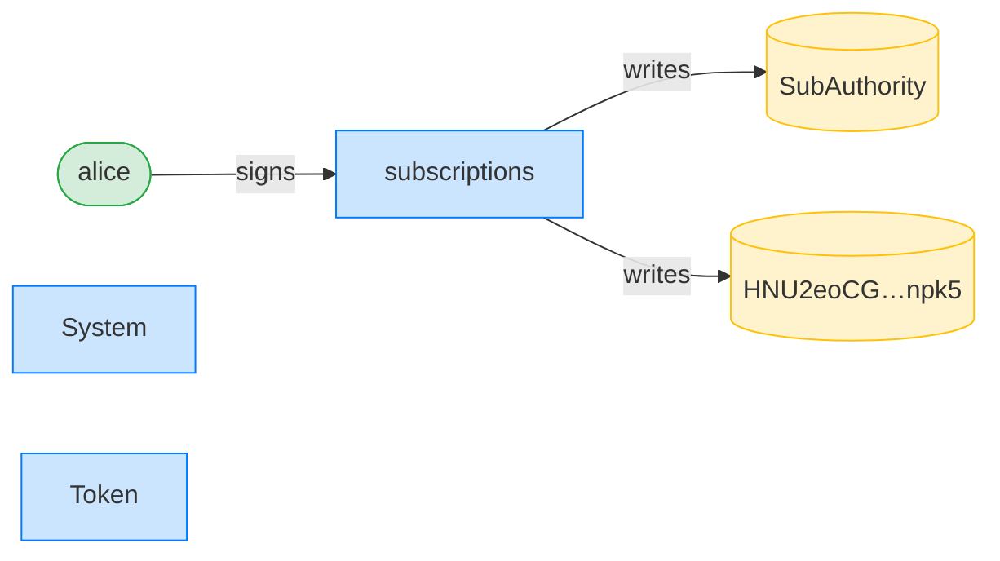

**InitSubscriptionAuthority: ownership graph**

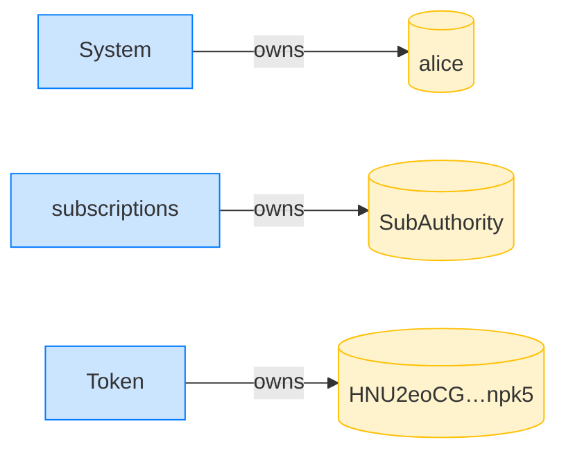

**CreateRecurringDelegation: structured CPI tree**

```text

Transaction  signers=[alice]
└── subscriptions::CreateRecurringDelegation [1] ✓ 3573cu  signer=alice
    └── System [2] ✓ (no cu)
Compute Units (this run): 3573
Fee: 5000 lamports
Legend (2):
  alice         = FXddRd8CdAC8SWKT3Ataasn69R7rbTfQZcKg8ejyrUbF
  subscriptions = De1egAFMkMWZSN5rYXRj9CAdheBamobVNubTsi9avR44
```

**CreateRecurringDelegation: sequence diagram**

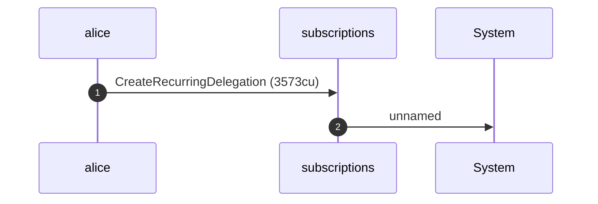

**CreateRecurringDelegation: sequence diagram, with lifelines**

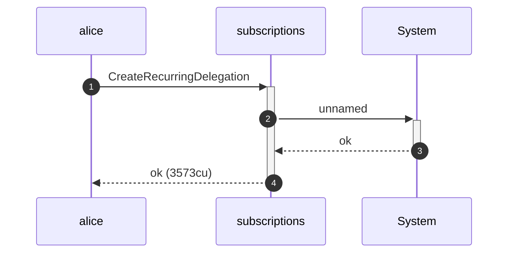

**CreateRecurringDelegation: authority graph**

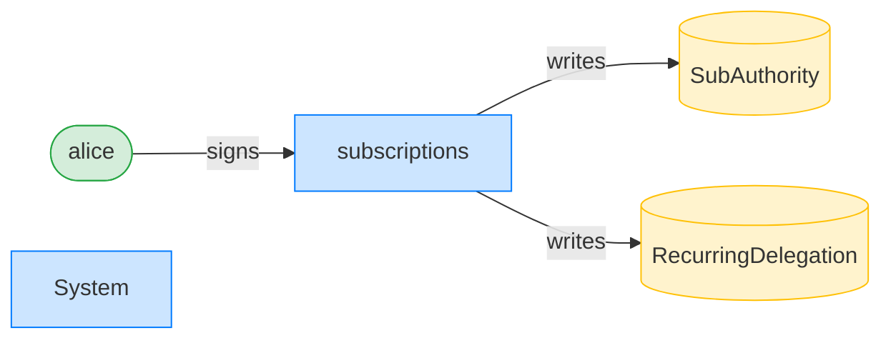

**CreateRecurringDelegation: ownership graph**

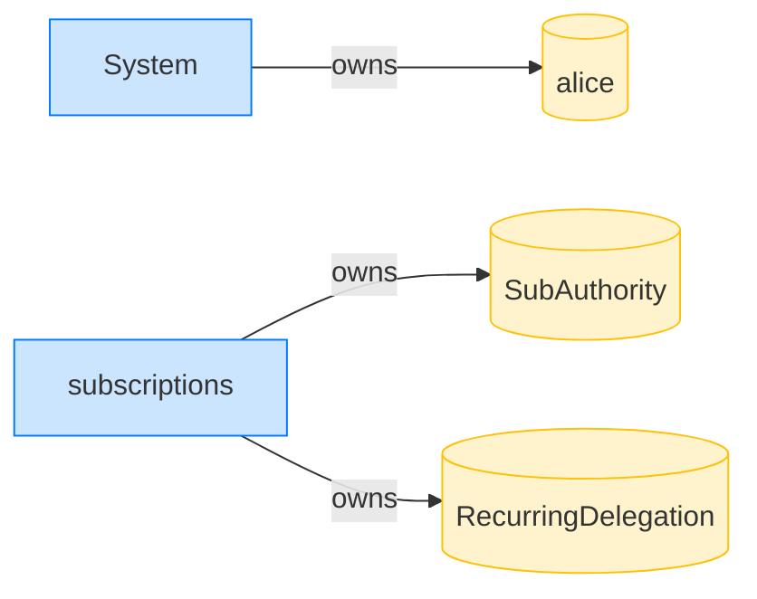

- [x] Bob's ATA starts empty: `0`

### Bob pulls 30 tokens in period 0

**TransferRecurring (period 0): structured CPI tree**

```text

Transaction  signers=[bob]
└── subscriptions::TransferRecurring [1] ✓ 5664cu  signer=bob
    ├── Token [2] ✓ 113cu
    └── subscriptions [2] ✓ 137cu
          🔔 RecurringTransfer
               delegatee:        bob,
               amount:           30000000,
               pulled_in_period: 30000000,
               receiver:         bob
Compute Units (this run): 5664
Fee: 5000 lamports
Legend (2):
  bob           = 9S8NPMnzAba71o3tr8dHDzUrfT5NesYFzP56QFpYieMR
  subscriptions = De1egAFMkMWZSN5rYXRj9CAdheBamobVNubTsi9avR44
```

**TransferRecurring (period 0): sequence diagram**


**TransferRecurring (period 0): sequence diagram, with lifelines**

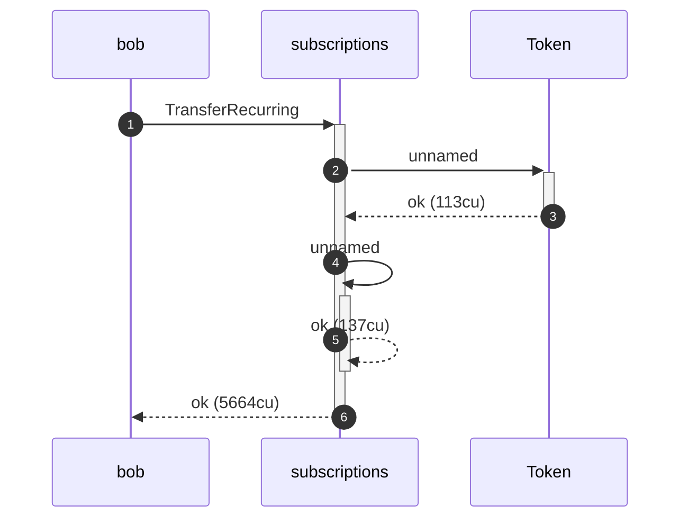

**TransferRecurring (period 0): authority graph**

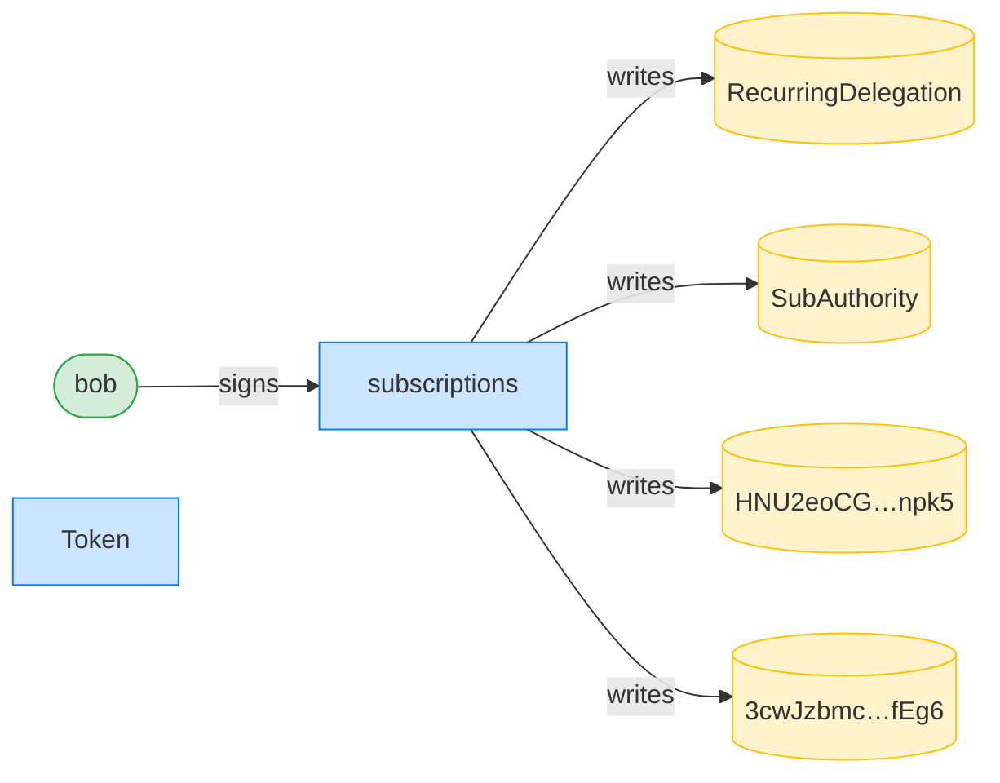

**TransferRecurring (period 0): ownership graph**

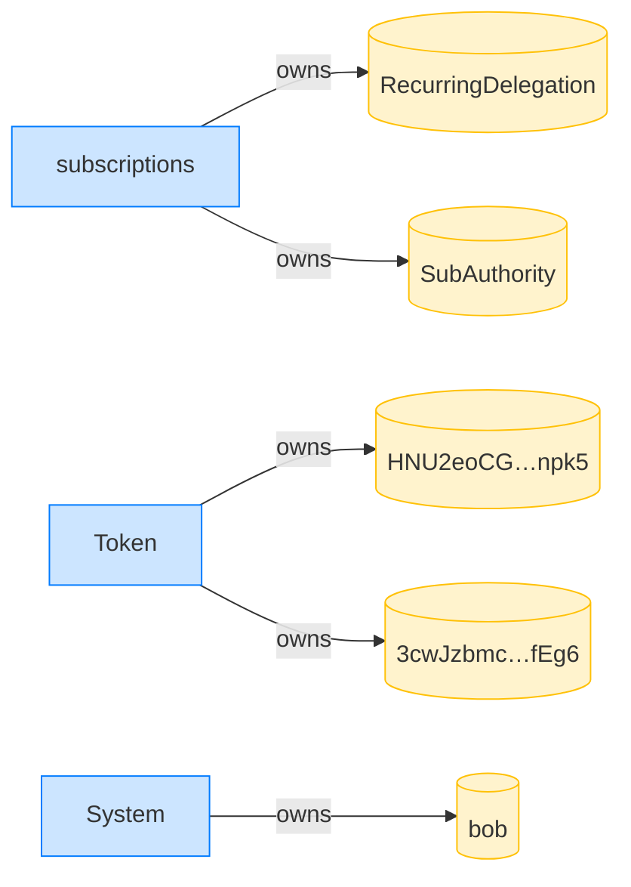

- [x] Bob received 30 tokens: `30000000`
- [x] 30 tokens pulled in period 0: `30000000`

### A full period elapses; the allowance resets and Bob pulls 30 again

**TransferRecurring (period 1): structured CPI tree**

```text

Transaction  signers=[bob]
└── subscriptions::TransferRecurring [1] ✓ 5755cu  signer=bob
    ├── Token [2] ✓ 113cu
    └── subscriptions [2] ✓ 137cu
          🔔 RecurringTransfer
               delegatee:        bob,
               amount:           30000000,
               pulled_in_period: 30000000,
               receiver:         bob
Compute Units (this run): 5755
Fee: 5000 lamports
Legend (2):
  bob           = 9S8NPMnzAba71o3tr8dHDzUrfT5NesYFzP56QFpYieMR
  subscriptions = De1egAFMkMWZSN5rYXRj9CAdheBamobVNubTsi9avR44
```

**TransferRecurring (period 1): sequence diagram**

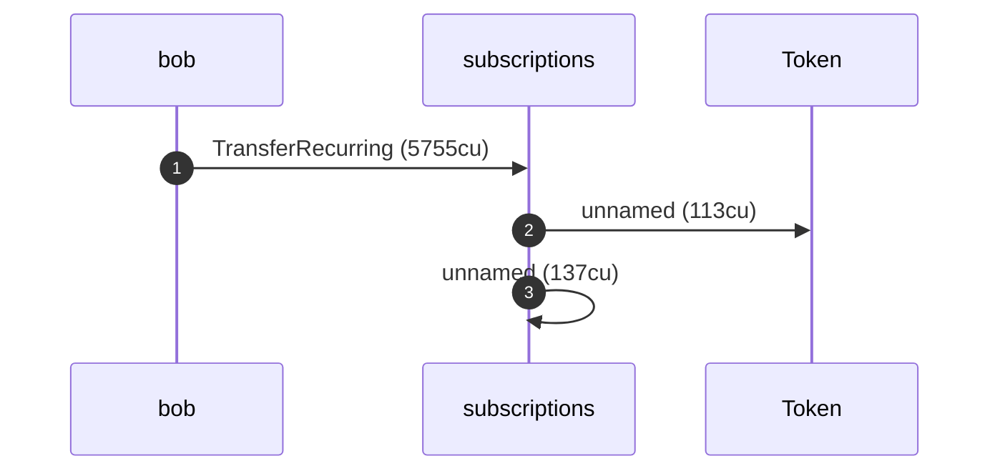

**TransferRecurring (period 1): sequence diagram, with lifelines**


**TransferRecurring (period 1): authority graph**


**TransferRecurring (period 1): ownership graph**


- [x] Bob received another 30 tokens: `60000000`
- [x] the pulled amount reset to 30 in the new period: `30000000`
