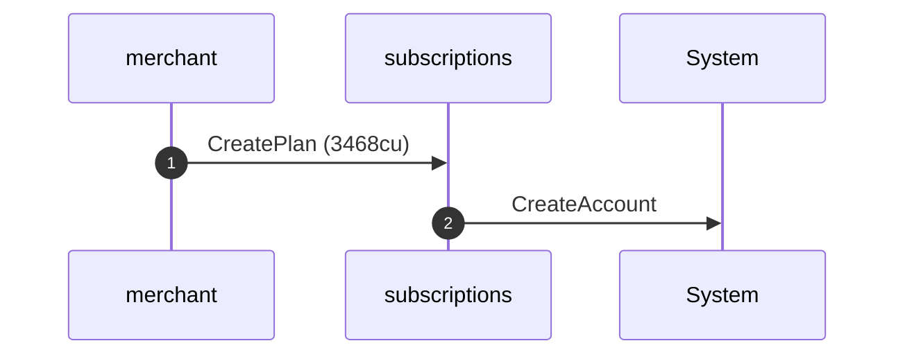
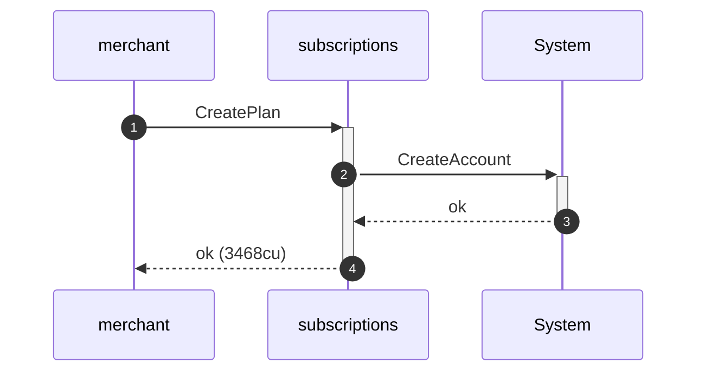
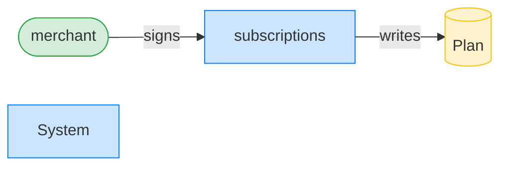
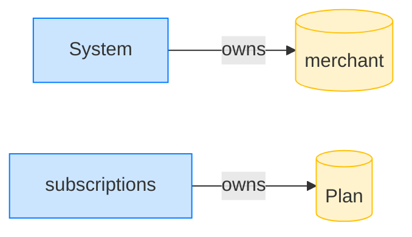
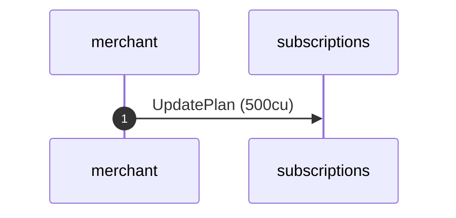
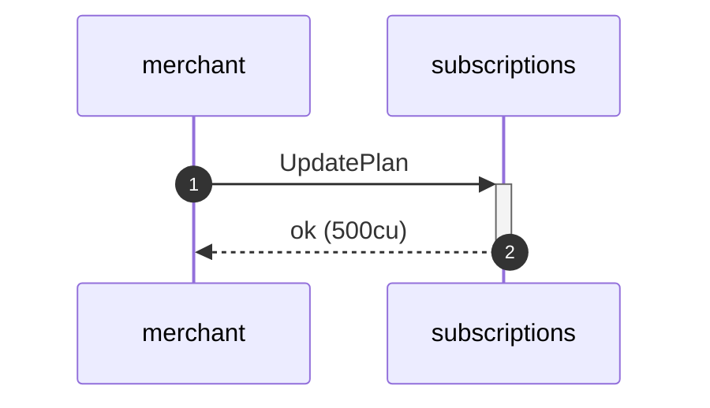
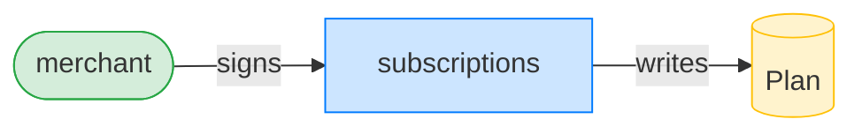
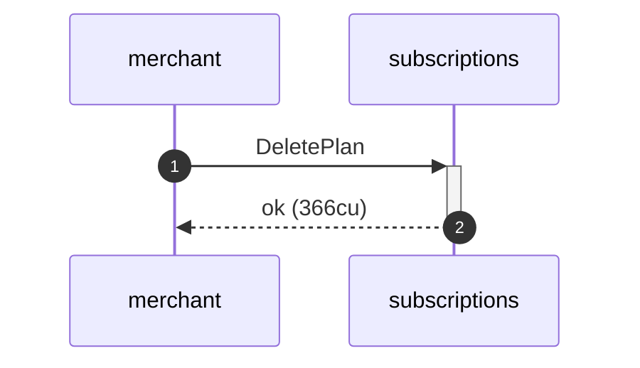
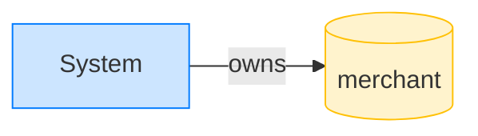

## Reject a double delete — PASS

> deleting an already-deleted plan fails (the account is gone)

**CreatePlan: structured CPI tree**

```text

Transaction  signers=[merchant]
└── subscriptions::CreatePlan [1] ✓ 3468cu  signer=merchant
    └── System::CreateAccount [2] ✓ (no cu)
Compute Units (this run): 3468
Fee: 5000 lamports
Legend (2):
  merchant      = J4fPsxKiTTKiXSiN9bgZ5JBrVgTM9c6N8tjhLN8gfdTq
  subscriptions = De1egAFMkMWZSN5rYXRj9CAdheBamobVNubTsi9avR44
```

**CreatePlan: sequence diagram**



**CreatePlan: sequence diagram, with lifelines**



**CreatePlan: authority graph**



**CreatePlan: ownership graph**



**UpdatePlan (sunset): structured CPI tree**

```text

Transaction  signers=[merchant]
└── subscriptions::UpdatePlan [1] ✓ 500cu  signer=merchant
Compute Units (this run): 500
Fee: 5000 lamports
Legend (2):
  merchant      = J4fPsxKiTTKiXSiN9bgZ5JBrVgTM9c6N8tjhLN8gfdTq
  subscriptions = De1egAFMkMWZSN5rYXRj9CAdheBamobVNubTsi9avR44
```

**UpdatePlan (sunset): sequence diagram**



**UpdatePlan (sunset): sequence diagram, with lifelines**



**UpdatePlan (sunset): authority graph**



**UpdatePlan (sunset): ownership graph**


### First delete succeeds

**DeletePlan (first): structured CPI tree**

```text

Transaction  signers=[merchant]
└── subscriptions::DeletePlan [1] ✓ 366cu  signer=merchant
Compute Units (this run): 366
Fee: 5000 lamports
Legend (2):
  merchant      = J4fPsxKiTTKiXSiN9bgZ5JBrVgTM9c6N8tjhLN8gfdTq
  subscriptions = De1egAFMkMWZSN5rYXRj9CAdheBamobVNubTsi9avR44
```

**DeletePlan (first): sequence diagram**


**DeletePlan (first): sequence diagram, with lifelines**



**DeletePlan (first): authority graph**


**DeletePlan (first): ownership graph**



### Second delete of the same plan must fail

**DeletePlan (double delete): structured CPI tree**

```text

Transaction  signers=[merchant]
└── subscriptions::DeletePlan [1] ✗ 173cu  signer=merchant
    └── Error: Invalid account owner
Error: InstructionError(0, InvalidAccountOwner)
Compute Units (this run): 173
Fee: 5000 lamports
Legend (2):
  merchant      = J4fPsxKiTTKiXSiN9bgZ5JBrVgTM9c6N8tjhLN8gfdTq
  subscriptions = De1egAFMkMWZSN5rYXRj9CAdheBamobVNubTsi9avR44
```

- [x] the second delete is refused: `false`
