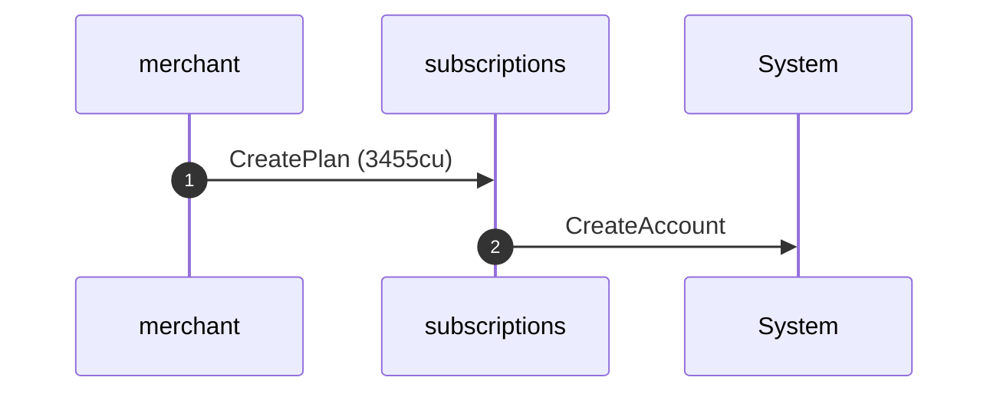
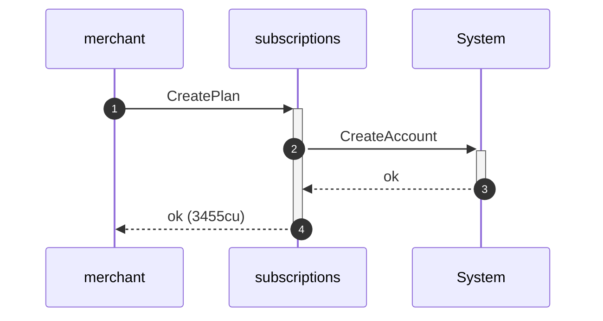
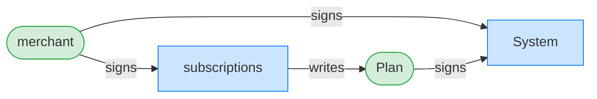
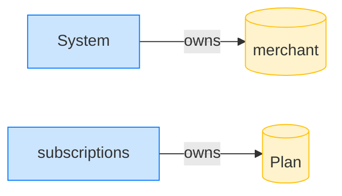

## Reject a duplicate plan id — PASS

> re-creating a plan with an existing id is rejected

### The merchant creates plan 1

**CreatePlan (first): structured CPI tree**

```text

── subscriptions::CreatePlan ───────────────────────────────
Transaction  signers=[merchant]
└── subscriptions::CreatePlan [1] ✓ 3455cu  signer=merchant
    └── System::CreateAccount [2] ✓ (no cu)
Compute Units (this run): 3455
Fee: 5000 lamports
Legend (2):
  subscriptions = De1egAFMkMWZSN5rYXRj9CAdheBamobVNubTsi9avR44
  merchant      = J4fPsxKiTTKiXSiN9bgZ5JBrVgTM9c6N8tjhLN8gfdTq
```

**CreatePlan (first): sequence diagram**



**CreatePlan (first): sequence diagram, with lifelines**



**CreatePlan (first): authority graph**



**CreatePlan (first): ownership graph**



### The merchant tries to create plan 1 again

**CreatePlan (duplicate id): structured CPI tree**

```text

── subscriptions::CreatePlan ───────────────────────────────
Transaction  signers=[merchant]
└── subscriptions::CreatePlan [1] ✗ 532cu  signer=merchant
    └── Error: PlanAlreadyExists (0x206)
Error: InstructionError(0, Custom(518))
Compute Units (this run): 532
Fee: 5000 lamports
Legend (2):
  subscriptions = De1egAFMkMWZSN5rYXRj9CAdheBamobVNubTsi9avR44
  merchant      = J4fPsxKiTTKiXSiN9bgZ5JBrVgTM9c6N8tjhLN8gfdTq
```
