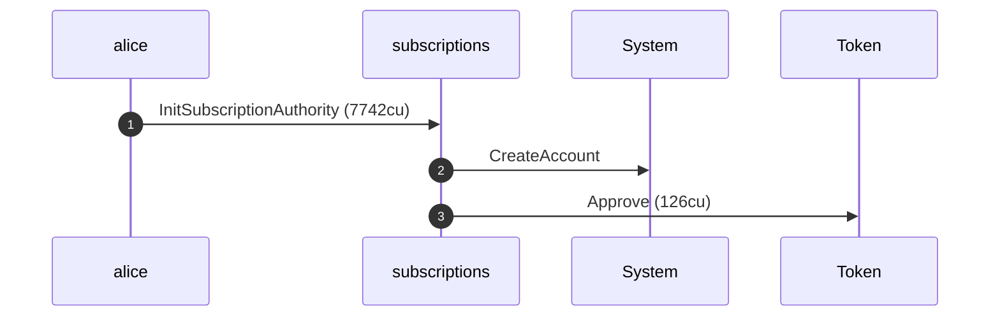
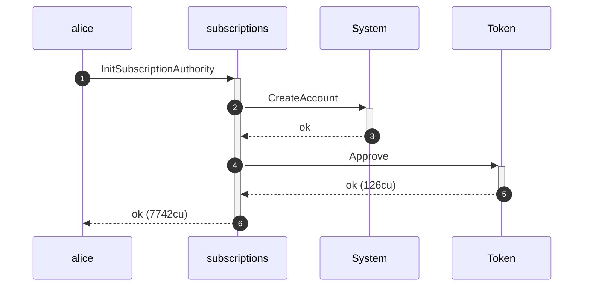
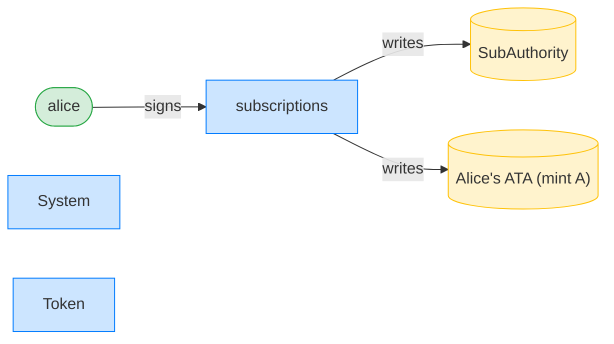
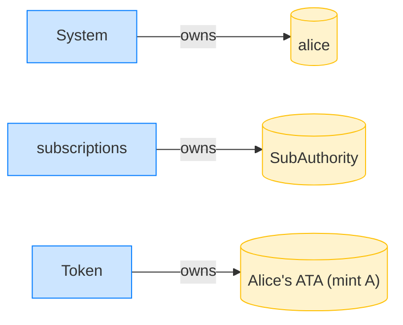

## Reject an ATA / mint mismatch — PASS

> revoke is refused when the passed ATA belongs to a different mint than the instruction's mint

### Alice initializes her authority over mint A

**InitSubscriptionAuthority: structured CPI tree**

```text

Transaction  signers=[alice]
└── subscriptions::InitSubscriptionAuthority [1] ✓ 7742cu  signer=alice
    ├── System::CreateAccount [2] ✓ (no cu)
    └── Token::Approve [2] ✓ 126cu
Compute Units (this run): 7742
Fee: 5000 lamports
Legend (2):
  alice         = FXddRd8CdAC8SWKT3Ataasn69R7rbTfQZcKg8ejyrUbF
  subscriptions = De1egAFMkMWZSN5rYXRj9CAdheBamobVNubTsi9avR44
```

**InitSubscriptionAuthority: sequence diagram**



**InitSubscriptionAuthority: sequence diagram, with lifelines**



**InitSubscriptionAuthority: authority graph**



**InitSubscriptionAuthority: ownership graph**



### Alice revokes mint B but passes mint A's ATA

**RevokeSubscriptionAuthority (ATA/mint mismatch): structured CPI tree**

```text

Transaction  signers=[alice]
└── subscriptions::RevokeSubscriptionAuthority [1] ✗ 369cu  signer=alice
    └── Error: MintMismatch
Error: InstructionError(0, Custom(125))
Compute Units (this run): 369
Fee: 5000 lamports
Legend (2):
  alice         = FXddRd8CdAC8SWKT3Ataasn69R7rbTfQZcKg8ejyrUbF
  subscriptions = De1egAFMkMWZSN5rYXRj9CAdheBamobVNubTsi9avR44
```
