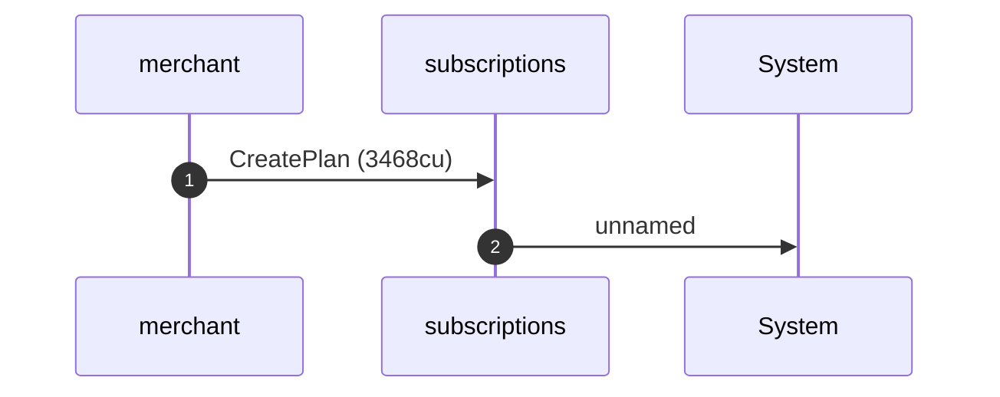
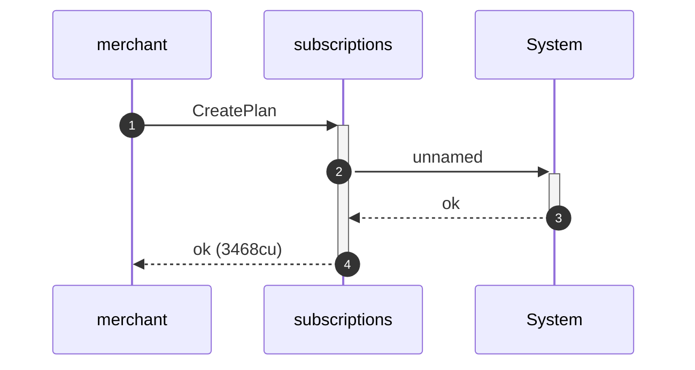
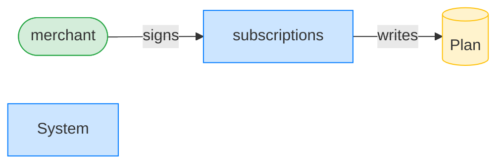
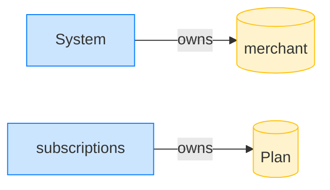
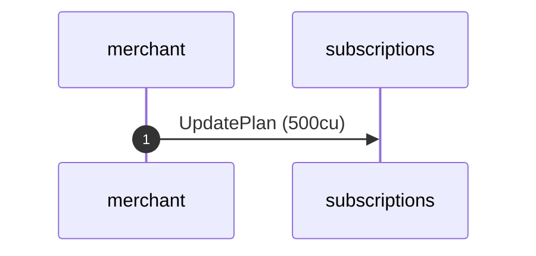
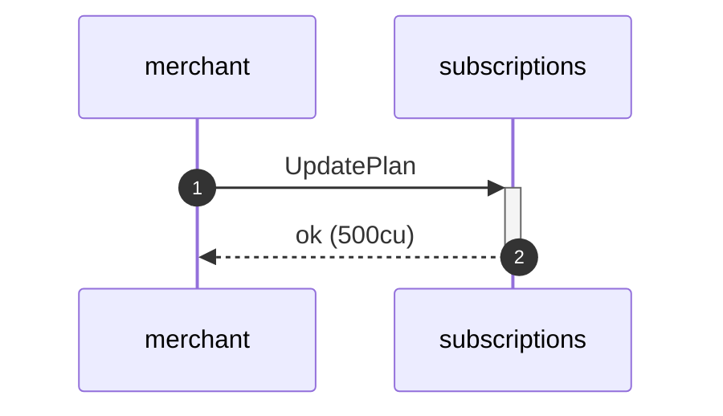

## Reject delete exactly at end_ts — PASS

> the expiry boundary is exclusive: a plan exactly at its end_ts is not yet deletable

**CreatePlan: structured CPI tree**

```text

Transaction  signers=[merchant]
└── subscriptions::CreatePlan [1] ✓ 3468cu  signer=merchant
    └── System [2] ✓ (no cu)
Compute Units (this run): 3468
Fee: 5000 lamports
Legend (2):
  merchant      = J4fPsxKiTTKiXSiN9bgZ5JBrVgTM9c6N8tjhLN8gfdTq
  subscriptions = De1egAFMkMWZSN5rYXRj9CAdheBamobVNubTsi9avR44
```

**CreatePlan: sequence diagram**



**CreatePlan: sequence diagram, with lifelines**



**CreatePlan: authority graph**



**CreatePlan: ownership graph**



**UpdatePlan (sunset): structured CPI tree**

```text

Transaction  signers=[merchant]
└── subscriptions::UpdatePlan [1] ✓ 500cu  signer=merchant
Compute Units (this run): 500
Fee: 5000 lamports
Legend (2):
  merchant      = J4fPsxKiTTKiXSiN9bgZ5JBrVgTM9c6N8tjhLN8gfdTq
  subscriptions = De1egAFMkMWZSN5rYXRj9CAdheBamobVNubTsi9avR44
```

**UpdatePlan (sunset): sequence diagram**



**UpdatePlan (sunset): sequence diagram, with lifelines**



**UpdatePlan (sunset): authority graph**


**UpdatePlan (sunset): ownership graph**


### The clock sits exactly on end_ts; the merchant attempts to delete

**DeletePlan (exactly at end_ts): structured CPI tree**

```text

Transaction  signers=[merchant]
└── subscriptions::DeletePlan [1] ✗ 351cu  signer=merchant
    └── Error: PlanNotExpired
Error: InstructionError(0, Custom(515))
Compute Units (this run): 351
Fee: 5000 lamports
Legend (2):
  merchant      = J4fPsxKiTTKiXSiN9bgZ5JBrVgTM9c6N8tjhLN8gfdTq
  subscriptions = De1egAFMkMWZSN5rYXRj9CAdheBamobVNubTsi9avR44
```
