## Resume allowed while the plan is sunset — PASS

> a sunset (but not yet expired) plan still admits a resume

### Stage: Alice's authority, the merchant's plan, Alice subscribed

**InitSubscriptionAuthority: structured CPI tree**

```text

Transaction  signers=[alice]
└── subscriptions::InitSubscriptionAuthority [1] ✓ 6242cu  signer=alice
    ├── System::CreateAccount [2] ✓ (no cu)
    └── Token::Approve [2] ✓ 126cu
Compute Units (this run): 6242
Fee: 5000 lamports
Legend (2):
  alice         = FXddRd8CdAC8SWKT3Ataasn69R7rbTfQZcKg8ejyrUbF
  subscriptions = De1egAFMkMWZSN5rYXRj9CAdheBamobVNubTsi9avR44
```

**InitSubscriptionAuthority: sequence diagram**

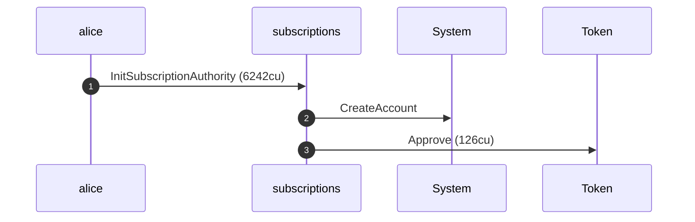

**InitSubscriptionAuthority: sequence diagram, with lifelines**

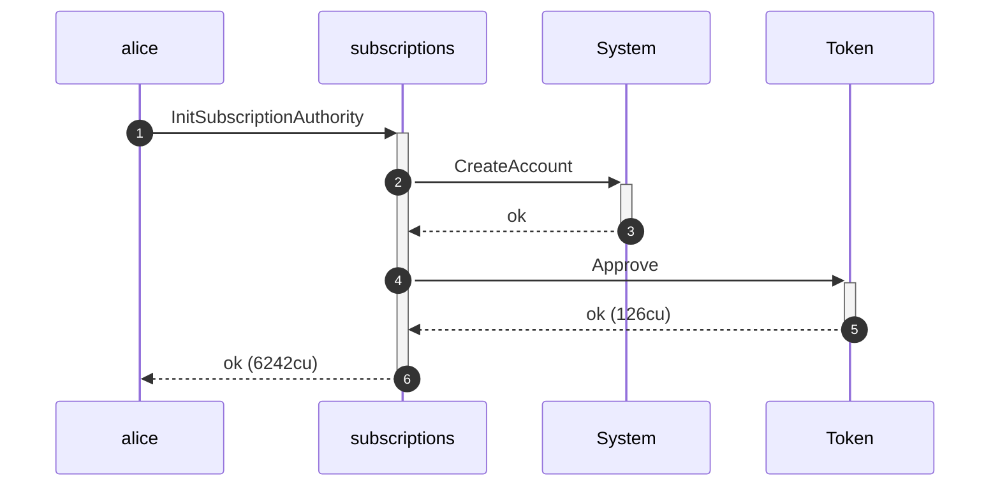

**InitSubscriptionAuthority: authority graph**

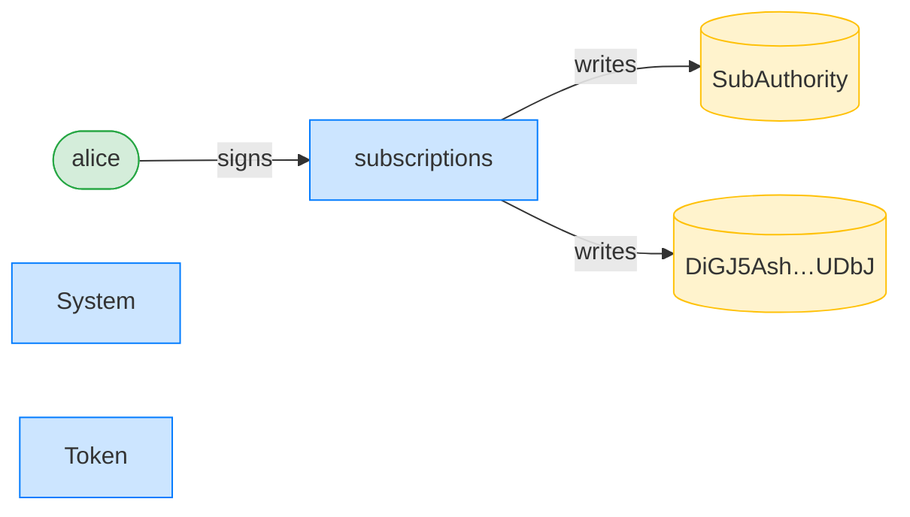

**InitSubscriptionAuthority: ownership graph**

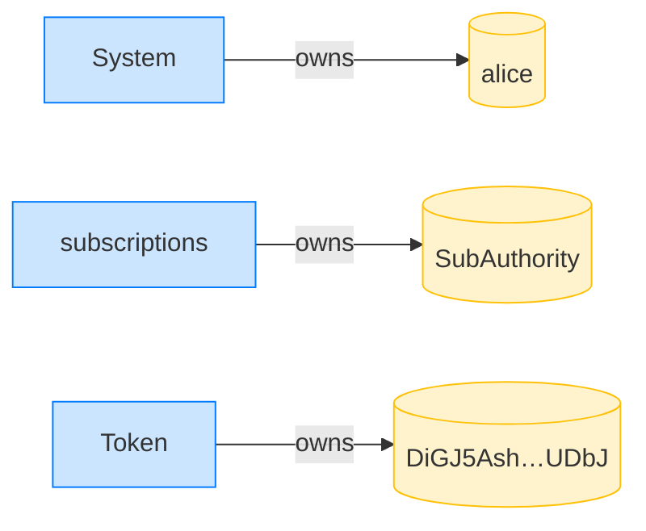

**CreatePlan: structured CPI tree**

```text

Transaction  signers=[merchant]
└── subscriptions::CreatePlan [1] ✓ 3468cu  signer=merchant
    └── System::CreateAccount [2] ✓ (no cu)
Compute Units (this run): 3468
Fee: 5000 lamports
Legend (2):
  merchant      = J4fPsxKiTTKiXSiN9bgZ5JBrVgTM9c6N8tjhLN8gfdTq
  subscriptions = De1egAFMkMWZSN5rYXRj9CAdheBamobVNubTsi9avR44
```

**CreatePlan: sequence diagram**

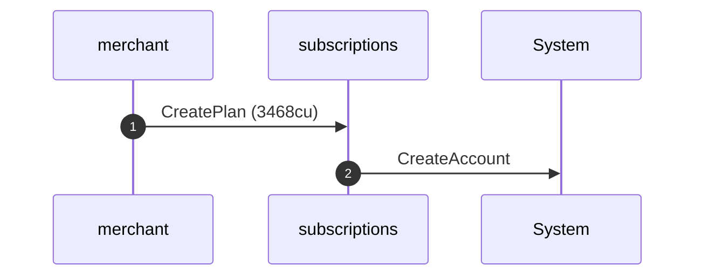

**CreatePlan: sequence diagram, with lifelines**

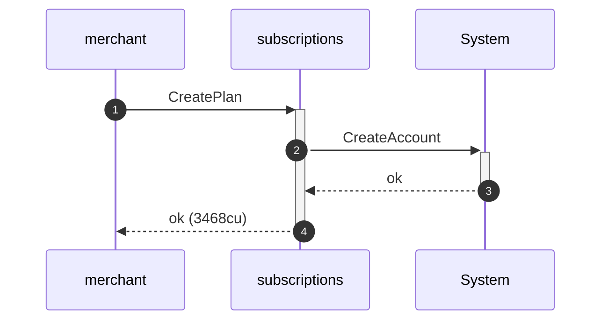

**CreatePlan: authority graph**

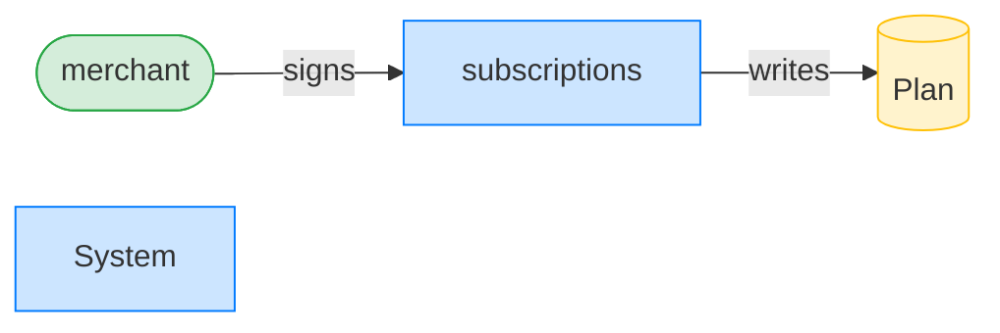

**CreatePlan: ownership graph**

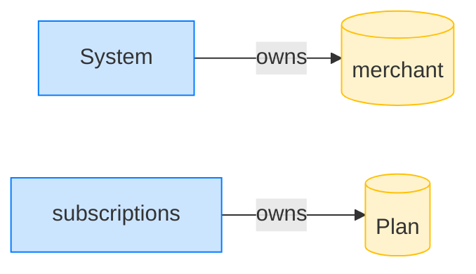

**Subscribe: structured CPI tree**

```text

Transaction  signers=[alice]
└── subscriptions::Subscribe [1] ✓ 6516cu  signer=alice
    ├── System::CreateAccount [2] ✓ (no cu)
    └── subscriptions::EmitEvent [2] ✓ 137cu
          🔔 SubscriptionCreated
               plan:       Plan,
               subscriber: alice,
               mint:       USDC mint,
               created_ts: 1700000000
Compute Units (this run): 6516
Fee: 5000 lamports
Legend (2):
  alice         = FXddRd8CdAC8SWKT3Ataasn69R7rbTfQZcKg8ejyrUbF
  subscriptions = De1egAFMkMWZSN5rYXRj9CAdheBamobVNubTsi9avR44
```

**Subscribe: sequence diagram**

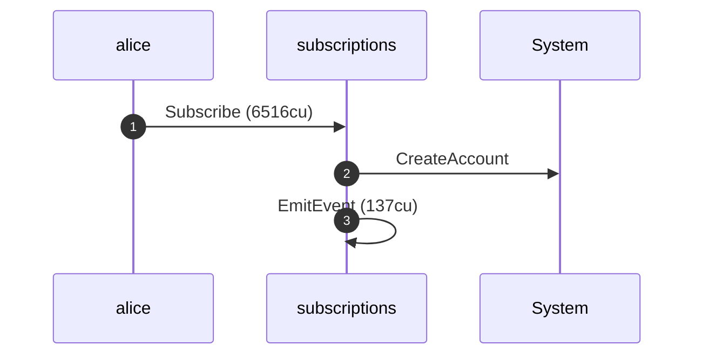

**Subscribe: sequence diagram, with lifelines**

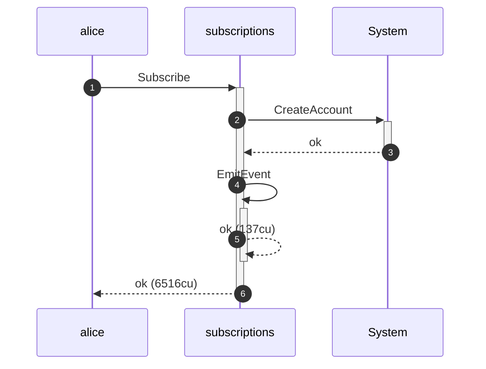

**Subscribe: authority graph**

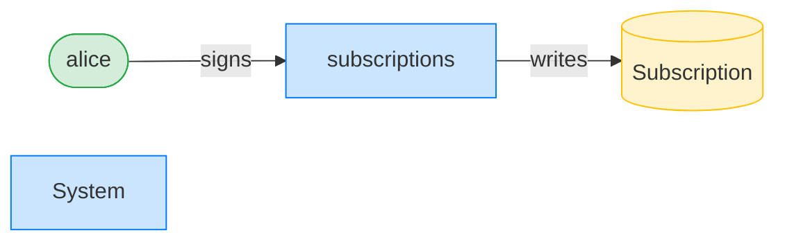

**Subscribe: ownership graph**

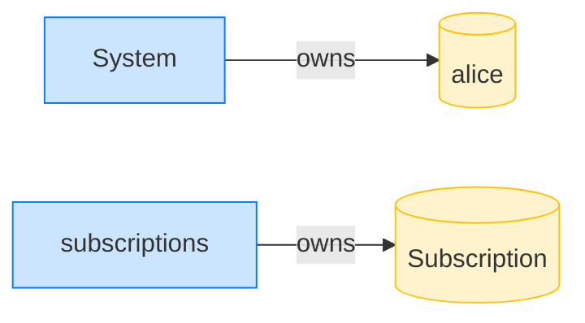

### Alice cancels her subscription

**CancelSubscription: structured CPI tree**

```text

Transaction  signers=[alice]
└── subscriptions::CancelSubscription [1] ✓ 1931cu  signer=alice
    └── subscriptions::EmitEvent [2] ✓ 137cu
Compute Units (this run): 1931
Fee: 5000 lamports
Legend (2):
  alice         = FXddRd8CdAC8SWKT3Ataasn69R7rbTfQZcKg8ejyrUbF
  subscriptions = De1egAFMkMWZSN5rYXRj9CAdheBamobVNubTsi9avR44
```

**CancelSubscription: sequence diagram**

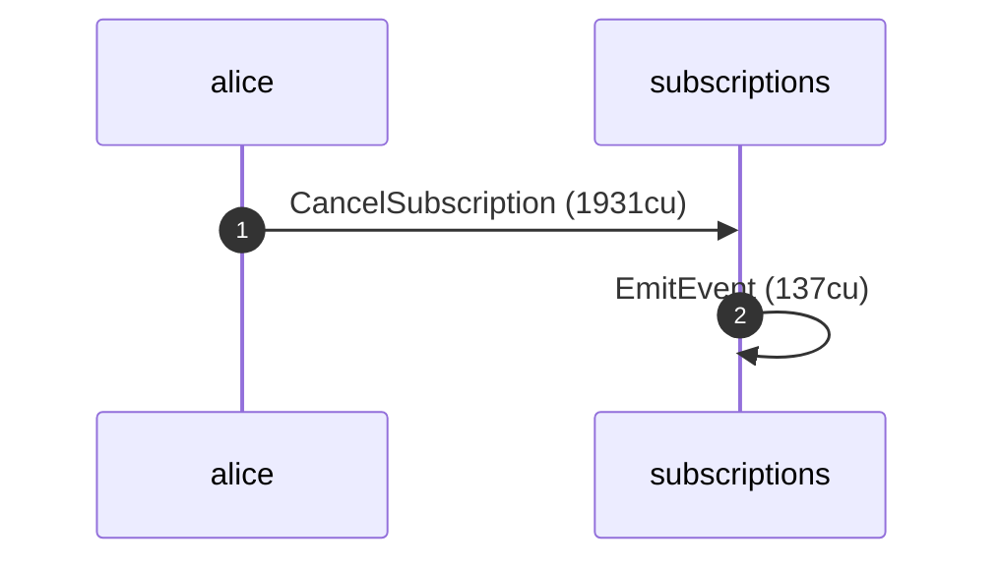

**CancelSubscription: sequence diagram, with lifelines**

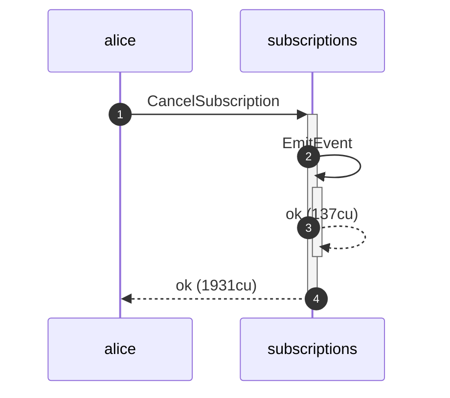

**CancelSubscription: authority graph**

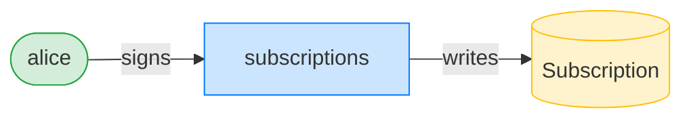

**CancelSubscription: ownership graph**


### The merchant sunsets the plan with a 7-day end

**UpdatePlan (sunset): structured CPI tree**

```text

Transaction  signers=[merchant]
└── subscriptions::UpdatePlan [1] ✓ 500cu  signer=merchant
Compute Units (this run): 500
Fee: 5000 lamports
Legend (2):
  merchant      = J4fPsxKiTTKiXSiN9bgZ5JBrVgTM9c6N8tjhLN8gfdTq
  subscriptions = De1egAFMkMWZSN5rYXRj9CAdheBamobVNubTsi9avR44
```

**UpdatePlan (sunset): sequence diagram**

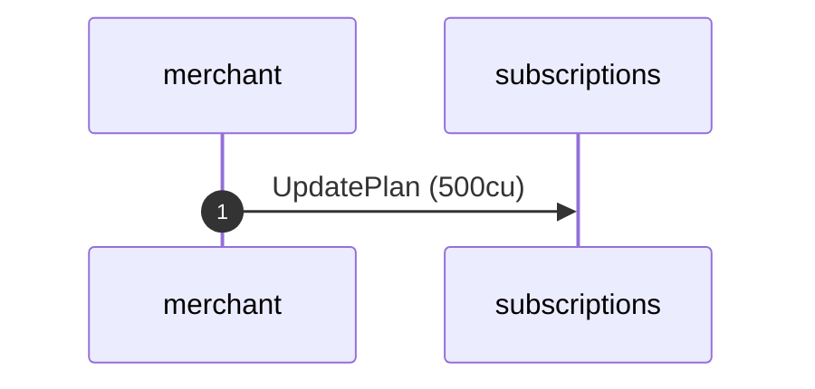

**UpdatePlan (sunset): sequence diagram, with lifelines**

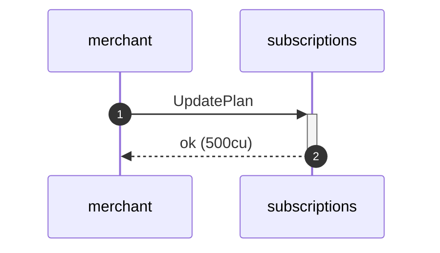

**UpdatePlan (sunset): authority graph**

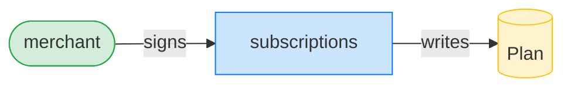

**UpdatePlan (sunset): ownership graph**


### Alice resumes while the plan is sunset

**ResumeSubscription: structured CPI tree**

```text

Transaction  signers=[alice]
└── subscriptions::ResumeSubscription [1] ✓ 1734cu  signer=alice
    └── subscriptions::EmitEvent [2] ✓ 137cu
Compute Units (this run): 1734
Fee: 5000 lamports
Legend (2):
  alice         = FXddRd8CdAC8SWKT3Ataasn69R7rbTfQZcKg8ejyrUbF
  subscriptions = De1egAFMkMWZSN5rYXRj9CAdheBamobVNubTsi9avR44
```

**ResumeSubscription: sequence diagram**

```mermaid
sequenceDiagram
    autonumber
    participant alice
    participant subscriptions
    alice ->> subscriptions: ResumeSubscription (1734cu)
    subscriptions ->> subscriptions: EmitEvent (137cu)
```

**ResumeSubscription: sequence diagram, with lifelines**

```mermaid
sequenceDiagram
    autonumber
    participant alice
    participant subscriptions
    alice ->>+ subscriptions: ResumeSubscription
    subscriptions ->>+ subscriptions: EmitEvent
    subscriptions -->>- subscriptions: ok (137cu)
    subscriptions -->>- alice: ok (1734cu)
```

**ResumeSubscription: authority graph**

```mermaid
flowchart LR
    classDef signer fill:#d4edda,stroke:#28a745;
    classDef program fill:#cce5ff,stroke:#007bff;
    classDef writable fill:#fff3cd,stroke:#ffc107;
    subscriptions[subscriptions]:::program
    alice([alice]):::signer
    Subscription[(Subscription)]:::writable
    alice -->|signs| subscriptions
    subscriptions -->|writes| Subscription
```

**ResumeSubscription: ownership graph**

```mermaid
flowchart LR
    classDef owner fill:#cce5ff,stroke:#007bff;
    classDef account fill:#fff3cd,stroke:#ffc107;
    System[System]:::owner
    alice[(alice)]:::account
    subscriptions[subscriptions]:::owner
    Subscription[(Subscription)]:::account
    System -->|owns| alice
    subscriptions -->|owns| Subscription
```

- [x] the expiry is cleared: `0`
