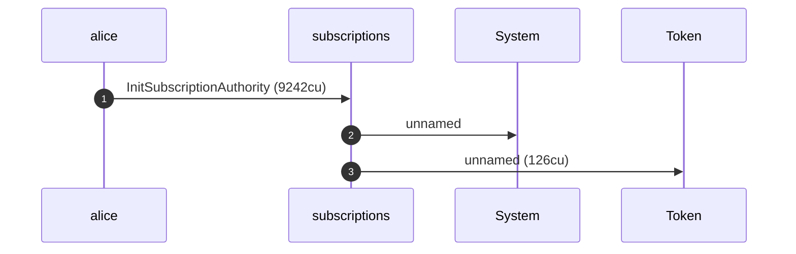
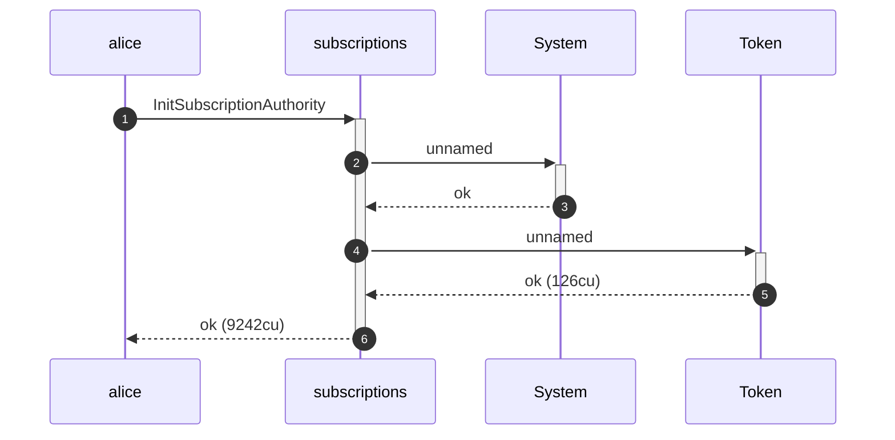
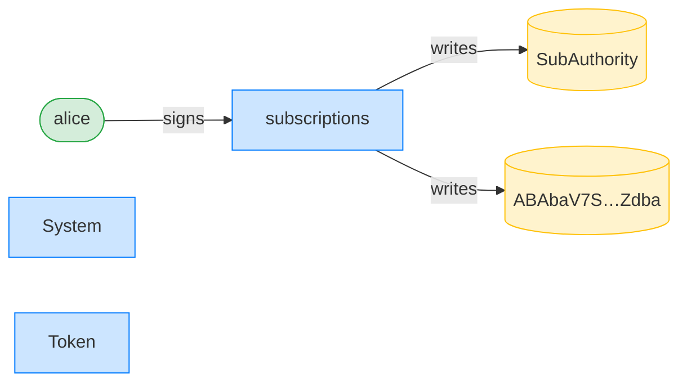
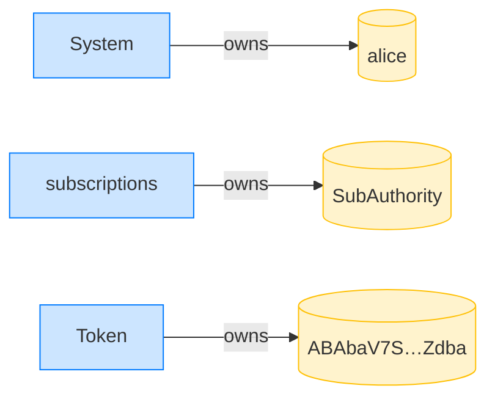
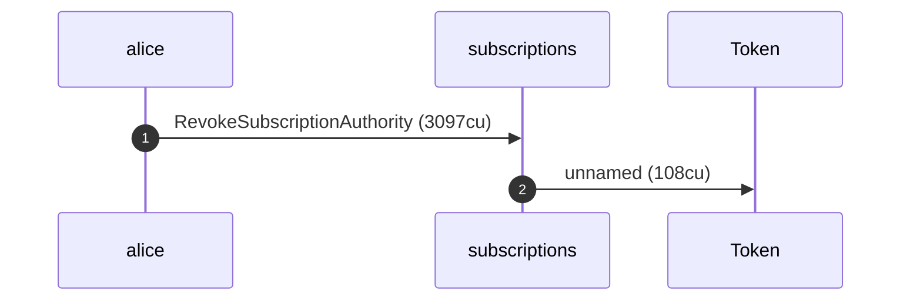
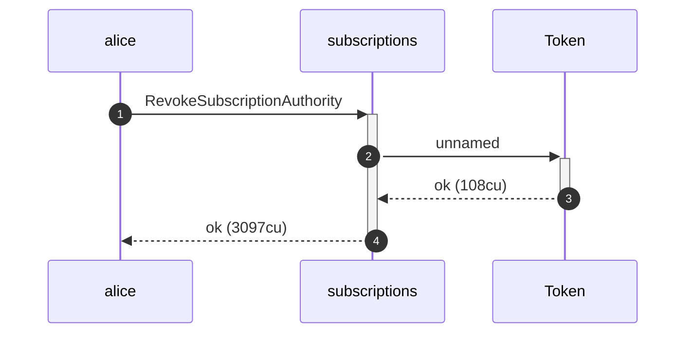
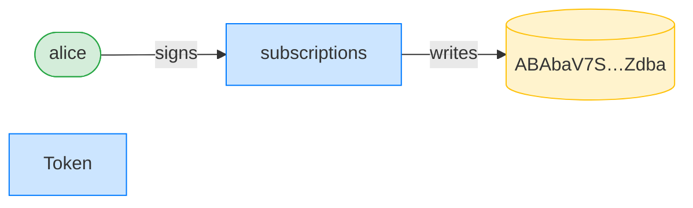
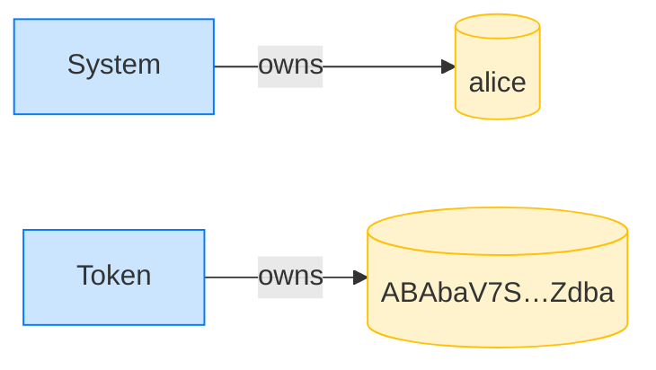

## Revoke clears the delegate — PASS

> Alice revokes her subscription authority; her ATA's delegate is cleared

### Alice initializes her subscription authority

**InitSubscriptionAuthority: structured CPI tree**

```text

Transaction  signers=[alice]
└── subscriptions::InitSubscriptionAuthority [1] ✓ 9242cu  signer=alice
    ├── System [2] ✓ (no cu)
    └── Token [2] ✓ 126cu
Compute Units (this run): 9242
Fee: 5000 lamports
Legend (2):
  alice         = FXddRd8CdAC8SWKT3Ataasn69R7rbTfQZcKg8ejyrUbF
  subscriptions = De1egAFMkMWZSN5rYXRj9CAdheBamobVNubTsi9avR44
```

**InitSubscriptionAuthority: sequence diagram**



**InitSubscriptionAuthority: sequence diagram, with lifelines**



**InitSubscriptionAuthority: authority graph**



**InitSubscriptionAuthority: ownership graph**



- [x] the ATA is delegated for the full amount before revoke: `18446744073709551615`

### Alice revokes her subscription authority

**RevokeSubscriptionAuthority: structured CPI tree**

```text

Transaction  signers=[alice]
└── subscriptions::RevokeSubscriptionAuthority [1] ✓ 3097cu  signer=alice
    └── Token [2] ✓ 108cu
Compute Units (this run): 3097
Fee: 5000 lamports
Legend (2):
  alice         = FXddRd8CdAC8SWKT3Ataasn69R7rbTfQZcKg8ejyrUbF
  subscriptions = De1egAFMkMWZSN5rYXRj9CAdheBamobVNubTsi9avR44
```

**RevokeSubscriptionAuthority: sequence diagram**



**RevokeSubscriptionAuthority: sequence diagram, with lifelines**



**RevokeSubscriptionAuthority: authority graph**



**RevokeSubscriptionAuthority: ownership graph**



- [x] the delegate is cleared after revoke: `true`
- [x] the delegated amount is zeroed after revoke: `0`
