## Sentinel start begins at landing — PASS

> a start_ts of 0 anchors the first period to the on-chain landing time, and the delegatee can pull

### Alice initializes her subscription authority

**InitSubscriptionAuthority: structured CPI tree**

```text

Transaction  signers=[alice]
└── subscriptions::InitSubscriptionAuthority [1] ✓ 10742cu  signer=alice
    ├── System [2] ✓ (no cu)
    └── Token [2] ✓ 126cu
Compute Units (this run): 10742
Fee: 5000 lamports
Legend (2):
  alice         = FXddRd8CdAC8SWKT3Ataasn69R7rbTfQZcKg8ejyrUbF
  subscriptions = De1egAFMkMWZSN5rYXRj9CAdheBamobVNubTsi9avR44
```

**InitSubscriptionAuthority: sequence diagram**

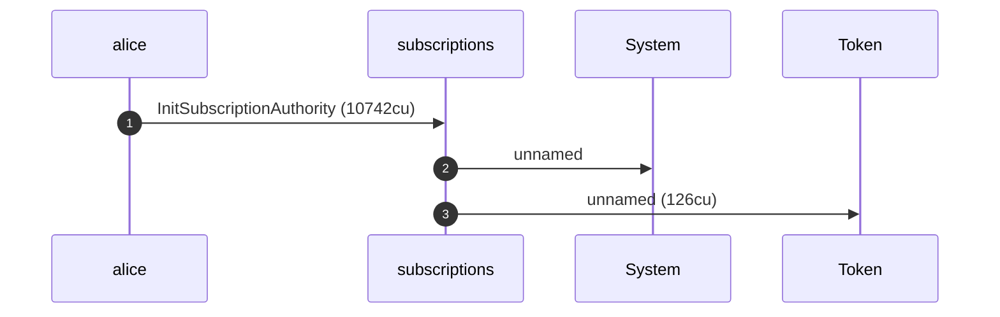

**InitSubscriptionAuthority: sequence diagram, with lifelines**

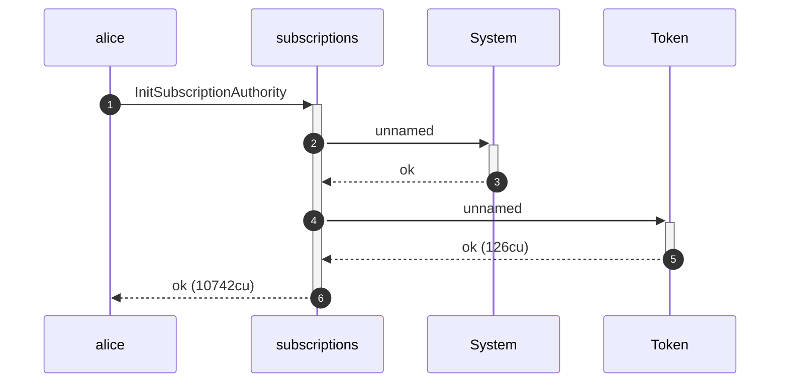

**InitSubscriptionAuthority: authority graph**

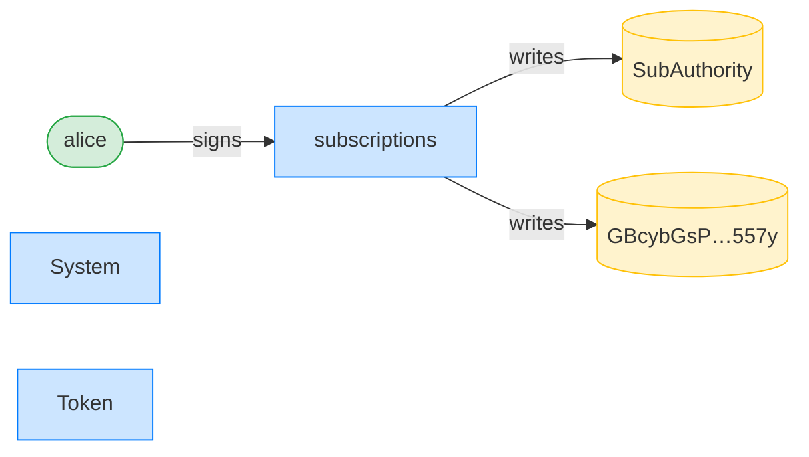

**InitSubscriptionAuthority: ownership graph**

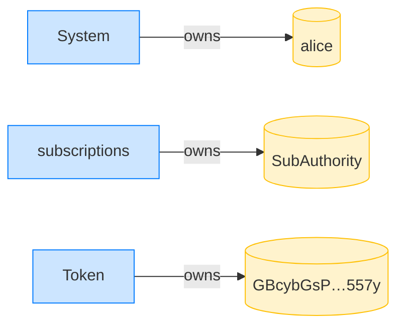

### Alice creates the delegation with a sentinel (landing) start

**CreateRecurringDelegation (sentinel start): structured CPI tree**

```text

Transaction  signers=[alice]
└── subscriptions::CreateRecurringDelegation [1] ✓ 5063cu  signer=alice
    └── System [2] ✓ (no cu)
Compute Units (this run): 5063
Fee: 5000 lamports
Legend (2):
  alice         = FXddRd8CdAC8SWKT3Ataasn69R7rbTfQZcKg8ejyrUbF
  subscriptions = De1egAFMkMWZSN5rYXRj9CAdheBamobVNubTsi9avR44
```

**CreateRecurringDelegation (sentinel start): sequence diagram**

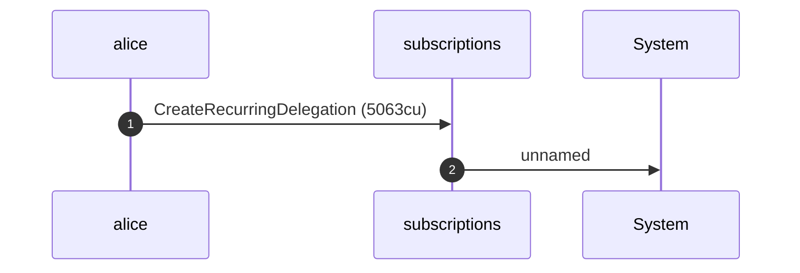

**CreateRecurringDelegation (sentinel start): sequence diagram, with lifelines**

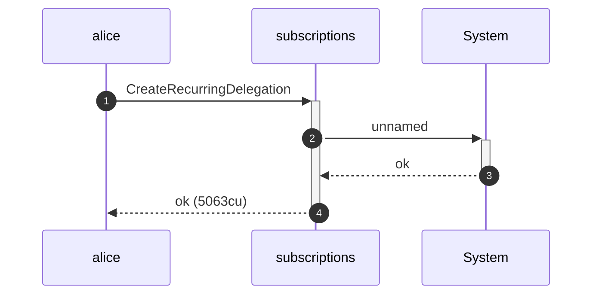

**CreateRecurringDelegation (sentinel start): authority graph**

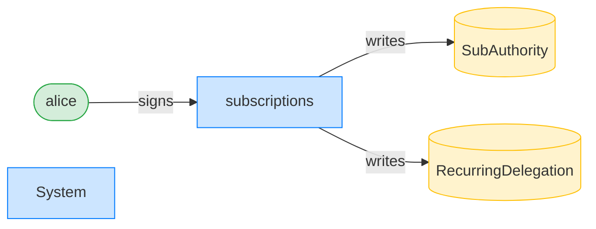

**CreateRecurringDelegation (sentinel start): ownership graph**

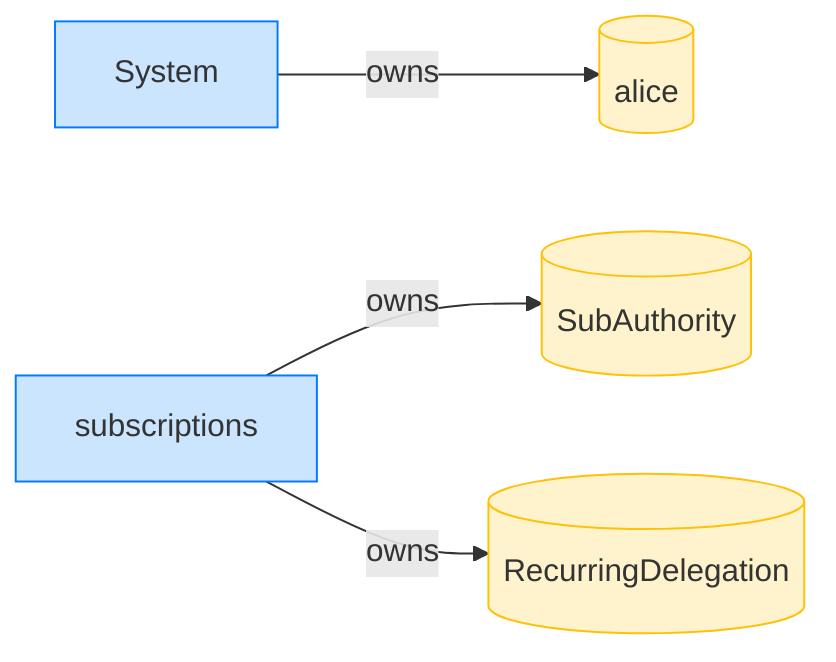

- [x] the period starts at the landing clock: `1700000000`

### Bob pulls against the delegation

**TransferRecurring: structured CPI tree**

```text

Transaction  signers=[bob]
└── subscriptions::TransferRecurring [1] ✓ 7164cu  signer=bob
    ├── Token [2] ✓ 113cu
    └── subscriptions [2] ✓ 137cu
          🔔 RecurringTransfer
               delegatee:        bob,
               amount:           10000000,
               pulled_in_period: 10000000,
               receiver:         bob
Compute Units (this run): 7164
Fee: 5000 lamports
Legend (2):
  bob           = 9S8NPMnzAba71o3tr8dHDzUrfT5NesYFzP56QFpYieMR
  subscriptions = De1egAFMkMWZSN5rYXRj9CAdheBamobVNubTsi9avR44
```

**TransferRecurring: sequence diagram**

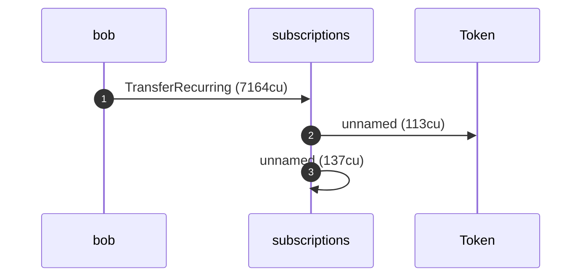

**TransferRecurring: sequence diagram, with lifelines**

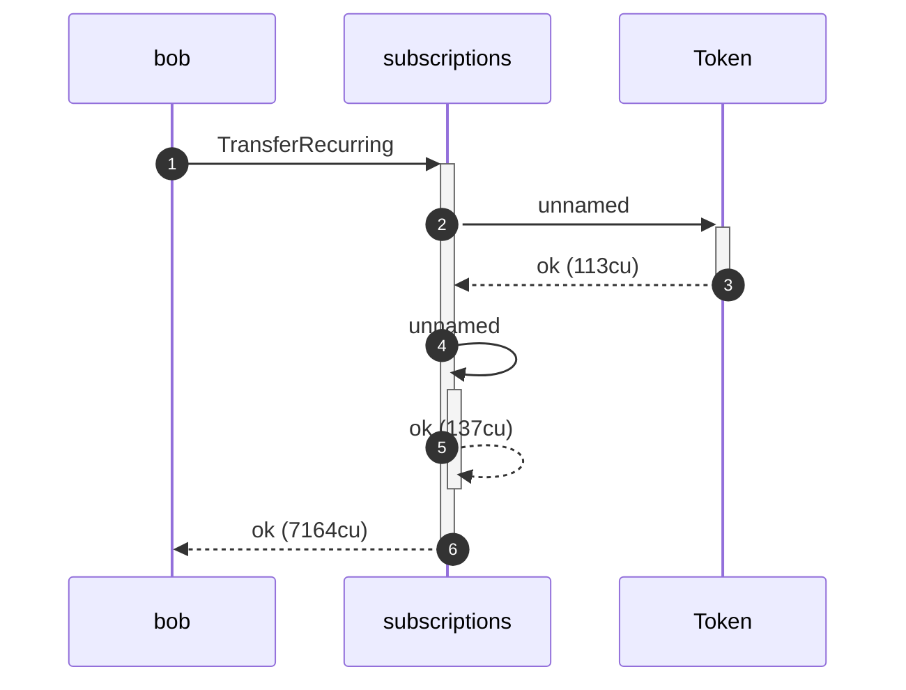

**TransferRecurring: authority graph**

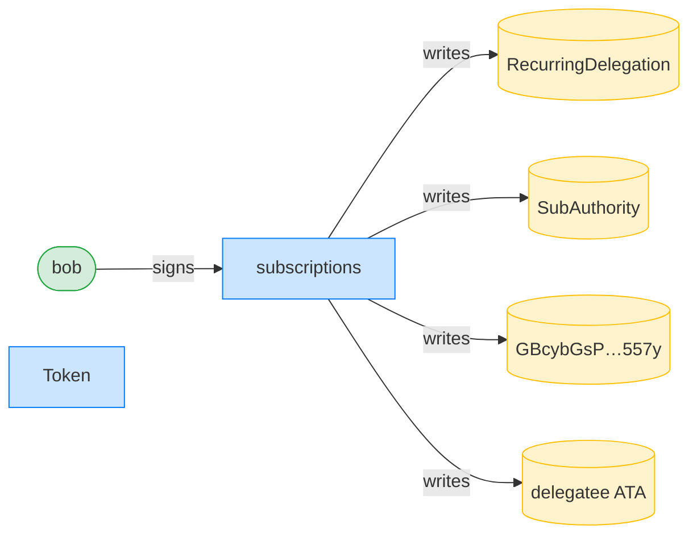

**TransferRecurring: ownership graph**

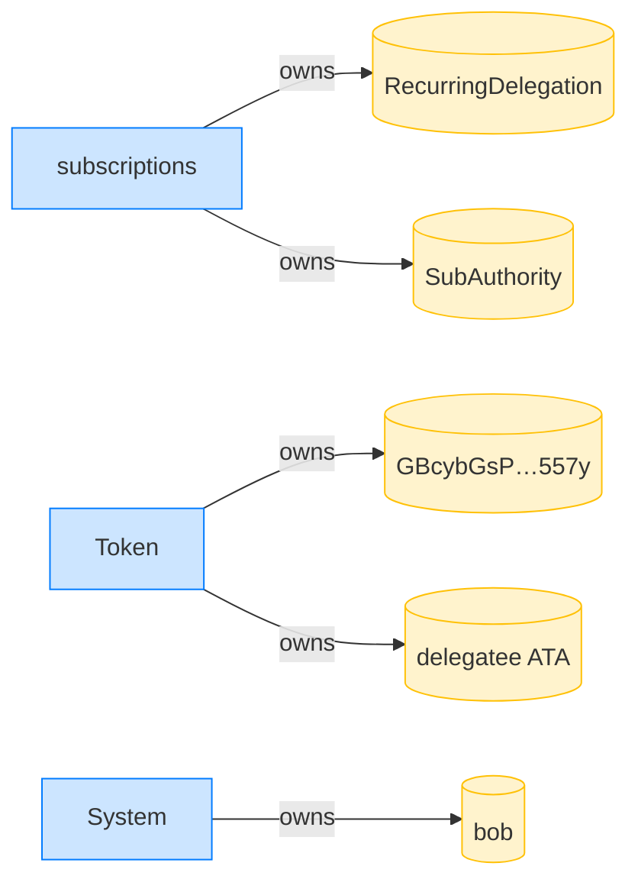

- [x] the pulled amount landed in Bob's ATA: `10000000`
