## Skipped periods do not accumulate allowance — PASS

> after skipping a period, the delegatee cannot claim twice the per-period allowance in the next

### Stage: Alice's authority and a recurring delegation to Bob

**InitSubscriptionAuthority: structured CPI tree**

```text

── subscriptions::InitSubscriptionAuthority ────────────────
Transaction  signers=[alice]
└── subscriptions::InitSubscriptionAuthority [1] ✓ 10742cu  signer=alice
    ├── System::CreateAccount [2] ✓ (no cu)
    └── Token::Approve [2] ✓ 126cu
Compute Units (this run): 10742
Fee: 5000 lamports
Legend (2):
  subscriptions = De1egAFMkMWZSN5rYXRj9CAdheBamobVNubTsi9avR44
  alice         = FXddRd8CdAC8SWKT3Ataasn69R7rbTfQZcKg8ejyrUbF
```

**InitSubscriptionAuthority: sequence diagram**

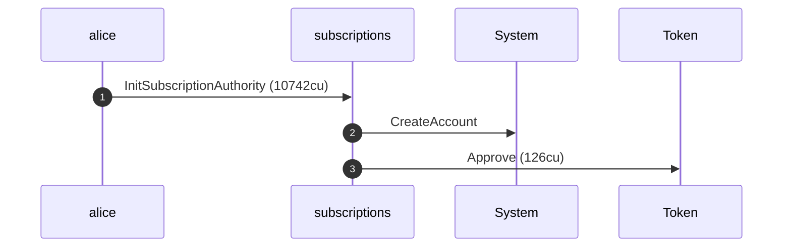

**InitSubscriptionAuthority: sequence diagram, with lifelines**

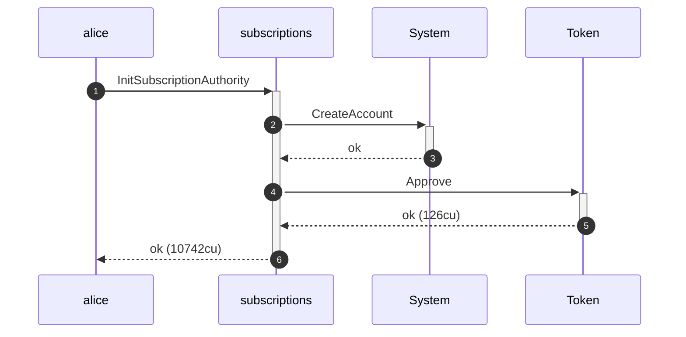

**InitSubscriptionAuthority: authority graph**

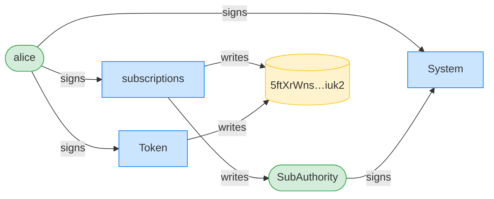

**InitSubscriptionAuthority: ownership graph**

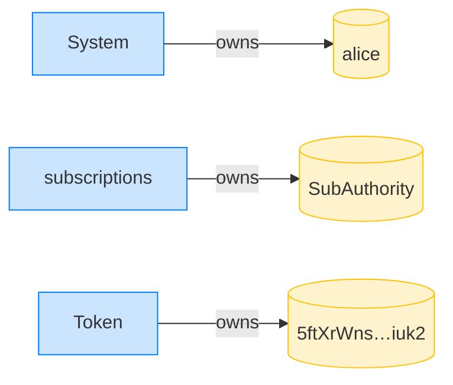

**CreateRecurringDelegation: structured CPI tree**

```text

── subscriptions::CreateRecurringDelegation ────────────────
Transaction  signers=[alice]
└── subscriptions::CreateRecurringDelegation [1] ✓ 6573cu  signer=alice
    └── System::CreateAccount [2] ✓ (no cu)
Compute Units (this run): 6573
Fee: 5000 lamports
Legend (2):
  subscriptions = De1egAFMkMWZSN5rYXRj9CAdheBamobVNubTsi9avR44
  alice         = FXddRd8CdAC8SWKT3Ataasn69R7rbTfQZcKg8ejyrUbF
```

**CreateRecurringDelegation: sequence diagram**

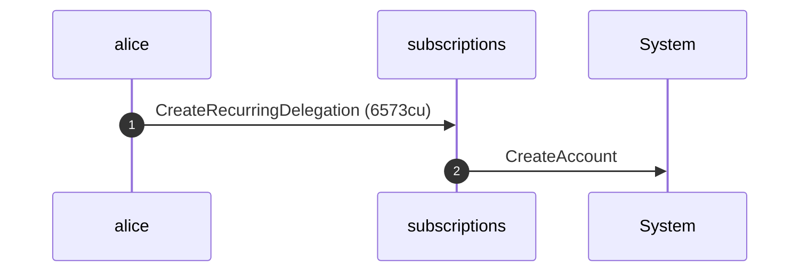

**CreateRecurringDelegation: sequence diagram, with lifelines**

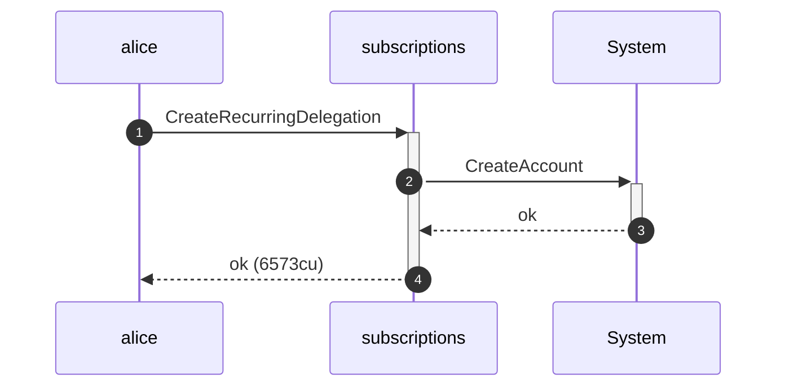

**CreateRecurringDelegation: authority graph**

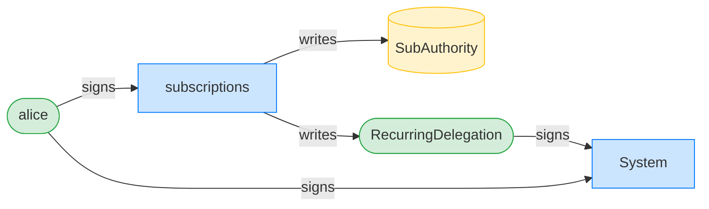

**CreateRecurringDelegation: ownership graph**

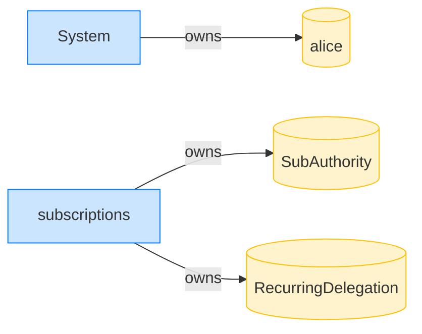

### Period 0: Bob claims the full allowance

**TransferRecurring (period 0, full): structured CPI tree**

```text

── subscriptions::TransferRecurring ────────────────────────
Transaction  signers=[bob]
└── subscriptions::TransferRecurring [1] ✓ 10164cu  signer=bob
    ├── Token::TransferChecked [2] ✓ 113cu
    └── subscriptions::EmitEvent [2] ✓ 137cu
          🔔 RecurringTransfer
               delegatee:        bob,
               amount:           50000000,
               pulled_in_period: 50000000,
               receiver:         bob
Compute Units (this run): 10164
Fee: 5000 lamports
Legend (2):
  subscriptions = De1egAFMkMWZSN5rYXRj9CAdheBamobVNubTsi9avR44
  bob           = 9S8NPMnzAba71o3tr8dHDzUrfT5NesYFzP56QFpYieMR
```

**TransferRecurring (period 0, full): sequence diagram**


**TransferRecurring (period 0, full): sequence diagram, with lifelines**


**TransferRecurring (period 0, full): authority graph**

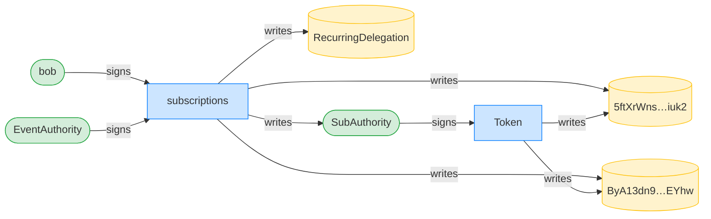

**TransferRecurring (period 0, full): ownership graph**

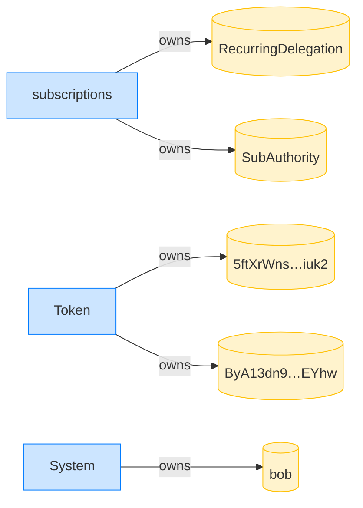

- [x] Bob received the full 50 tokens: `50000000`

### Period 1 is skipped entirely; advance to the start of period 2

### Period 2: Bob claims the full allowance again

**TransferRecurring (period 2, full): structured CPI tree**

```text

── subscriptions::TransferRecurring ────────────────────────
Transaction  signers=[bob]
└── subscriptions::TransferRecurring [1] ✓ 10255cu  signer=bob
    ├── Token::TransferChecked [2] ✓ 113cu
    └── subscriptions::EmitEvent [2] ✓ 137cu
          🔔 RecurringTransfer
               delegatee:        bob,
               amount:           50000000,
               pulled_in_period: 50000000,
               receiver:         bob
Compute Units (this run): 10255
Fee: 5000 lamports
Legend (2):
  subscriptions = De1egAFMkMWZSN5rYXRj9CAdheBamobVNubTsi9avR44
  bob           = 9S8NPMnzAba71o3tr8dHDzUrfT5NesYFzP56QFpYieMR
```

**TransferRecurring (period 2, full): sequence diagram**

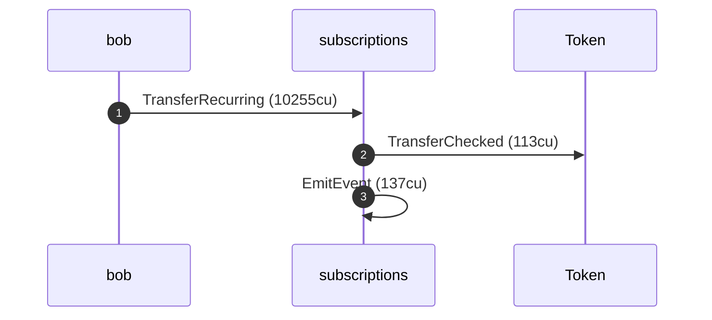

**TransferRecurring (period 2, full): sequence diagram, with lifelines**

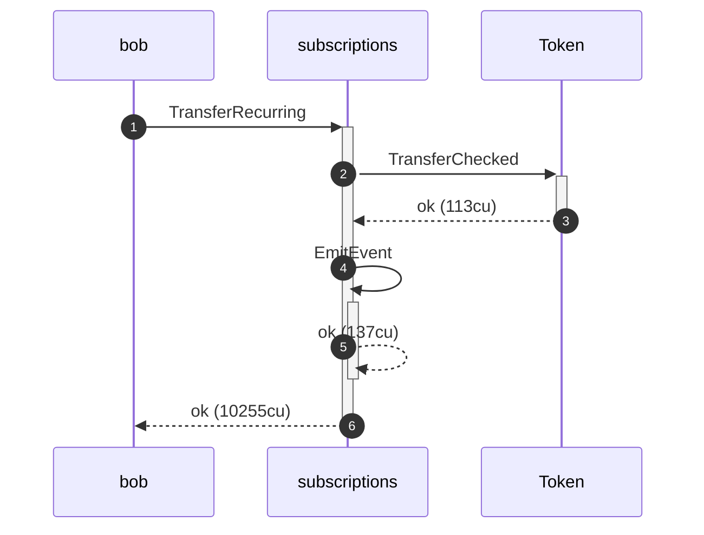

**TransferRecurring (period 2, full): authority graph**


**TransferRecurring (period 2, full): ownership graph**


- [x] Bob received another full 50 tokens: `100000000`

### Period 2: Bob immediately tries to claim again; it is refused

**TransferRecurring (period 2, second claim): structured CPI tree**

```text

── subscriptions::TransferRecurring ────────────────────────
Transaction  signers=[bob]
└── subscriptions::TransferRecurring [1] ✗ 937cu  signer=bob
    └── Error: AmountExceedsPeriodLimit (0x190)
Error: InstructionError(0, Custom(400))
Compute Units (this run): 937
Fee: 5000 lamports
Legend (2):
  subscriptions = De1egAFMkMWZSN5rYXRj9CAdheBamobVNubTsi9avR44
  bob           = 9S8NPMnzAba71o3tr8dHDzUrfT5NesYFzP56QFpYieMR
```

- [x] Bob's balance is unchanged after the refused claim: `100000000`
- [x] the full allowance is marked pulled: `50000000`
- [x] the period start is aligned to period 2: `1700007200`
