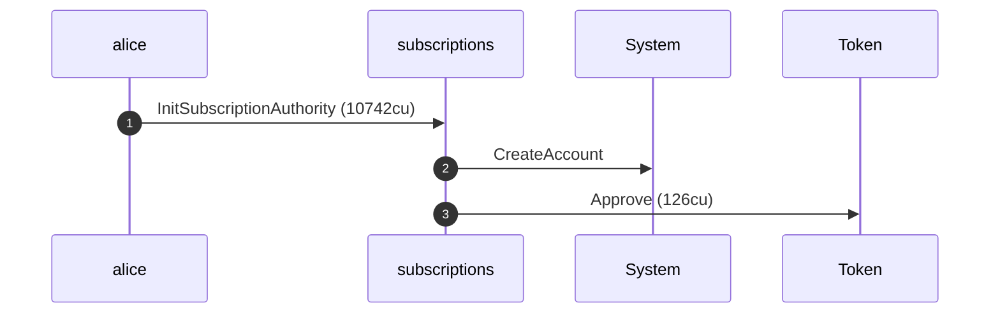
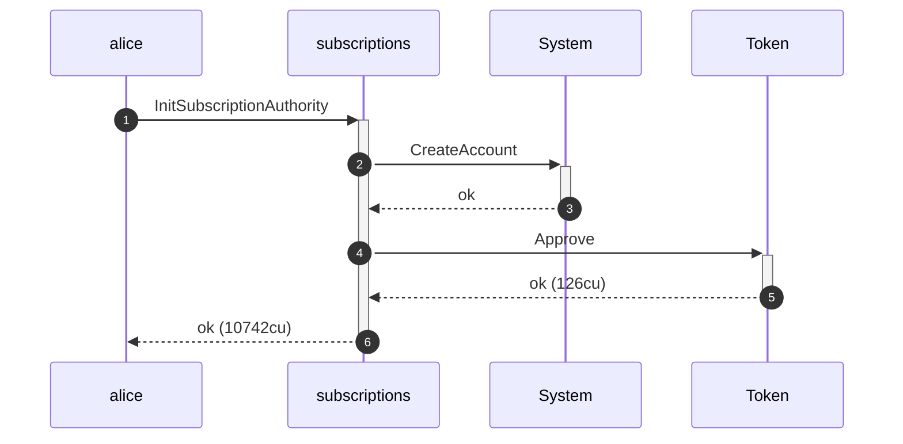
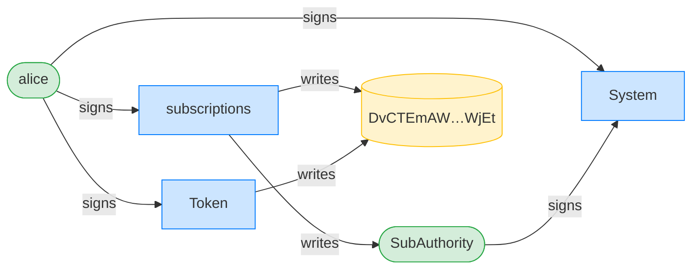
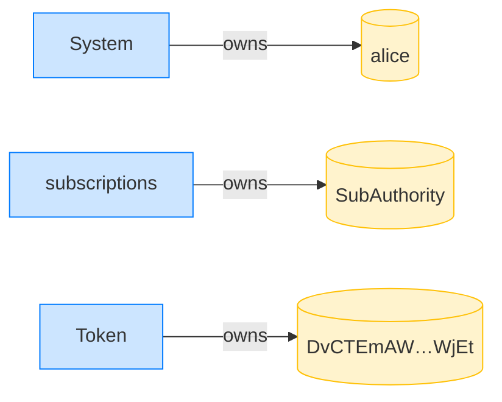
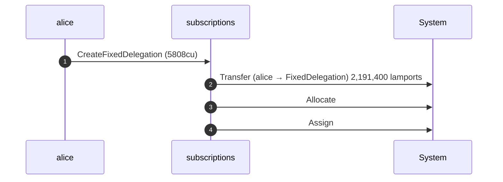
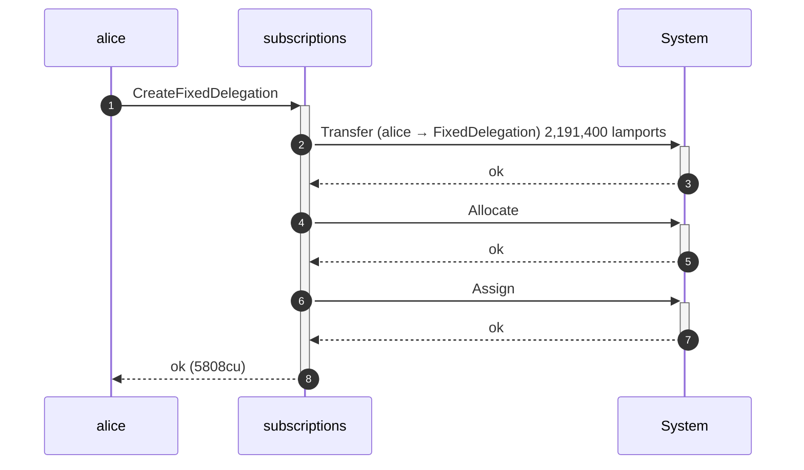
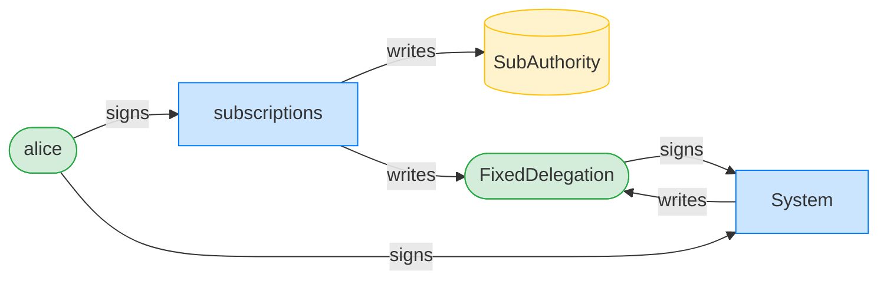
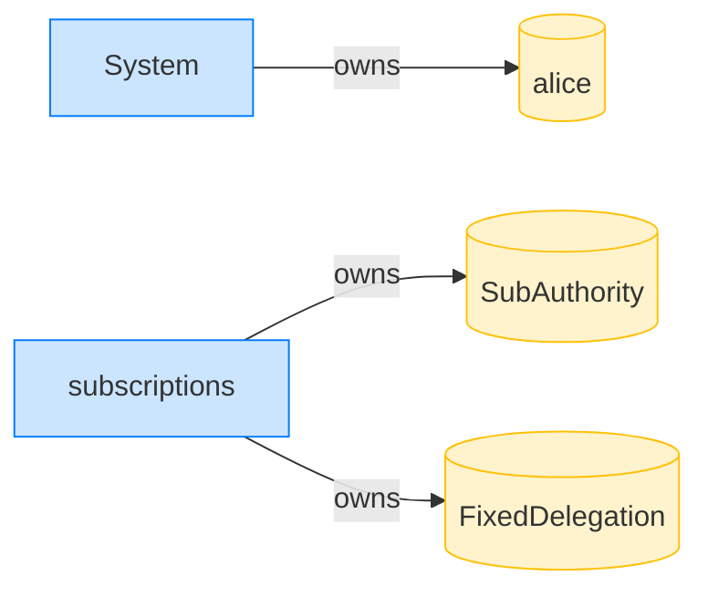

## Survive a pre-funded delegation PDA — PASS

> a griefer pre-funds the delegation PDA; Alice can still create it

**InitSubscriptionAuthority: structured CPI tree**

```text

── subscriptions::InitSubscriptionAuthority ────────────────
Transaction  signers=[alice]
└── subscriptions::InitSubscriptionAuthority [1] ✓ 10742cu  signer=alice
    ├── System::CreateAccount [2] ✓ (no cu)
    └── Token::Approve [2] ✓ 126cu
Compute Units (this run): 10742
Fee: 5000 lamports
Legend (2):
  subscriptions = De1egAFMkMWZSN5rYXRj9CAdheBamobVNubTsi9avR44
  alice         = FXddRd8CdAC8SWKT3Ataasn69R7rbTfQZcKg8ejyrUbF
```

**InitSubscriptionAuthority: sequence diagram**



**InitSubscriptionAuthority: sequence diagram, with lifelines**



**InitSubscriptionAuthority: authority graph**



**InitSubscriptionAuthority: ownership graph**



### Despite the pre-funded PDA, Alice creates the fixed delegation

**CreateFixedDelegation (pre-funded PDA): structured CPI tree**

```text

── subscriptions::CreateFixedDelegation ────────────────────
Transaction  signers=[alice]
└── subscriptions::CreateFixedDelegation [1] ✓ 5808cu  signer=alice
    ├── System::Transfer (alice -> FixedDelegation) 2,191,400 lamports [2] ✓ (no cu)
    ├── System::Allocate [2] ✓ (no cu)
    └── System::Assign [2] ✓ (no cu)
Compute Units (this run): 5808
Fee: 5000 lamports
Legend (2):
  subscriptions = De1egAFMkMWZSN5rYXRj9CAdheBamobVNubTsi9avR44
  alice         = FXddRd8CdAC8SWKT3Ataasn69R7rbTfQZcKg8ejyrUbF
```

**CreateFixedDelegation (pre-funded PDA): sequence diagram**



**CreateFixedDelegation (pre-funded PDA): sequence diagram, with lifelines**



**CreateFixedDelegation (pre-funded PDA): authority graph**



**CreateFixedDelegation (pre-funded PDA): ownership graph**



- [x] the delegator is Alice: `FXddRd8CdAC8SWKT3Ataasn69R7rbTfQZcKg8ejyrUbF`
- [x] the delegatee matches: `1112hLa87sNLYBQAUemfLRCzgGV8UiCqYDLksz7xnqs`
- [x] the account is tagged FixedDelegation: `2`
- [x] the delegated amount matches: `100000000`
- [x] the expiry matches: `1700086400`
