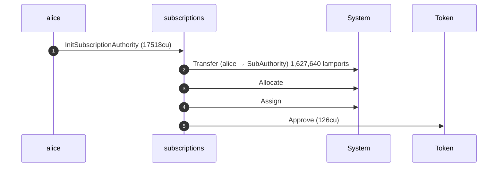
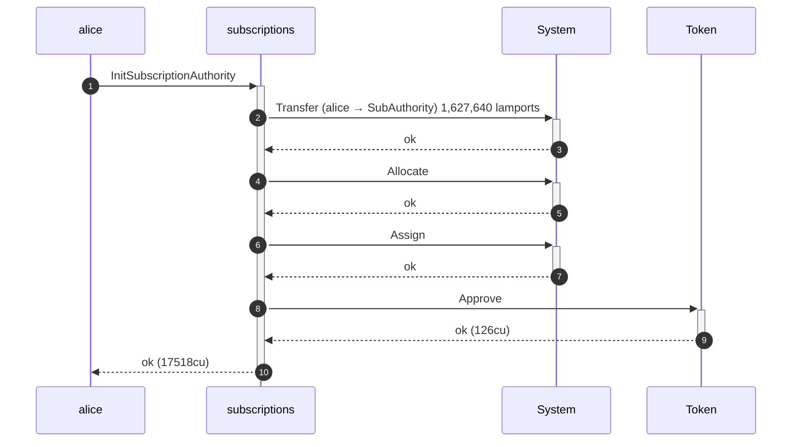
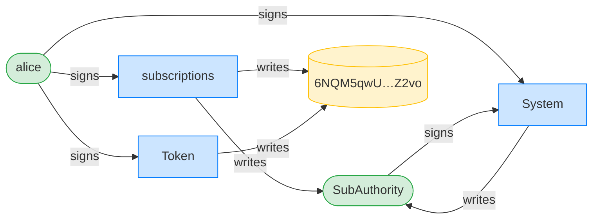
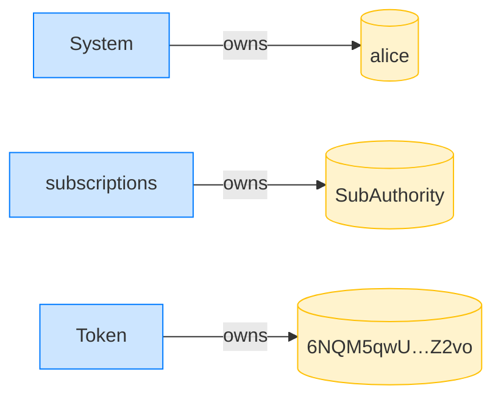

## Survive a pre-funded PDA — PASS

> a griefer pre-funds the authority PDA; Alice can still initialize it

### Despite the pre-funded PDA, Alice initializes her authority

**InitSubscriptionAuthority: structured CPI tree**

```text

── subscriptions::InitSubscriptionAuthority ────────────────
Transaction  signers=[alice]
└── subscriptions::InitSubscriptionAuthority [1] ✓ 17518cu  signer=alice
    ├── System::Transfer (alice -> SubAuthority) 1,627,640 lamports [2] ✓ (no cu)
    ├── System::Allocate [2] ✓ (no cu)
    ├── System::Assign [2] ✓ (no cu)
    └── Token::Approve [2] ✓ 126cu
Compute Units (this run): 17518
Fee: 5000 lamports
Legend (2):
  subscriptions = De1egAFMkMWZSN5rYXRj9CAdheBamobVNubTsi9avR44
  alice         = FXddRd8CdAC8SWKT3Ataasn69R7rbTfQZcKg8ejyrUbF
```

**InitSubscriptionAuthority: sequence diagram**



**InitSubscriptionAuthority: sequence diagram, with lifelines**



**InitSubscriptionAuthority: authority graph**



**InitSubscriptionAuthority: ownership graph**


