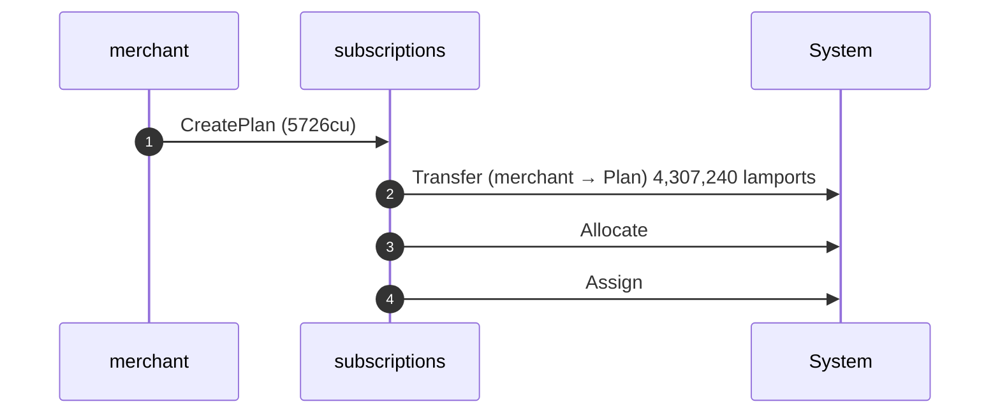
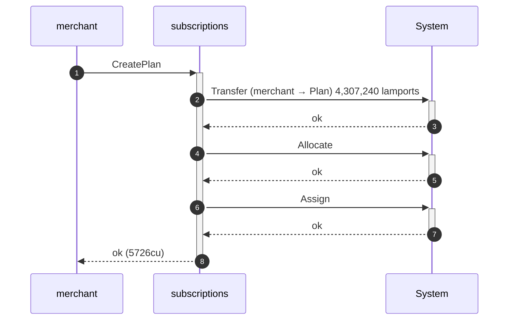
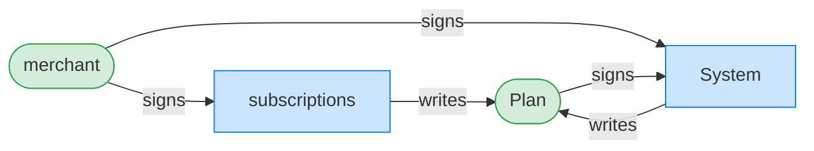
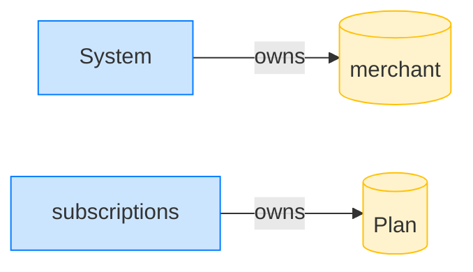

## Survive a pre-funded plan PDA — PASS

> a griefer pre-funds the plan PDA; the merchant can still create the plan

### Despite the pre-funded PDA, the merchant creates the plan

**CreatePlan (pre-funded PDA): structured CPI tree**

```text

── subscriptions::CreatePlan ───────────────────────────────
Transaction  signers=[merchant]
└── subscriptions::CreatePlan [1] ✓ 5726cu  signer=merchant
    ├── System::Transfer (merchant -> Plan) 4,307,240 lamports [2] ✓ (no cu)
    ├── System::Allocate [2] ✓ (no cu)
    └── System::Assign [2] ✓ (no cu)
Compute Units (this run): 5726
Fee: 5000 lamports
Legend (2):
  subscriptions = De1egAFMkMWZSN5rYXRj9CAdheBamobVNubTsi9avR44
  merchant      = J4fPsxKiTTKiXSiN9bgZ5JBrVgTM9c6N8tjhLN8gfdTq
```

**CreatePlan (pre-funded PDA): sequence diagram**



**CreatePlan (pre-funded PDA): sequence diagram, with lifelines**



**CreatePlan (pre-funded PDA): authority graph**



**CreatePlan (pre-funded PDA): ownership graph**



- [x] the plan owner is the merchant: `J4fPsxKiTTKiXSiN9bgZ5JBrVgTM9c6N8tjhLN8gfdTq`
- [x] the plan is Active: `1`
