## Transfer subscription: a ghost (re-created) plan is refused — PASS

> a plan deleted and re-created at the same PDA with new terms staling the subscription's pull

### Stage: Alice's authority, the merchant's plan, Alice subscribed

**InitSubscriptionAuthority: structured CPI tree**

```text

Transaction  signers=[alice]
└── subscriptions::InitSubscriptionAuthority [1] ✓ 9242cu  signer=alice
    ├── System [2] ✓ (no cu)
    └── Token [2] ✓ 126cu
Compute Units (this run): 9242
Fee: 5000 lamports
Legend (2):
  alice         = FXddRd8CdAC8SWKT3Ataasn69R7rbTfQZcKg8ejyrUbF
  subscriptions = De1egAFMkMWZSN5rYXRj9CAdheBamobVNubTsi9avR44
```

**InitSubscriptionAuthority: sequence diagram**

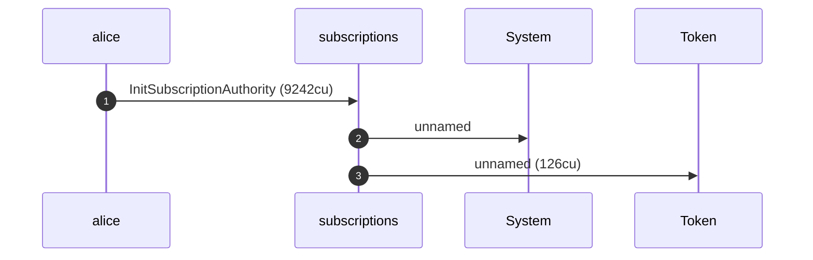

**InitSubscriptionAuthority: sequence diagram, with lifelines**

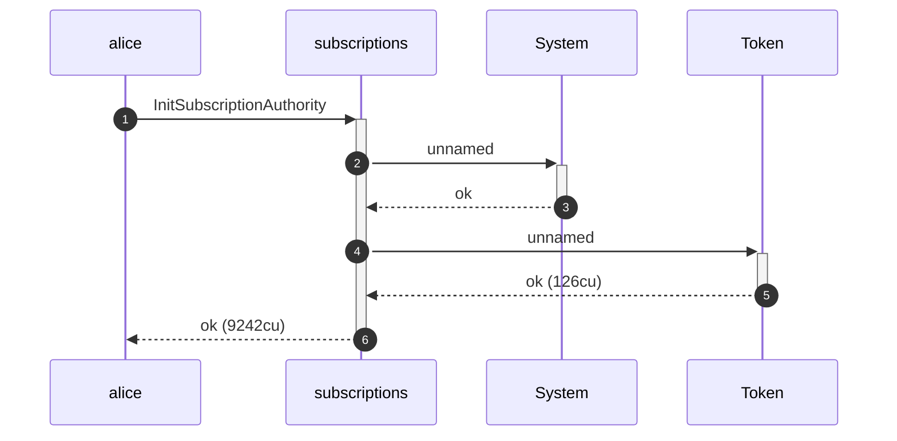

**InitSubscriptionAuthority: authority graph**

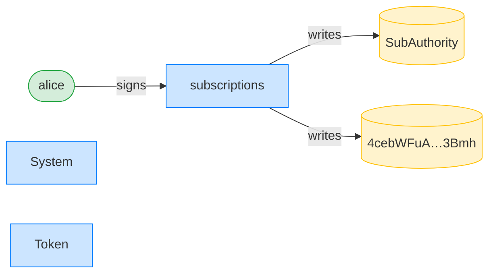

**InitSubscriptionAuthority: ownership graph**

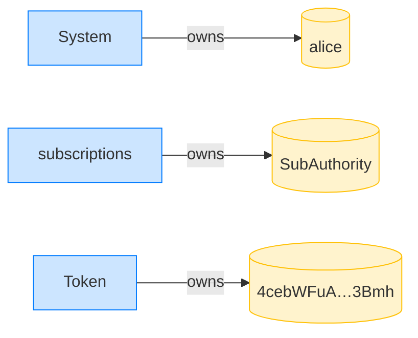

**CreatePlan: structured CPI tree**

```text

Transaction  signers=[merchant]
└── subscriptions::CreatePlan [1] ✓ 3468cu  signer=merchant
    └── System [2] ✓ (no cu)
Compute Units (this run): 3468
Fee: 5000 lamports
Legend (2):
  merchant      = J4fPsxKiTTKiXSiN9bgZ5JBrVgTM9c6N8tjhLN8gfdTq
  subscriptions = De1egAFMkMWZSN5rYXRj9CAdheBamobVNubTsi9avR44
```

**CreatePlan: sequence diagram**

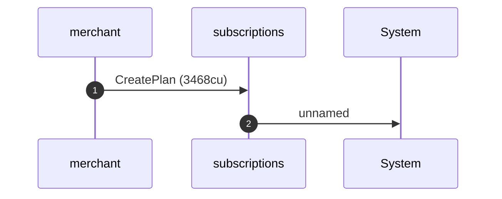

**CreatePlan: sequence diagram, with lifelines**

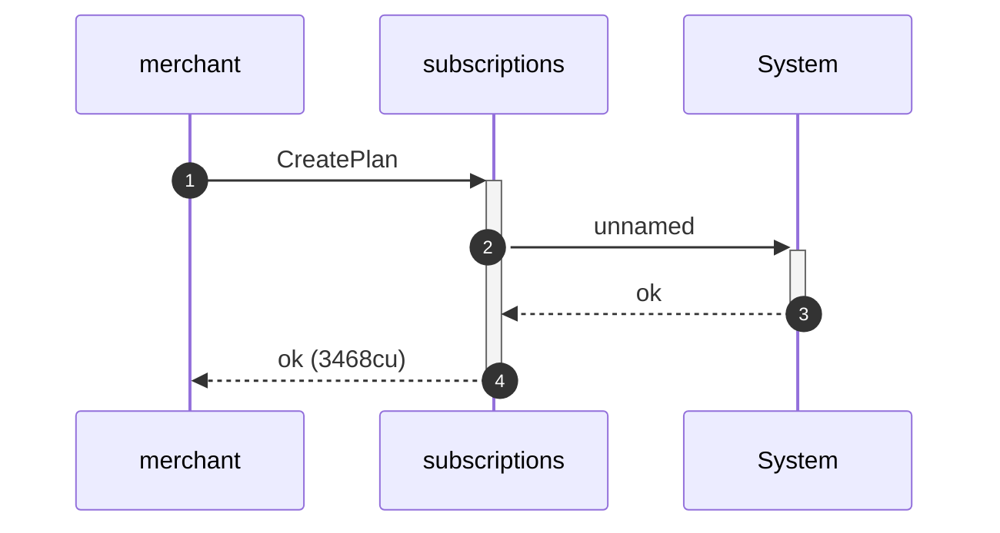

**CreatePlan: authority graph**


**CreatePlan: ownership graph**

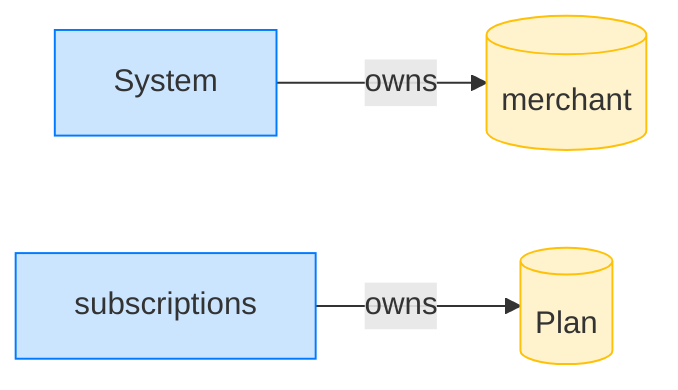

### The merchant sunsets, deletes, and re-creates the plan at the same PDA

**UpdatePlan (sunset): structured CPI tree**

```text

Transaction  signers=[merchant]
└── subscriptions::UpdatePlan [1] ✓ 500cu  signer=merchant
Compute Units (this run): 500
Fee: 5000 lamports
Legend (2):
  merchant      = J4fPsxKiTTKiXSiN9bgZ5JBrVgTM9c6N8tjhLN8gfdTq
  subscriptions = De1egAFMkMWZSN5rYXRj9CAdheBamobVNubTsi9avR44
```

**UpdatePlan (sunset): sequence diagram**

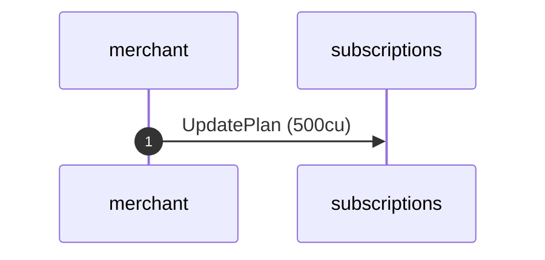

**UpdatePlan (sunset): sequence diagram, with lifelines**

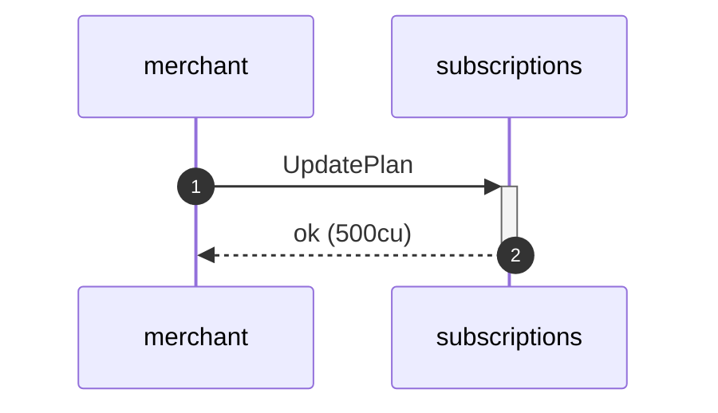

**UpdatePlan (sunset): authority graph**


**UpdatePlan (sunset): ownership graph**


**DeletePlan: structured CPI tree**

```text

Transaction  signers=[merchant]
└── subscriptions::DeletePlan [1] ✓ 366cu  signer=merchant
Compute Units (this run): 366
Fee: 5000 lamports
Legend (2):
  merchant      = J4fPsxKiTTKiXSiN9bgZ5JBrVgTM9c6N8tjhLN8gfdTq
  subscriptions = De1egAFMkMWZSN5rYXRj9CAdheBamobVNubTsi9avR44
```

**DeletePlan: sequence diagram**


**DeletePlan: sequence diagram, with lifelines**

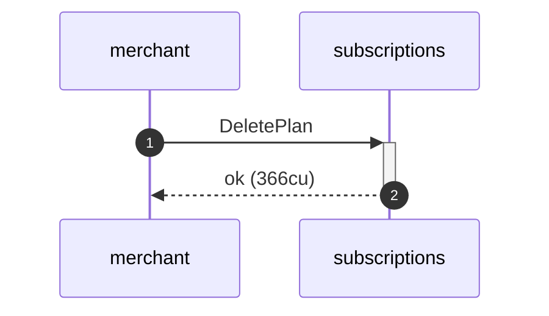

**DeletePlan: authority graph**

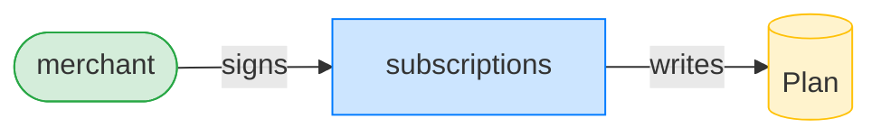

**DeletePlan: ownership graph**

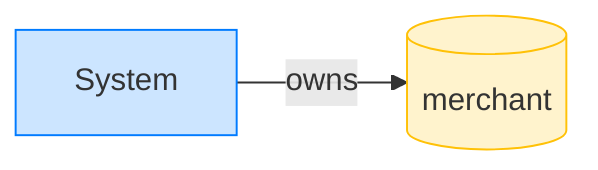

**CreatePlan (re-created): structured CPI tree**

```text

Transaction  signers=[merchant]
└── subscriptions::CreatePlan [1] ✓ 3468cu  signer=merchant
    └── System [2] ✓ (no cu)
Compute Units (this run): 3468
Fee: 5000 lamports
Legend (2):
  merchant      = J4fPsxKiTTKiXSiN9bgZ5JBrVgTM9c6N8tjhLN8gfdTq
  subscriptions = De1egAFMkMWZSN5rYXRj9CAdheBamobVNubTsi9avR44
```

**CreatePlan (re-created): sequence diagram**


**CreatePlan (re-created): sequence diagram, with lifelines**


**CreatePlan (re-created): authority graph**

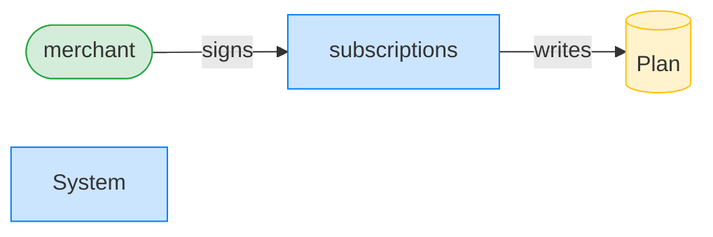

**CreatePlan (re-created): ownership graph**


- [x] the re-created plan lands at the same PDA: `6rGpcSJciD37aqctggyrJTLjrL1n73dgm5U8JFoNjWxW`

### The merchant pulls against the ghost plan with the original subscription

**TransferSubscription (ghost plan): structured CPI tree**

```text

Transaction  signers=[merchant]
└── subscriptions::TransferSubscription [1] ✗ 1063cu  signer=merchant
    └── Error: PlanTermsMismatch
Error: InstructionError(0, Custom(519))
Compute Units (this run): 1063
Fee: 5000 lamports
Legend (2):
  merchant      = J4fPsxKiTTKiXSiN9bgZ5JBrVgTM9c6N8tjhLN8gfdTq
  subscriptions = De1egAFMkMWZSN5rYXRj9CAdheBamobVNubTsi9avR44
```
