## Transfer subscription: an authorized puller pulls — PASS

> a whitelisted puller (not the merchant) pulls against the subscription

### Stage: Alice's authority, the merchant's plan, Alice subscribed

**InitSubscriptionAuthority: structured CPI tree**

```text

Transaction  signers=[alice]
└── subscriptions::InitSubscriptionAuthority [1] ✓ 6242cu  signer=alice
    ├── System [2] ✓ (no cu)
    └── Token [2] ✓ 126cu
Compute Units (this run): 6242
Fee: 5000 lamports
Legend (2):
  alice         = FXddRd8CdAC8SWKT3Ataasn69R7rbTfQZcKg8ejyrUbF
  subscriptions = De1egAFMkMWZSN5rYXRj9CAdheBamobVNubTsi9avR44
```

**InitSubscriptionAuthority: sequence diagram**

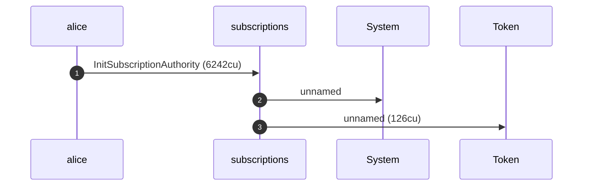

**InitSubscriptionAuthority: sequence diagram, with lifelines**

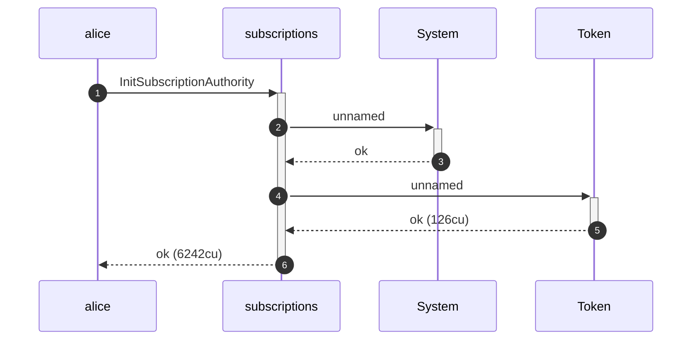

**InitSubscriptionAuthority: authority graph**

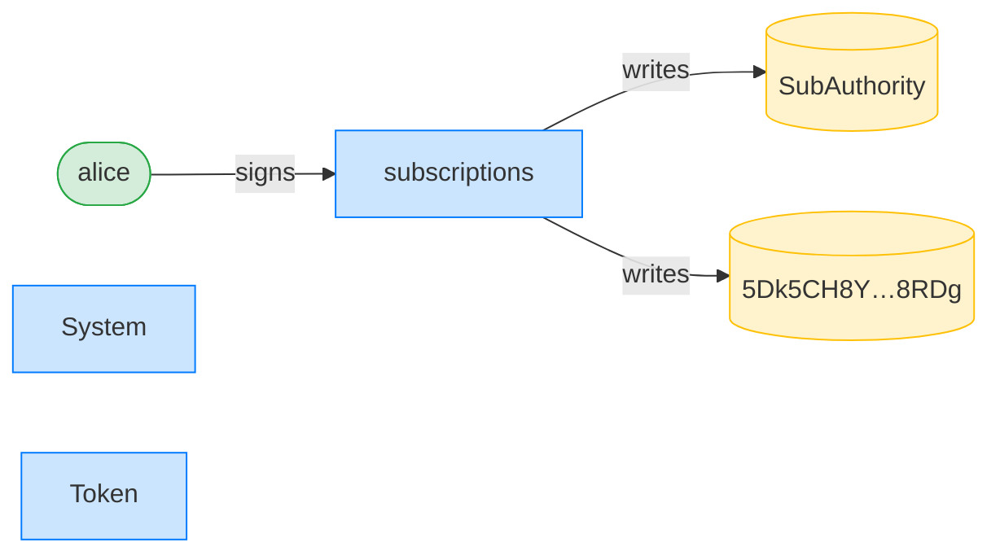

**InitSubscriptionAuthority: ownership graph**

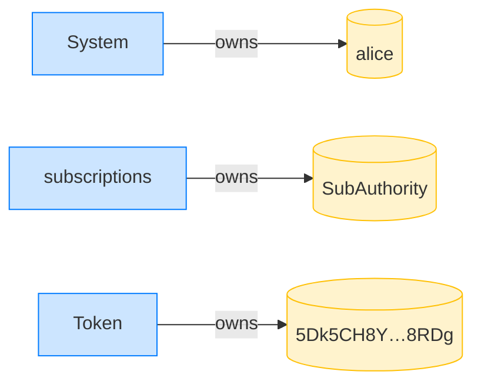

**CreatePlan: structured CPI tree**

```text

Transaction  signers=[merchant]
└── subscriptions::CreatePlan [1] ✓ 3468cu  signer=merchant
    └── System [2] ✓ (no cu)
Compute Units (this run): 3468
Fee: 5000 lamports
Legend (2):
  merchant      = J4fPsxKiTTKiXSiN9bgZ5JBrVgTM9c6N8tjhLN8gfdTq
  subscriptions = De1egAFMkMWZSN5rYXRj9CAdheBamobVNubTsi9avR44
```

**CreatePlan: sequence diagram**

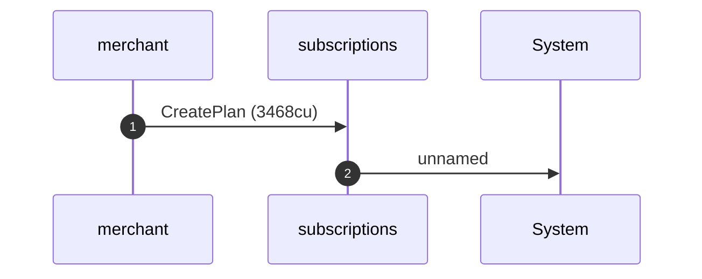

**CreatePlan: sequence diagram, with lifelines**

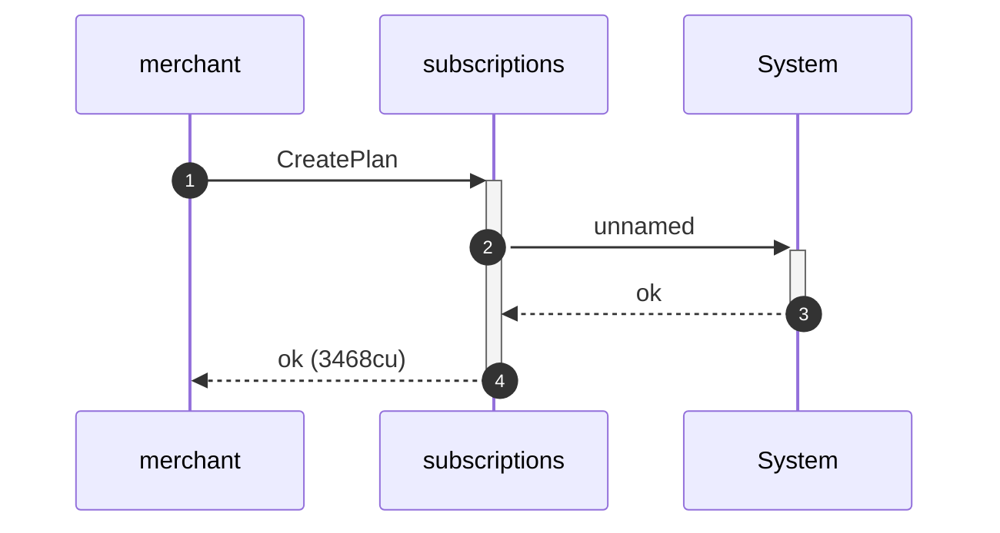

**CreatePlan: authority graph**

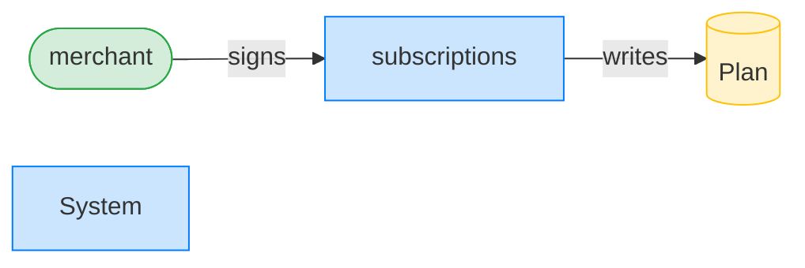

**CreatePlan: ownership graph**

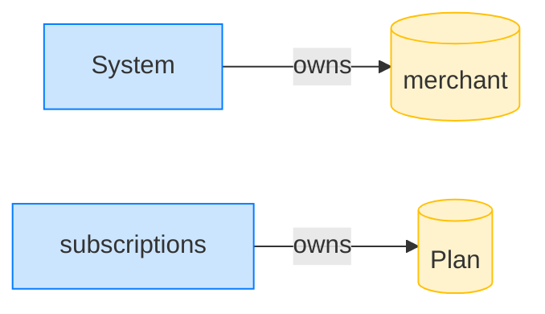

### The whitelisted puller pulls 10 tokens to the merchant ATA

**TransferSubscription (authorized puller): structured CPI tree**

```text

Transaction  signers=[puller]
└── subscriptions::TransferSubscription [1] ✓ 5955cu  signer=puller
    ├── Token [2] ✓ 113cu
    └── subscriptions [2] ✓ 137cu
Compute Units (this run): 5955
Fee: 5000 lamports
Legend (2):
  puller        = 6MyHPNpi5TVyR6mNQ3RbqUpt3XjpABEFQXirP3Fyosot
  subscriptions = De1egAFMkMWZSN5rYXRj9CAdheBamobVNubTsi9avR44
```

**TransferSubscription (authorized puller): sequence diagram**

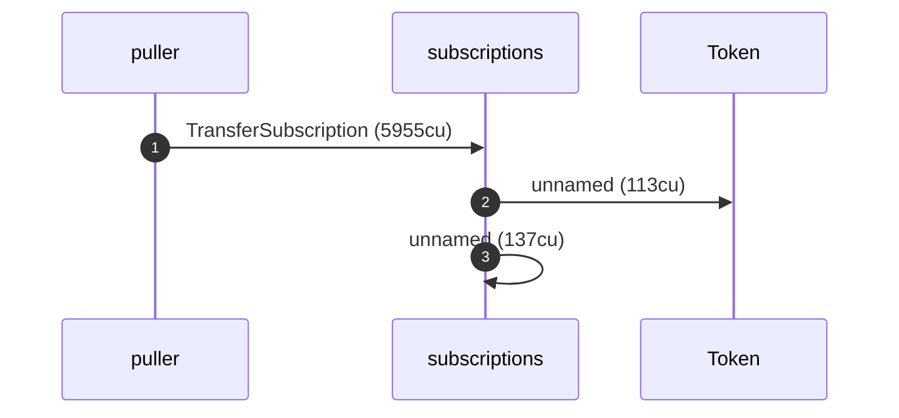

**TransferSubscription (authorized puller): sequence diagram, with lifelines**

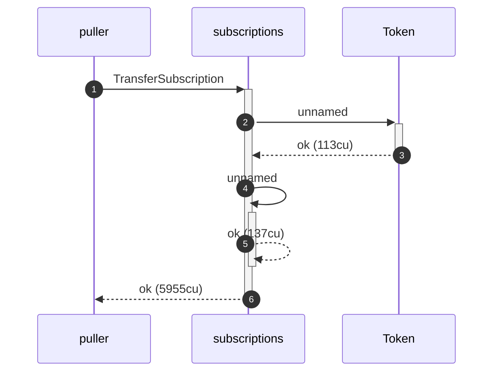

**TransferSubscription (authorized puller): authority graph**

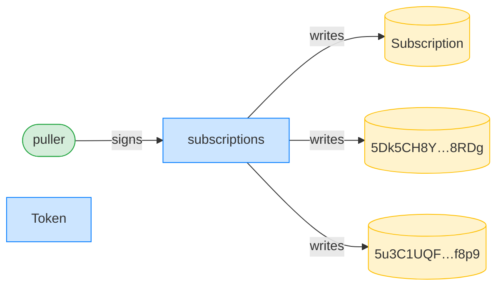

**TransferSubscription (authorized puller): ownership graph**

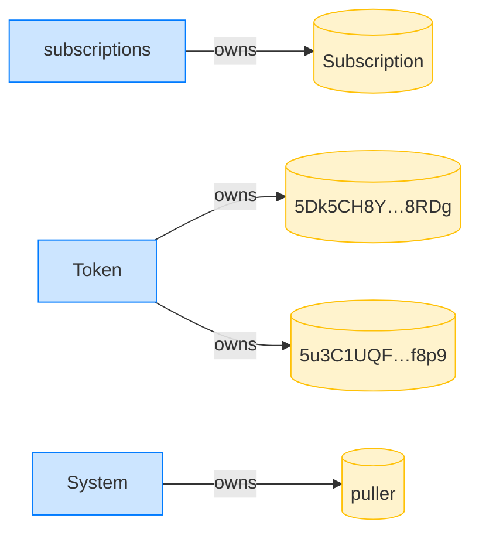

- [x] the merchant received 10 tokens: `10000000`
