## Transfer subscription: the period rolls over — PASS

> advancing past the period boundary resets the pulled amount

### Stage: Alice's authority, the merchant's plan, Alice subscribed

**InitSubscriptionAuthority: structured CPI tree**

```text

── subscriptions::InitSubscriptionAuthority ────────────────
Transaction  signers=[alice]
└── subscriptions::InitSubscriptionAuthority [1] ✓ 6242cu  signer=alice
    ├── System::CreateAccount [2] ✓ (no cu)
    └── Token::Approve [2] ✓ 126cu
Compute Units (this run): 6242
Fee: 5000 lamports
Legend (2):
  subscriptions = De1egAFMkMWZSN5rYXRj9CAdheBamobVNubTsi9avR44
  alice         = FXddRd8CdAC8SWKT3Ataasn69R7rbTfQZcKg8ejyrUbF
```

**InitSubscriptionAuthority: sequence diagram**

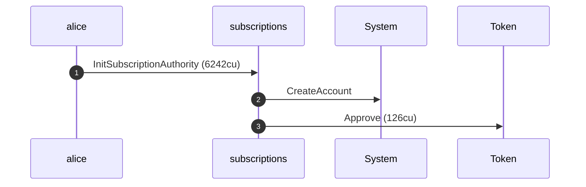

**InitSubscriptionAuthority: sequence diagram, with lifelines**

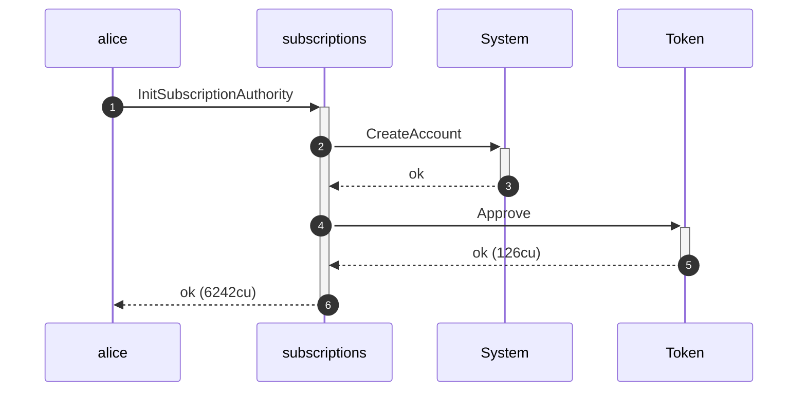

**InitSubscriptionAuthority: authority graph**

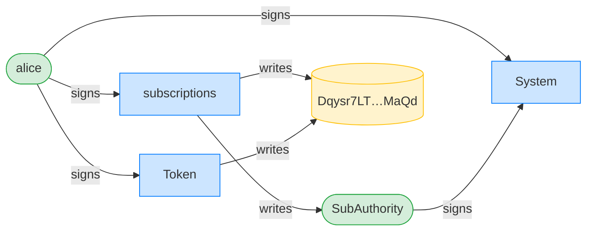

**InitSubscriptionAuthority: ownership graph**

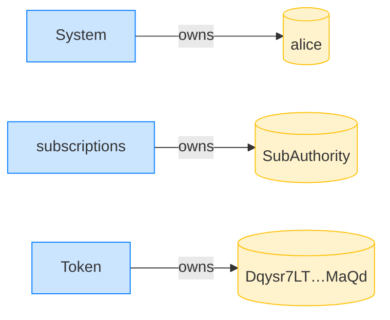

**CreatePlan: structured CPI tree**

```text

── subscriptions::CreatePlan ───────────────────────────────
Transaction  signers=[merchant]
└── subscriptions::CreatePlan [1] ✓ 3468cu  signer=merchant
    └── System::CreateAccount [2] ✓ (no cu)
Compute Units (this run): 3468
Fee: 5000 lamports
Legend (2):
  subscriptions = De1egAFMkMWZSN5rYXRj9CAdheBamobVNubTsi9avR44
  merchant      = J4fPsxKiTTKiXSiN9bgZ5JBrVgTM9c6N8tjhLN8gfdTq
```

**CreatePlan: sequence diagram**

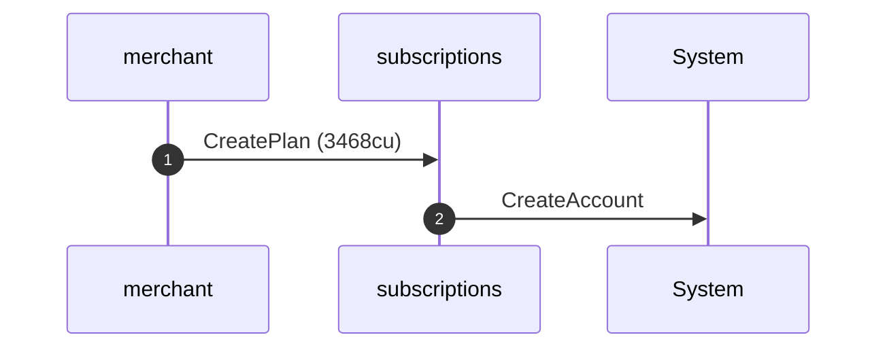

**CreatePlan: sequence diagram, with lifelines**

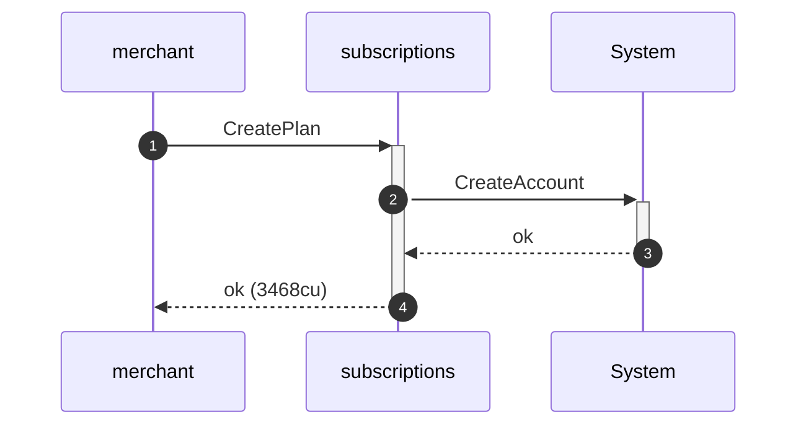

**CreatePlan: authority graph**

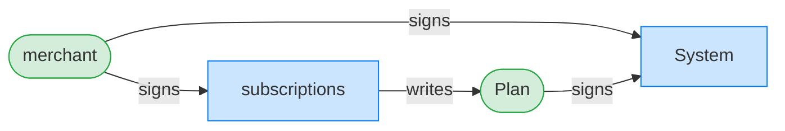

**CreatePlan: ownership graph**

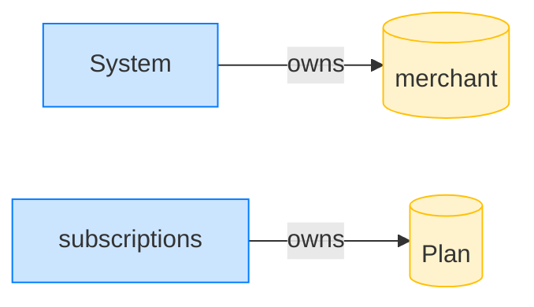

### The merchant pulls the full 50-token period

**TransferSubscription (period 1): structured CPI tree**

```text

── subscriptions::TransferSubscription ─────────────────────
Transaction  signers=[merchant]
└── subscriptions::TransferSubscription [1] ✓ 5942cu  signer=merchant
    ├── Token::TransferChecked [2] ✓ 113cu
    └── subscriptions::EmitEvent [2] ✓ 137cu
Compute Units (this run): 5942
Fee: 5000 lamports
Legend (2):
  subscriptions = De1egAFMkMWZSN5rYXRj9CAdheBamobVNubTsi9avR44
  merchant      = J4fPsxKiTTKiXSiN9bgZ5JBrVgTM9c6N8tjhLN8gfdTq
```

**TransferSubscription (period 1): sequence diagram**

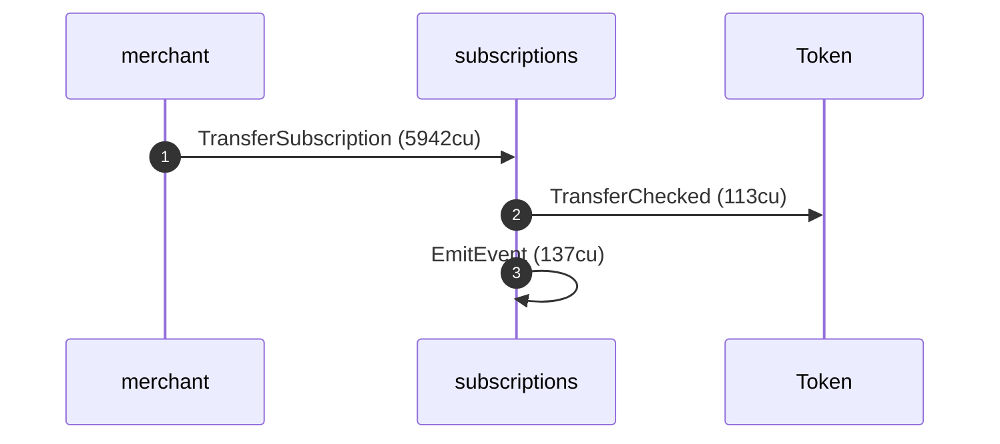

**TransferSubscription (period 1): sequence diagram, with lifelines**


**TransferSubscription (period 1): authority graph**

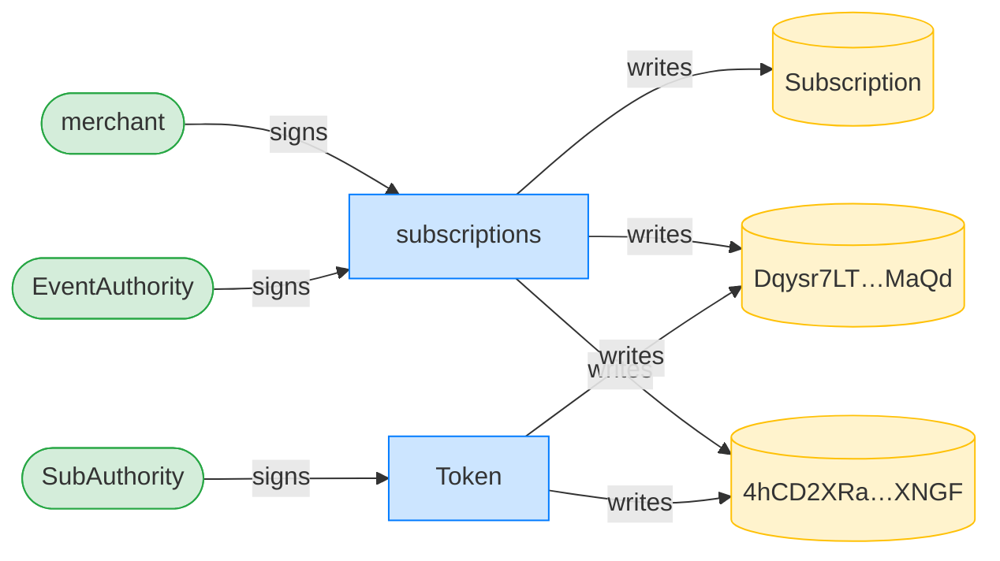

**TransferSubscription (period 1): ownership graph**

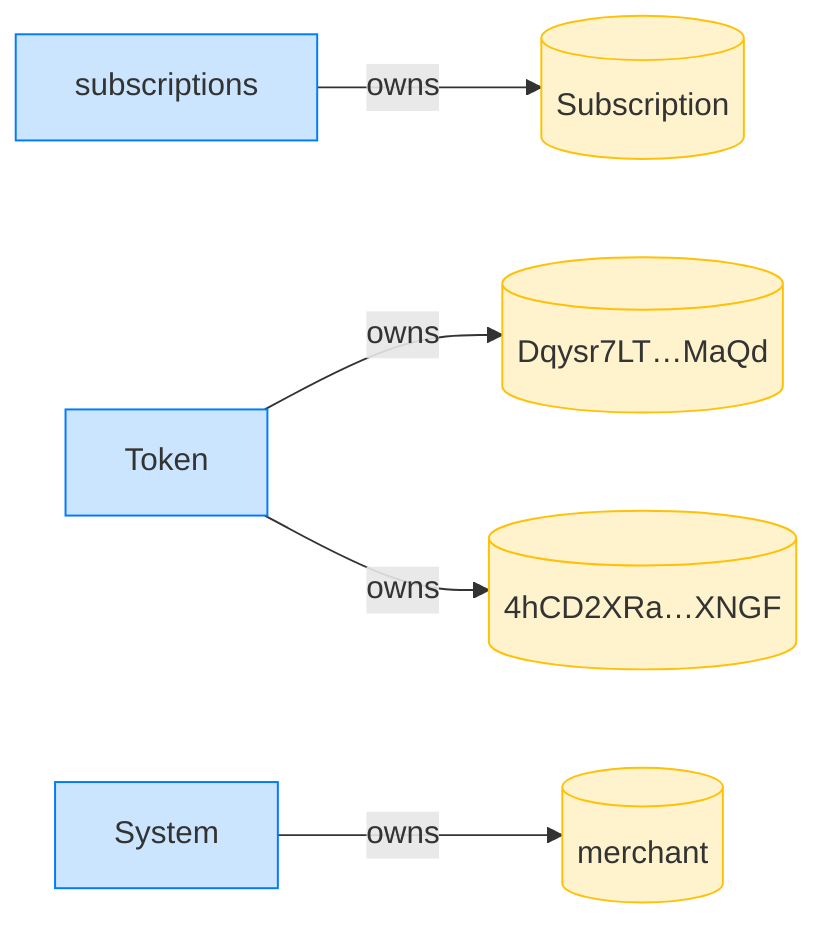

- [x] the merchant has the full period: `50000000`

### The clock advances one period

### The merchant pulls 30 tokens in the new period

**TransferSubscription (period 2): structured CPI tree**

```text

── subscriptions::TransferSubscription ─────────────────────
Transaction  signers=[merchant]
└── subscriptions::TransferSubscription [1] ✓ 6033cu  signer=merchant
    ├── Token::TransferChecked [2] ✓ 113cu
    └── subscriptions::EmitEvent [2] ✓ 137cu
Compute Units (this run): 6033
Fee: 5000 lamports
Legend (2):
  subscriptions = De1egAFMkMWZSN5rYXRj9CAdheBamobVNubTsi9avR44
  merchant      = J4fPsxKiTTKiXSiN9bgZ5JBrVgTM9c6N8tjhLN8gfdTq
```

**TransferSubscription (period 2): sequence diagram**


**TransferSubscription (period 2): sequence diagram, with lifelines**

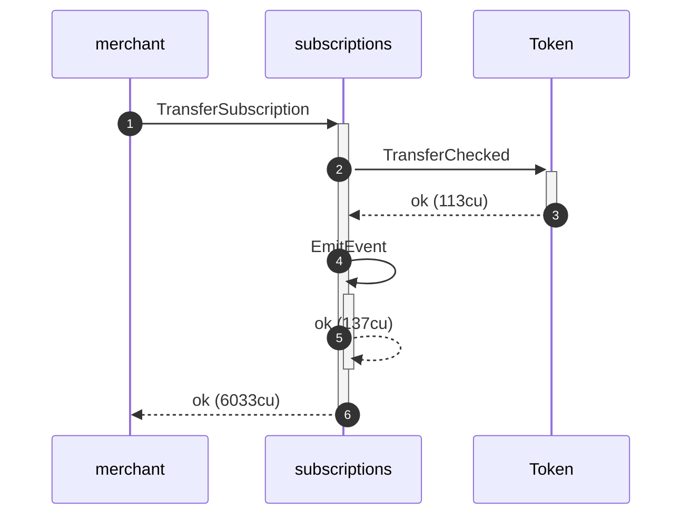

**TransferSubscription (period 2): authority graph**


**TransferSubscription (period 2): ownership graph**


- [x] the merchant total is 80 tokens: `80000000`
- [x] the pulled-in-period reset to 30 tokens: `30000000`
