## A sponsor can revoke a subscription once the plan is closed — PASS

> after the merchant sunsets and deletes the plan, the sponsor can revoke the subscription

### Stage: Alice's authority, the merchant's plan, Alice subscribed (sponsored)

**InitSubscriptionAuthority: structured CPI tree**

```text

── subscriptions::Approve ──────────────────────────────────
Transaction  signers=[alice]
└── subscriptions::InitSubscriptionAuthority [1] ✓ 13520cu  signer=alice
    ├── System::CreateAccount [2] ✓ (no cu)
    └── Token::Approve [2] ✓ 2904cu
Compute Units (this run): 13520
Fee: 0 lamports
Legend (2):
  subscriptions = De1egAFMkMWZSN5rYXRj9CAdheBamobVNubTsi9avR44
  alice         = FXddRd8CdAC8SWKT3Ataasn69R7rbTfQZcKg8ejyrUbF
```

**InitSubscriptionAuthority: sequence diagram**

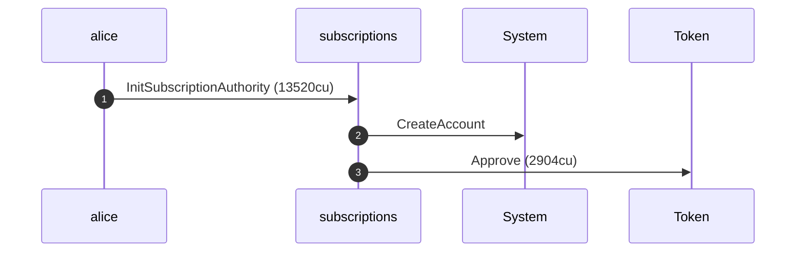

**InitSubscriptionAuthority: sequence diagram, with lifelines**

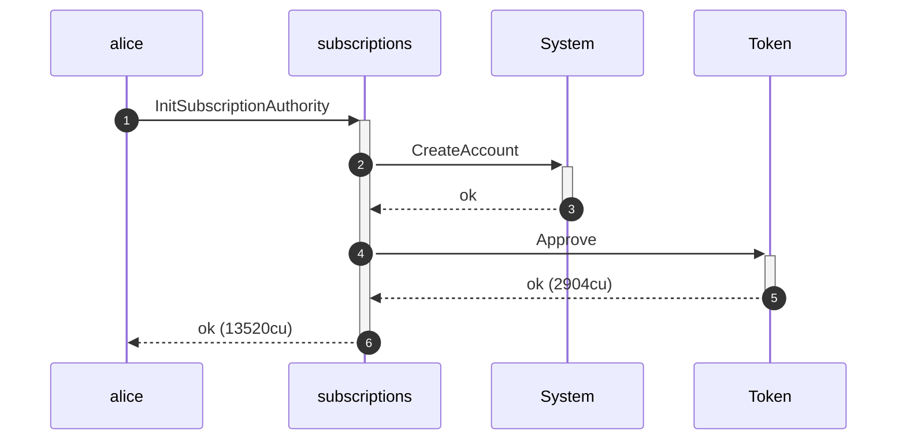

**InitSubscriptionAuthority: authority graph**

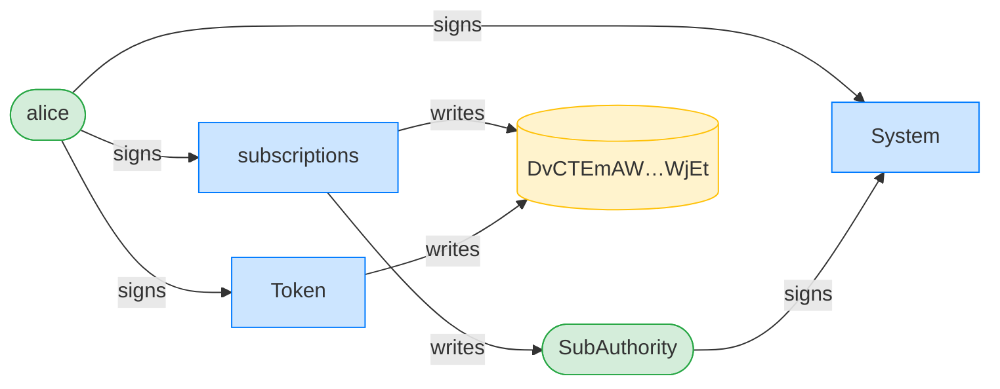

**InitSubscriptionAuthority: ownership graph**

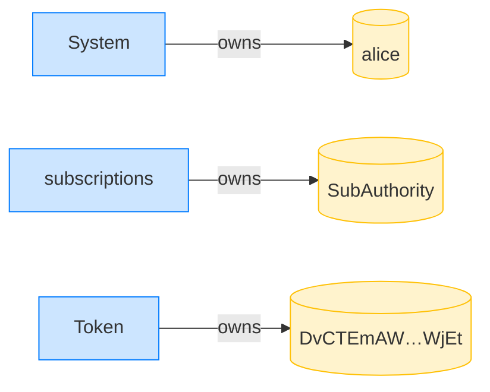

**CreatePlan: structured CPI tree**

```text

── subscriptions::CreatePlan ───────────────────────────────
Transaction  signers=[merchant]
└── subscriptions::CreatePlan [1] ✓ 3468cu  signer=merchant
    └── System::CreateAccount [2] ✓ (no cu)
Compute Units (this run): 3468
Fee: 0 lamports
Legend (2):
  subscriptions = De1egAFMkMWZSN5rYXRj9CAdheBamobVNubTsi9avR44
  merchant      = J4fPsxKiTTKiXSiN9bgZ5JBrVgTM9c6N8tjhLN8gfdTq
```

**CreatePlan: sequence diagram**

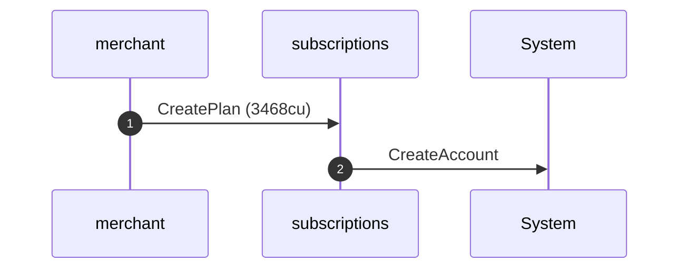

**CreatePlan: sequence diagram, with lifelines**

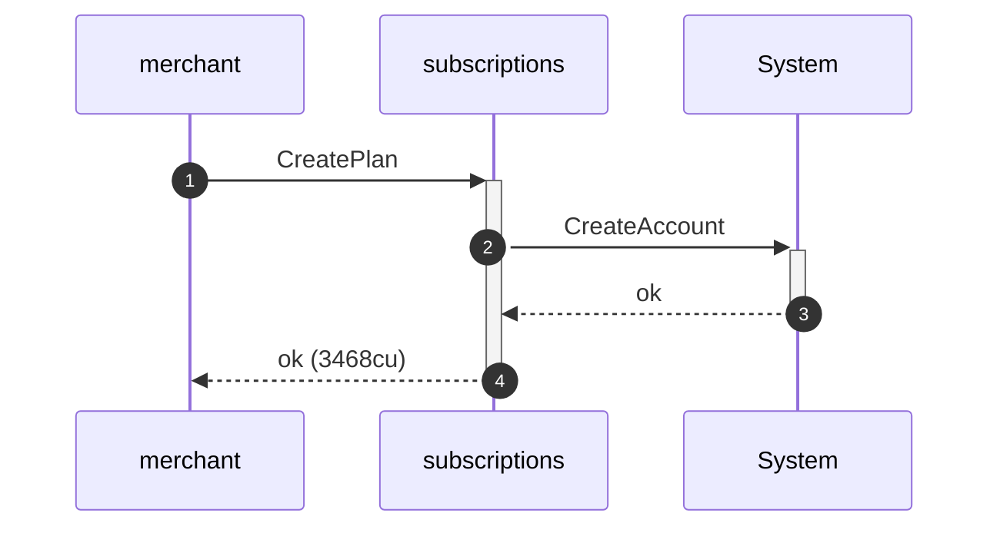

**CreatePlan: authority graph**

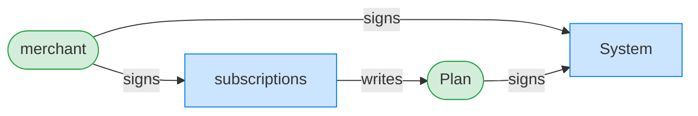

**CreatePlan: ownership graph**

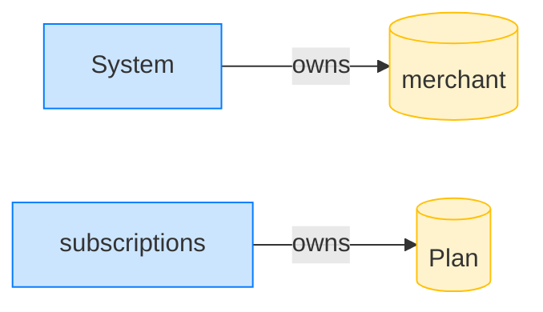

**Subscribe (sponsored): structured CPI tree**

```text

── subscriptions::Subscribe ────────────────────────────────
Transaction  signers=[sponsor, alice]
└── subscriptions::Subscribe [1] ✓ 6540cu  signer=[alice, sponsor]
    ├── System::CreateAccount [2] ✓ (no cu)
    └── subscriptions::EmitEvent [2] ✓ 137cu
          🔔 SubscriptionCreated
               plan:       Plan,
               subscriber: alice,
               mint:       USDC mint,
               created_ts: 1700000000
Compute Units (this run): 6540
Fee: 0 lamports
Legend (3):
  subscriptions = De1egAFMkMWZSN5rYXRj9CAdheBamobVNubTsi9avR44
  sponsor       = 47cncVPgU4mK37H7VvxLCCsoDEKYaVhNLHHp4MbnEwvx
  alice         = FXddRd8CdAC8SWKT3Ataasn69R7rbTfQZcKg8ejyrUbF
```

**Subscribe (sponsored): sequence diagram**

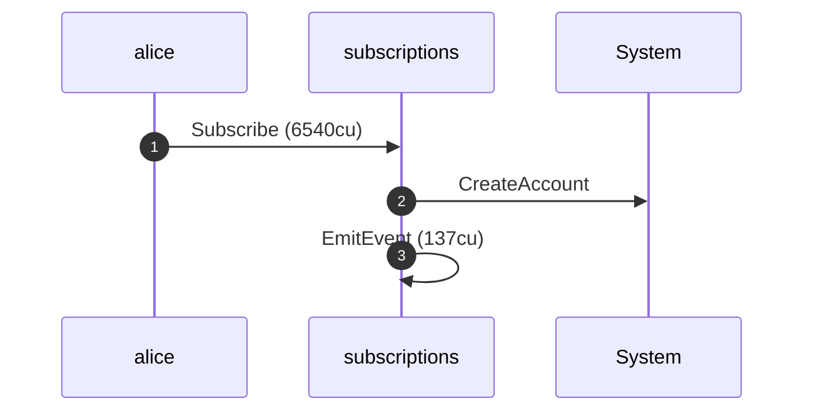

**Subscribe (sponsored): sequence diagram, with lifelines**

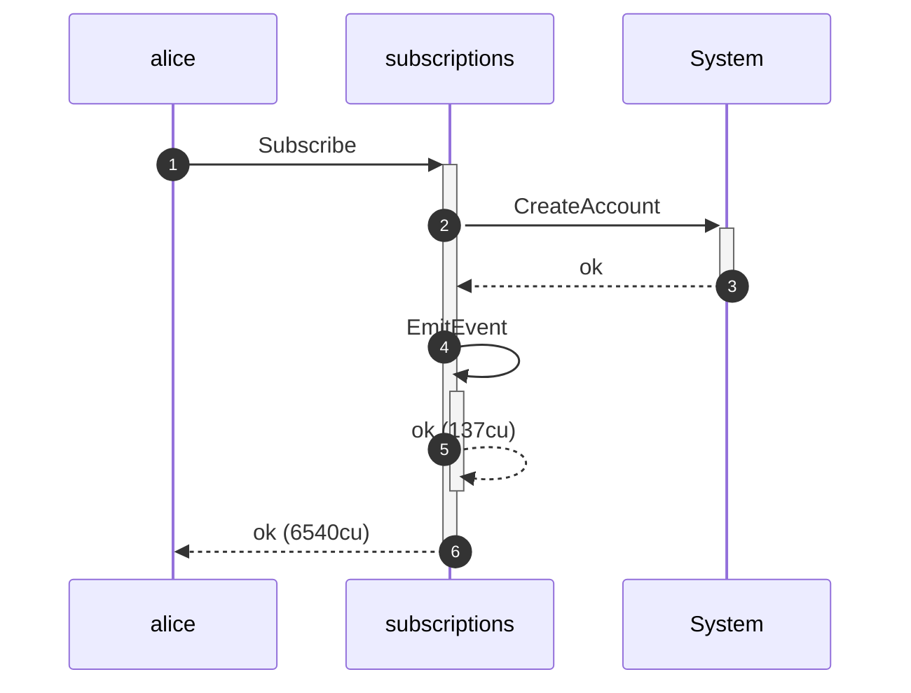

**Subscribe (sponsored): authority graph**

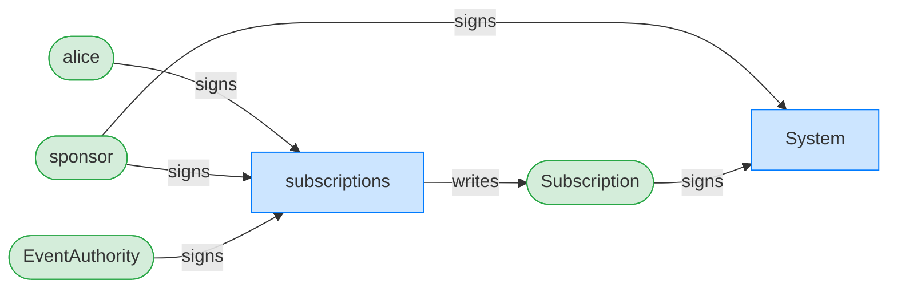

**Subscribe (sponsored): ownership graph**

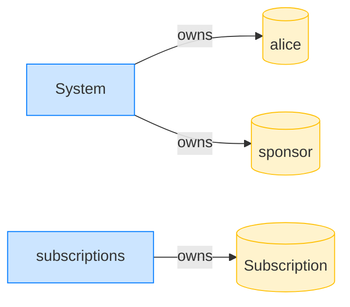

### The merchant sunsets the plan

**UpdatePlan (sunset): structured CPI tree**

```text

── subscriptions::UpdatePlan ───────────────────────────────
Transaction  signers=[merchant]
└── subscriptions::UpdatePlan [1] ✓ 500cu  signer=merchant
Compute Units (this run): 500
Fee: 0 lamports
Legend (2):
  subscriptions = De1egAFMkMWZSN5rYXRj9CAdheBamobVNubTsi9avR44
  merchant      = J4fPsxKiTTKiXSiN9bgZ5JBrVgTM9c6N8tjhLN8gfdTq
```

**UpdatePlan (sunset): sequence diagram**

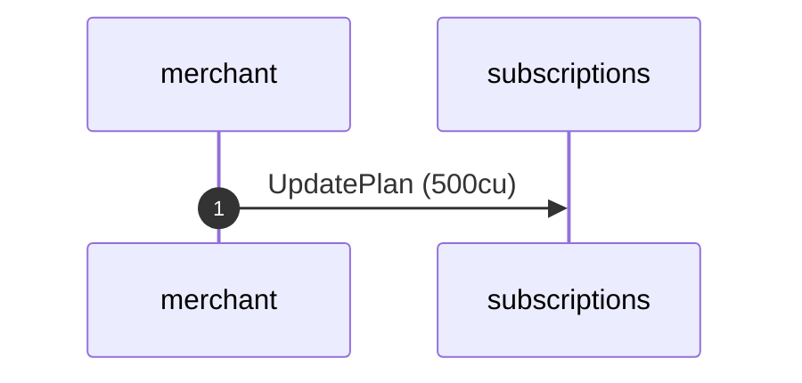

**UpdatePlan (sunset): sequence diagram, with lifelines**

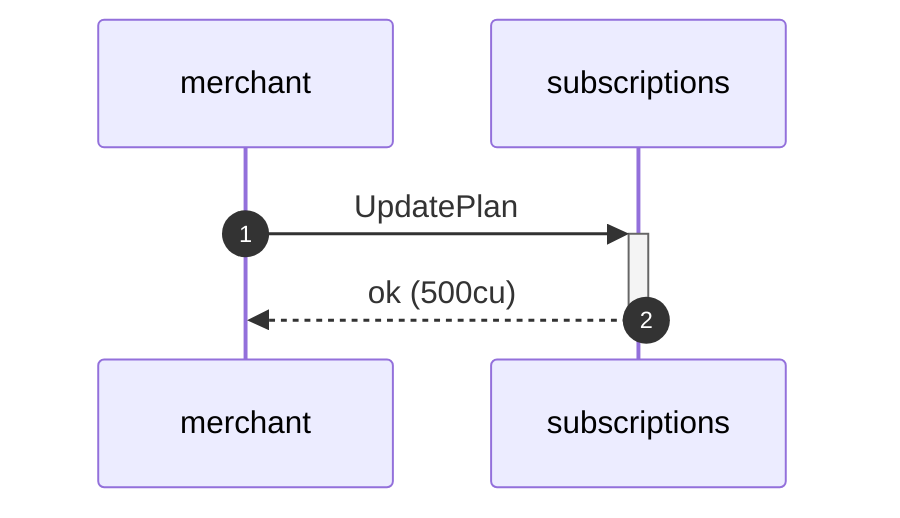

**UpdatePlan (sunset): authority graph**

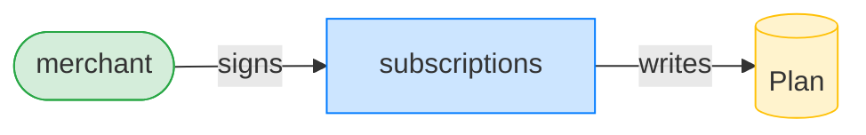

**UpdatePlan (sunset): ownership graph**


### The merchant deletes the expired plan

**DeletePlan: structured CPI tree**

```text

── subscriptions::DeletePlan ───────────────────────────────
Transaction  signers=[merchant]
└── subscriptions::DeletePlan [1] ✓ 366cu  signer=merchant
Compute Units (this run): 366
Fee: 0 lamports
Legend (2):
  subscriptions = De1egAFMkMWZSN5rYXRj9CAdheBamobVNubTsi9avR44
  merchant      = J4fPsxKiTTKiXSiN9bgZ5JBrVgTM9c6N8tjhLN8gfdTq
```

**DeletePlan: sequence diagram**


**DeletePlan: sequence diagram, with lifelines**

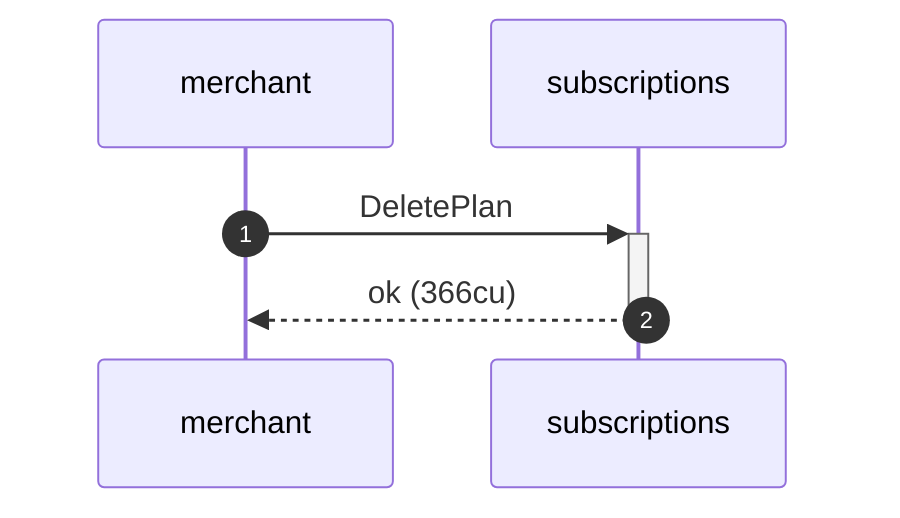

**DeletePlan: authority graph**


**DeletePlan: ownership graph**

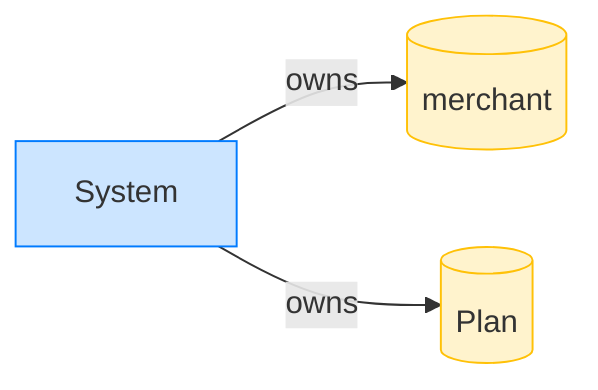

### The sponsor revokes against the closed plan

**RevokeSubscription (plan closed): structured CPI tree**

```text

── subscriptions::RevokeDelegation ─────────────────────────
Transaction  signers=[sponsor]
└── subscriptions::RevokeDelegation [1] ✓ 460cu  signer=sponsor
Compute Units (this run): 460
Fee: 0 lamports
Legend (2):
  subscriptions = De1egAFMkMWZSN5rYXRj9CAdheBamobVNubTsi9avR44
  sponsor       = 47cncVPgU4mK37H7VvxLCCsoDEKYaVhNLHHp4MbnEwvx
```

**RevokeSubscription (plan closed): sequence diagram**

```mermaid
sequenceDiagram
    autonumber
    participant sponsor
    participant subscriptions
    sponsor ->> subscriptions: RevokeDelegation (460cu)
```

**RevokeSubscription (plan closed): sequence diagram, with lifelines**

```mermaid
sequenceDiagram
    autonumber
    participant sponsor
    participant subscriptions
    sponsor ->>+ subscriptions: RevokeDelegation
    subscriptions -->>- sponsor: ok (460cu)
```

**RevokeSubscription (plan closed): authority graph**

```mermaid
flowchart LR
    classDef signer fill:#d4edda,stroke:#28a745;
    classDef program fill:#cce5ff,stroke:#007bff;
    classDef writable fill:#fff3cd,stroke:#ffc107;
    subscriptions[subscriptions]:::program
    sponsor([sponsor]):::signer
    Subscription[(Subscription)]:::writable
    sponsor -->|signs| subscriptions
    subscriptions -->|writes| Subscription
```

**RevokeSubscription (plan closed): ownership graph**

```mermaid
flowchart LR
    classDef owner fill:#cce5ff,stroke:#007bff;
    classDef account fill:#fff3cd,stroke:#ffc107;
    System[System]:::owner
    sponsor[(sponsor)]:::account
    Subscription[(Subscription)]:::account
    System -->|owns| sponsor
    System -->|owns| Subscription
```
