## A zero expiry means no expiry — PASS

> a zero expiry_ts records an open-ended delegation that still pulls after a long warp

### Alice initializes her subscription authority

**InitSubscriptionAuthority: structured CPI tree**

```text

── subscriptions::Approve ──────────────────────────────────
Transaction  signers=[alice]
└── subscriptions::InitSubscriptionAuthority [1] ✓ 9020cu  signer=alice
    ├── System::CreateAccount [2] ✓ (no cu)
    └── Token::Approve [2] ✓ 2904cu
Compute Units (this run): 9020
Fee: 0 lamports
Legend (2):
  subscriptions = De1egAFMkMWZSN5rYXRj9CAdheBamobVNubTsi9avR44
  alice         = FXddRd8CdAC8SWKT3Ataasn69R7rbTfQZcKg8ejyrUbF
```

**InitSubscriptionAuthority: sequence diagram**

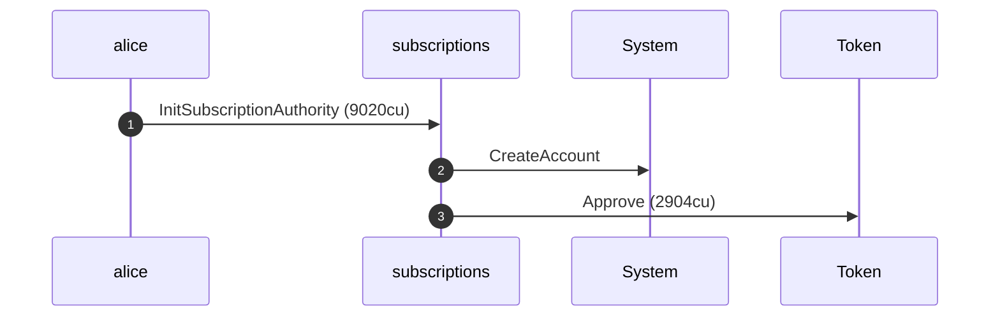

**InitSubscriptionAuthority: sequence diagram, with lifelines**

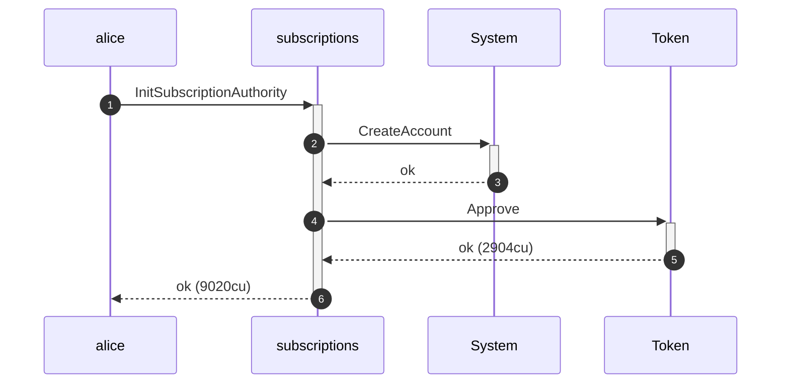

**InitSubscriptionAuthority: authority graph**

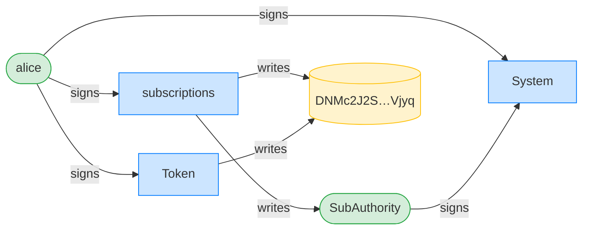

**InitSubscriptionAuthority: ownership graph**

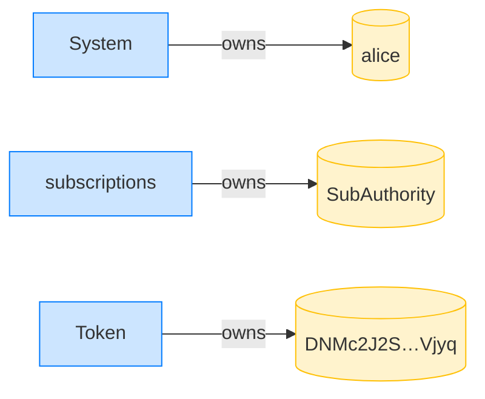

### Alice creates an open-ended (zero expiry) delegation

**CreateRecurringDelegation (zero expiry): structured CPI tree**

```text

── subscriptions::CreateRecurringDelegation ────────────────
Transaction  signers=[alice]
└── subscriptions::CreateRecurringDelegation [1] ✓ 3571cu  signer=alice
    └── System::CreateAccount [2] ✓ (no cu)
Compute Units (this run): 3571
Fee: 0 lamports
Legend (2):
  subscriptions = De1egAFMkMWZSN5rYXRj9CAdheBamobVNubTsi9avR44
  alice         = FXddRd8CdAC8SWKT3Ataasn69R7rbTfQZcKg8ejyrUbF
```

**CreateRecurringDelegation (zero expiry): sequence diagram**

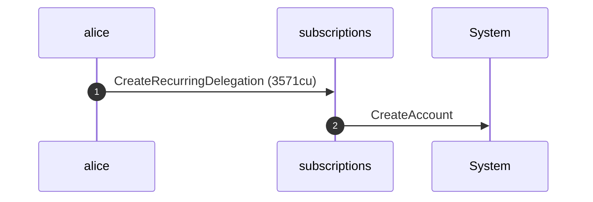

**CreateRecurringDelegation (zero expiry): sequence diagram, with lifelines**

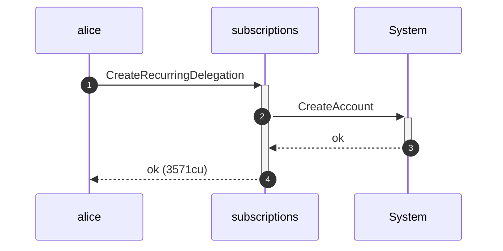

**CreateRecurringDelegation (zero expiry): authority graph**

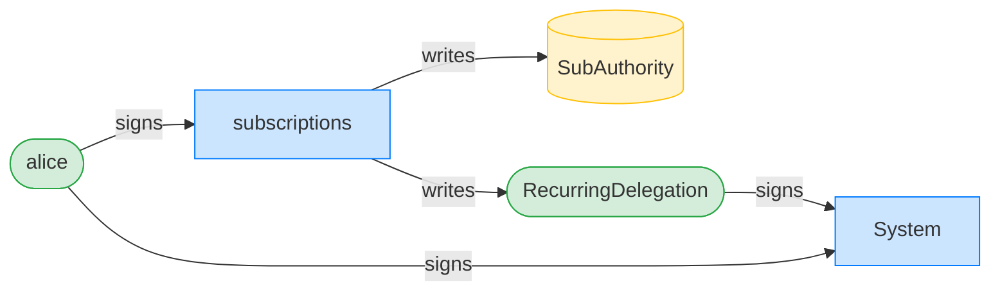

**CreateRecurringDelegation (zero expiry): ownership graph**

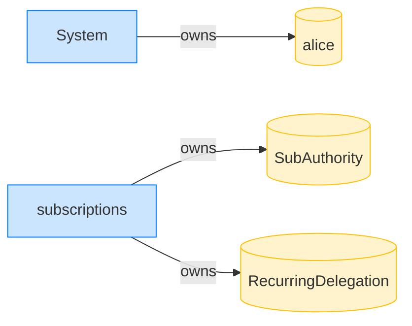

- [x] the expiry is recorded as zero (open-ended): `0`

### The clock advances 30 days; the delegation is still pullable

**TransferRecurring: structured CPI tree**

```text

── subscriptions::TransferChecked ──────────────────────────
Transaction  signers=[bob]
└── subscriptions::TransferRecurring [1] ✓ 11919cu  signer=bob
    ├── Token::TransferChecked [2] ✓ 6280cu
    └── subscriptions::EmitEvent [2] ✓ 137cu
          🔔 RecurringTransfer
               delegatee:        bob,
               amount:           10000000,
               pulled_in_period: 10000000,
               receiver:         bob
Compute Units (this run): 11919
Fee: 0 lamports
Legend (2):
  subscriptions = De1egAFMkMWZSN5rYXRj9CAdheBamobVNubTsi9avR44
  bob           = 9S8NPMnzAba71o3tr8dHDzUrfT5NesYFzP56QFpYieMR
```

**TransferRecurring: sequence diagram**

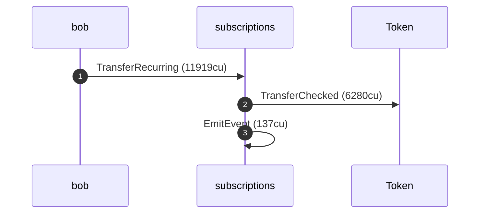

**TransferRecurring: sequence diagram, with lifelines**

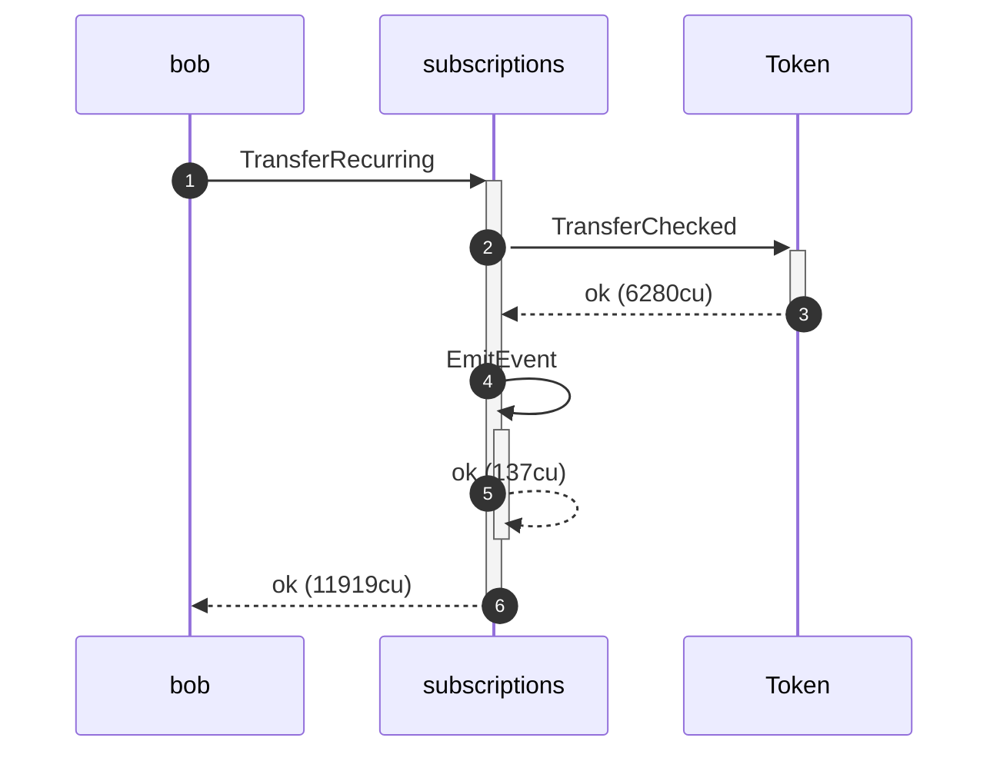

**TransferRecurring: authority graph**

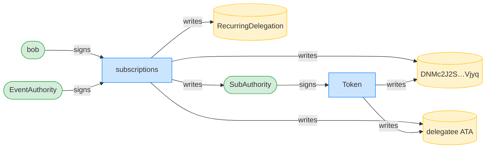

**TransferRecurring: ownership graph**

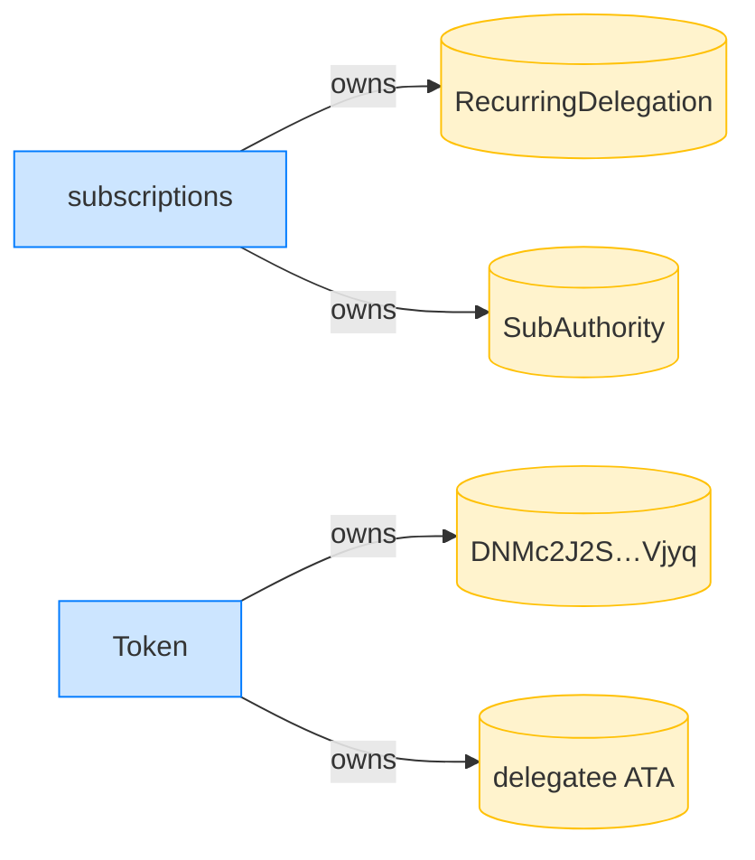

- [x] the pulled amount landed in Bob's ATA: `10000000`
