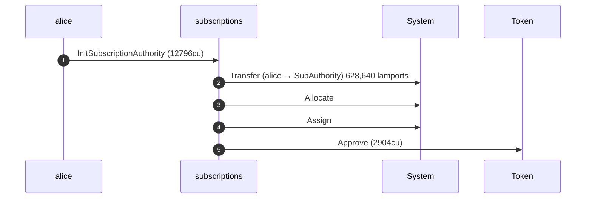
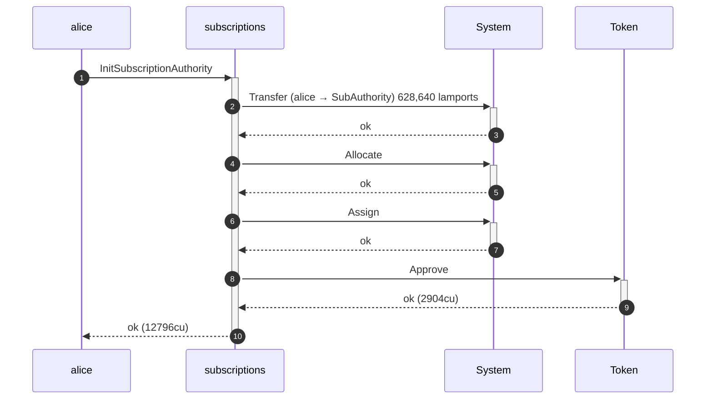
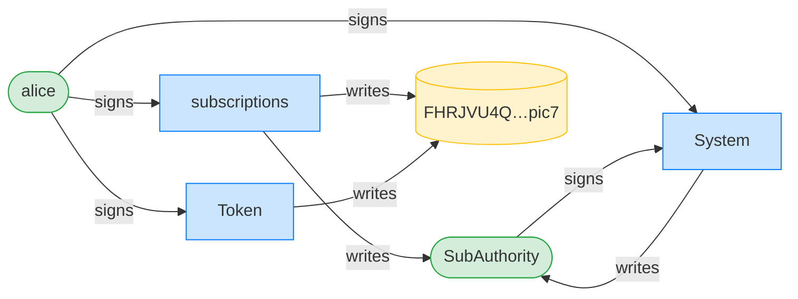
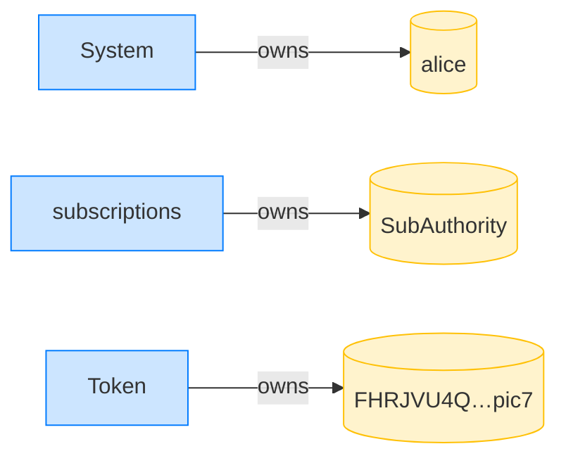

## AUDIT 3.1.3 (regression): the fix survives a pre-funded PDA — PASS

> the PR5 fix tops up a pre-funded PDA so Alice can still initialize (Cantina HIGH 3.1.3)

### Mallory pre-funds Alice's authority PDA address

### Alice tries to initialize her authority

**InitSubscriptionAuthority: structured CPI tree**

```text

── subscriptions::Approve ──────────────────────────────────
Transaction  signers=[alice]
└── subscriptions::InitSubscriptionAuthority [1] ✓ 12796cu  signer=alice
    ├── System::Transfer (alice -> SubAuthority) 628,640 lamports [2] ✓ (no cu)
    ├── System::Allocate [2] ✓ (no cu)
    ├── System::Assign [2] ✓ (no cu)
    └── Token::Approve [2] ✓ 2904cu
Compute Units (this run): 12796
Fee: 0 lamports
Legend (2):
  subscriptions = De1egAFMkMWZSN5rYXRj9CAdheBamobVNubTsi9avR44
  alice         = FXddRd8CdAC8SWKT3Ataasn69R7rbTfQZcKg8ejyrUbF
```

**InitSubscriptionAuthority: sequence diagram**



**InitSubscriptionAuthority: sequence diagram, with lifelines**



**InitSubscriptionAuthority: authority graph**



**InitSubscriptionAuthority: ownership graph**



Finding 3.1.3: the PDA address was pre-funded, so the unconditional CreateAccount on this branch is rejected by the System program and Alice's authority cannot be created — a permanent denial of service against any user whose (deterministic) PDA Mallory front-runs. On the fixed code (PR5) the program tops up the rent and Allocate/Assign-s in place, creation succeeds, and the check below confirms it — this regression guards the fix.

- [x] the fix survives the pre-funded PDA (creation succeeds): `false`
