## Cancel on a ghost plan expires immediately — PASS

> a recreated plan (same id, new terms) gives a cancelled subscription no grace period

### Stage: Alice's authority, the merchant's plan, Alice subscribed

**InitSubscriptionAuthority: structured CPI tree**

```text

── subscriptions::Approve ──────────────────────────────────
Transaction  signers=[alice]
└── subscriptions::InitSubscriptionAuthority [1] ✓ 12020cu  signer=alice
    ├── System::CreateAccount [2] ✓ (no cu)
    └── Token::Approve [2] ✓ 2904cu
Compute Units (this run): 12020
Fee: 0 lamports
Legend (2):
  subscriptions = De1egAFMkMWZSN5rYXRj9CAdheBamobVNubTsi9avR44
  alice         = FXddRd8CdAC8SWKT3Ataasn69R7rbTfQZcKg8ejyrUbF
```

**InitSubscriptionAuthority: sequence diagram**

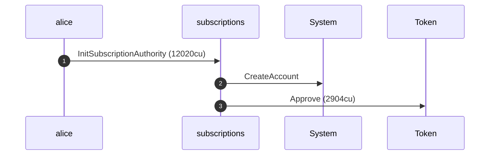

**InitSubscriptionAuthority: sequence diagram, with lifelines**

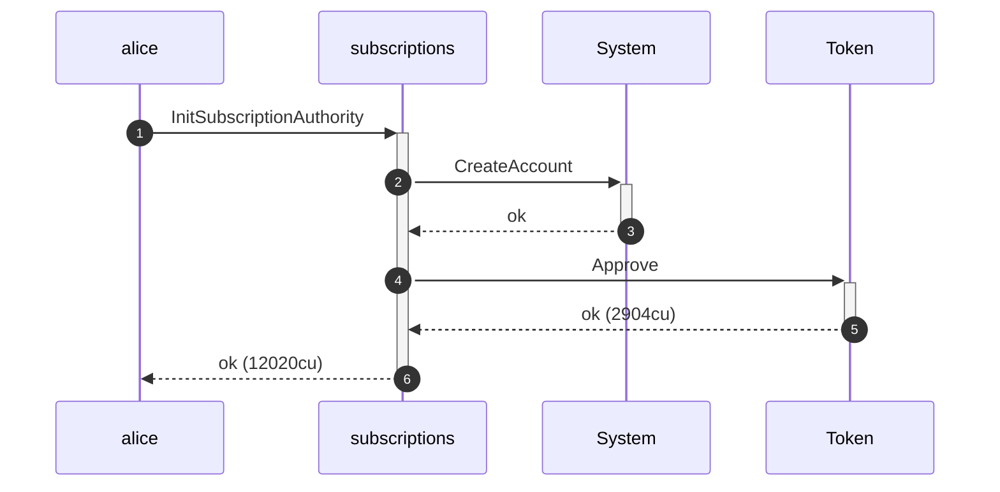

**InitSubscriptionAuthority: authority graph**

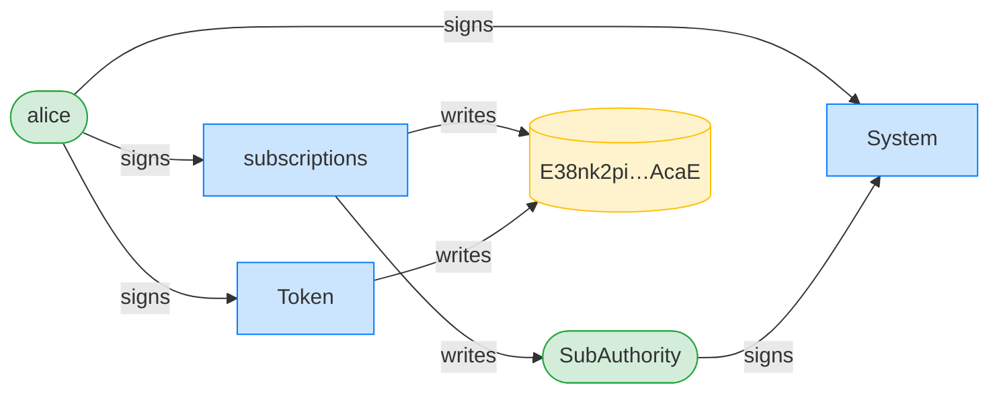

**InitSubscriptionAuthority: ownership graph**

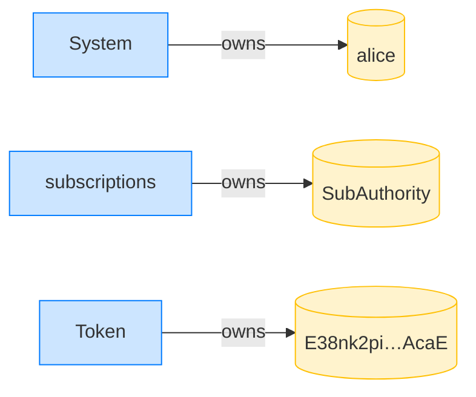

**CreatePlan: structured CPI tree**

```text

── subscriptions::CreatePlan ───────────────────────────────
Transaction  signers=[merchant]
└── subscriptions::CreatePlan [1] ✓ 3468cu  signer=merchant
    └── System::CreateAccount [2] ✓ (no cu)
Compute Units (this run): 3468
Fee: 0 lamports
Legend (2):
  subscriptions = De1egAFMkMWZSN5rYXRj9CAdheBamobVNubTsi9avR44
  merchant      = J4fPsxKiTTKiXSiN9bgZ5JBrVgTM9c6N8tjhLN8gfdTq
```

**CreatePlan: sequence diagram**

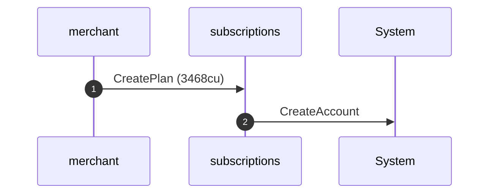

**CreatePlan: sequence diagram, with lifelines**

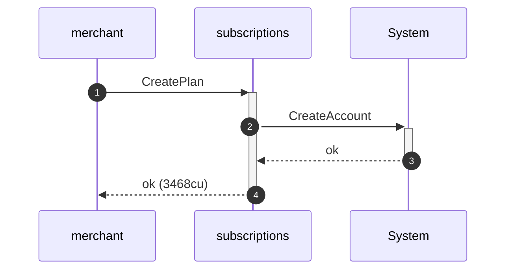

**CreatePlan: authority graph**

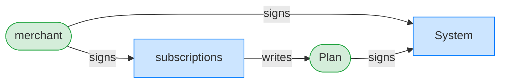

**CreatePlan: ownership graph**

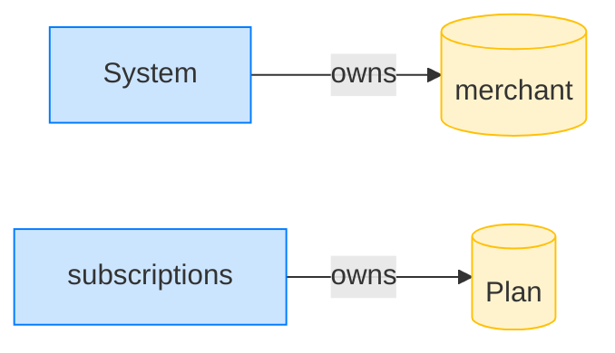

**Subscribe: structured CPI tree**

```text

── subscriptions::Subscribe ────────────────────────────────
Transaction  signers=[alice]
└── subscriptions::Subscribe [1] ✓ 6516cu  signer=alice
    ├── System::CreateAccount [2] ✓ (no cu)
    └── subscriptions::EmitEvent [2] ✓ 137cu
          🔔 SubscriptionCreated
               plan:       Plan,
               subscriber: alice,
               mint:       USDC mint,
               created_ts: 1700000000
Compute Units (this run): 6516
Fee: 0 lamports
Legend (2):
  subscriptions = De1egAFMkMWZSN5rYXRj9CAdheBamobVNubTsi9avR44
  alice         = FXddRd8CdAC8SWKT3Ataasn69R7rbTfQZcKg8ejyrUbF
```

**Subscribe: sequence diagram**

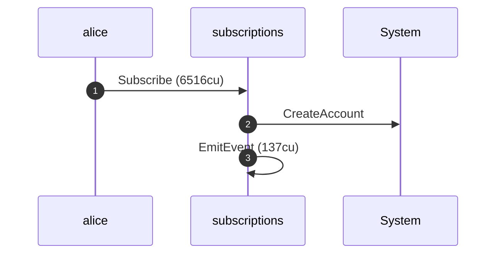

**Subscribe: sequence diagram, with lifelines**

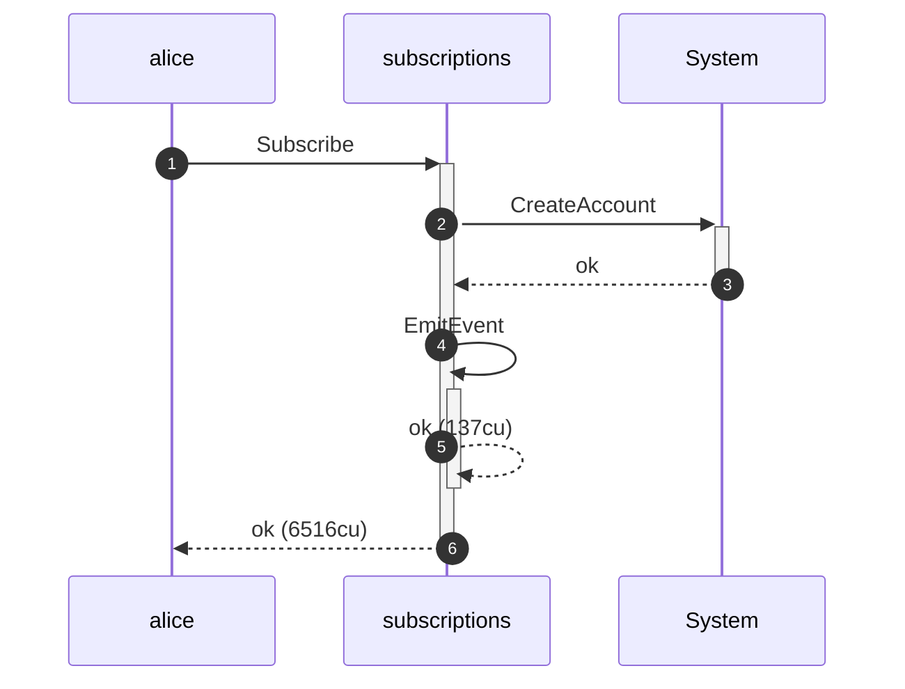

**Subscribe: authority graph**

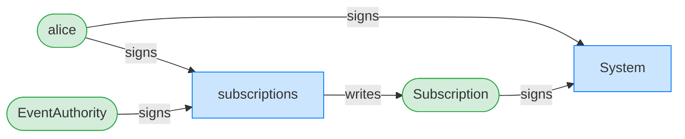

**Subscribe: ownership graph**

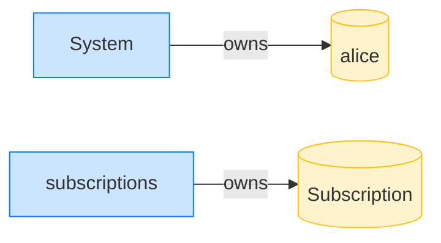

### The merchant sunsets the plan

**UpdatePlan (sunset): structured CPI tree**

```text

── subscriptions::UpdatePlan ───────────────────────────────
Transaction  signers=[merchant]
└── subscriptions::UpdatePlan [1] ✓ 500cu  signer=merchant
Compute Units (this run): 500
Fee: 0 lamports
Legend (2):
  subscriptions = De1egAFMkMWZSN5rYXRj9CAdheBamobVNubTsi9avR44
  merchant      = J4fPsxKiTTKiXSiN9bgZ5JBrVgTM9c6N8tjhLN8gfdTq
```

**UpdatePlan (sunset): sequence diagram**

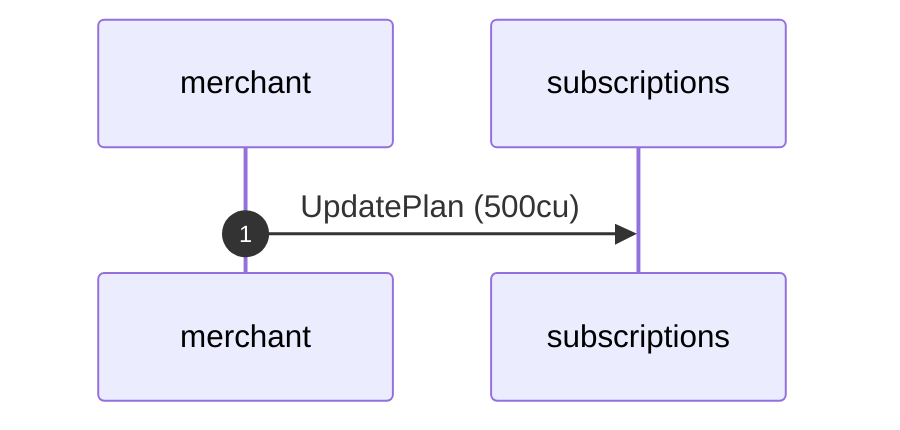

**UpdatePlan (sunset): sequence diagram, with lifelines**

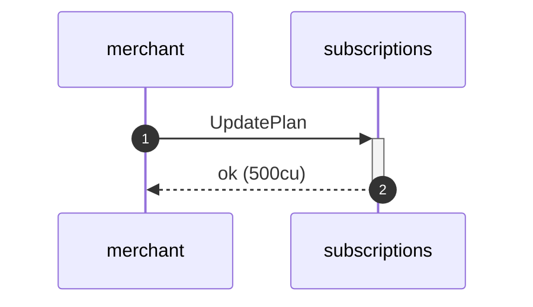

**UpdatePlan (sunset): authority graph**


**UpdatePlan (sunset): ownership graph**


### The merchant deletes the expired plan

**DeletePlan: structured CPI tree**

```text

── subscriptions::DeletePlan ───────────────────────────────
Transaction  signers=[merchant]
└── subscriptions::DeletePlan [1] ✓ 366cu  signer=merchant
Compute Units (this run): 366
Fee: 0 lamports
Legend (2):
  subscriptions = De1egAFMkMWZSN5rYXRj9CAdheBamobVNubTsi9avR44
  merchant      = J4fPsxKiTTKiXSiN9bgZ5JBrVgTM9c6N8tjhLN8gfdTq
```

**DeletePlan: sequence diagram**


**DeletePlan: sequence diagram, with lifelines**

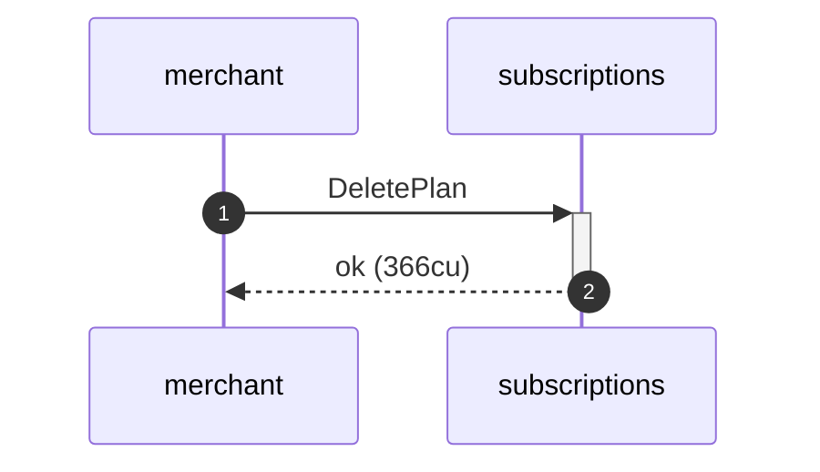

**DeletePlan: authority graph**

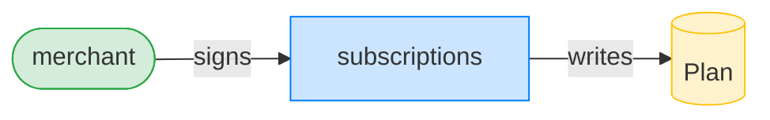

**DeletePlan: ownership graph**

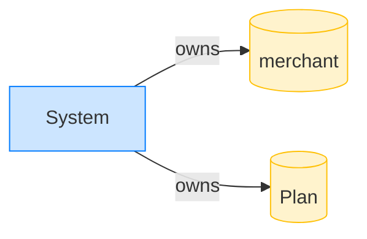

### The merchant recreates a plan with the same id but new terms (a ghost plan)

**CreatePlan (ghost): structured CPI tree**

```text

── subscriptions::CreatePlan ───────────────────────────────
Transaction  signers=[merchant]
└── subscriptions::CreatePlan [1] ✓ 3468cu  signer=merchant
    └── System::CreateAccount [2] ✓ (no cu)
Compute Units (this run): 3468
Fee: 0 lamports
Legend (2):
  subscriptions = De1egAFMkMWZSN5rYXRj9CAdheBamobVNubTsi9avR44
  merchant      = J4fPsxKiTTKiXSiN9bgZ5JBrVgTM9c6N8tjhLN8gfdTq
```

**CreatePlan (ghost): sequence diagram**

```mermaid
sequenceDiagram
    autonumber
    participant merchant
    participant subscriptions
    participant System
    merchant ->> subscriptions: CreatePlan (3468cu)
    subscriptions ->> System: CreateAccount
```

**CreatePlan (ghost): sequence diagram, with lifelines**

```mermaid
sequenceDiagram
    autonumber
    participant merchant
    participant subscriptions
    participant System
    merchant ->>+ subscriptions: CreatePlan
    subscriptions ->>+ System: CreateAccount
    System -->>- subscriptions: ok
    subscriptions -->>- merchant: ok (3468cu)
```

**CreatePlan (ghost): authority graph**

```mermaid
flowchart LR
    classDef signer fill:#d4edda,stroke:#28a745;
    classDef program fill:#cce5ff,stroke:#007bff;
    classDef writable fill:#fff3cd,stroke:#ffc107;
    subscriptions[subscriptions]:::program
    merchant([merchant]):::signer
    Plan([Plan]):::signer
    System[System]:::program
    merchant -->|signs| subscriptions
    merchant -->|signs| System
    Plan -->|signs| System
    subscriptions -->|writes| Plan
```

**CreatePlan (ghost): ownership graph**

```mermaid
flowchart LR
    classDef owner fill:#cce5ff,stroke:#007bff;
    classDef account fill:#fff3cd,stroke:#ffc107;
    System[System]:::owner
    merchant[(merchant)]:::account
    subscriptions[subscriptions]:::owner
    Plan[(Plan)]:::account
    System -->|owns| merchant
    subscriptions -->|owns| Plan
```

- [x] the recreated plan resolves to the same PDA: `6rGpcSJciD37aqctggyrJTLjrL1n73dgm5U8JFoNjWxW`

### Alice cancels against the ghost plan

**CancelSubscription (ghost): structured CPI tree**

```text

── subscriptions::CancelSubscription ───────────────────────
Transaction  signers=[alice]
└── subscriptions::CancelSubscription [1] ✓ 1729cu  signer=alice
    └── subscriptions::EmitEvent [2] ✓ 137cu
Compute Units (this run): 1729
Fee: 0 lamports
Legend (2):
  subscriptions = De1egAFMkMWZSN5rYXRj9CAdheBamobVNubTsi9avR44
  alice         = FXddRd8CdAC8SWKT3Ataasn69R7rbTfQZcKg8ejyrUbF
```

**CancelSubscription (ghost): sequence diagram**

```mermaid
sequenceDiagram
    autonumber
    participant alice
    participant subscriptions
    alice ->> subscriptions: CancelSubscription (1729cu)
    subscriptions ->> subscriptions: EmitEvent (137cu)
```

**CancelSubscription (ghost): sequence diagram, with lifelines**

```mermaid
sequenceDiagram
    autonumber
    participant alice
    participant subscriptions
    alice ->>+ subscriptions: CancelSubscription
    subscriptions ->>+ subscriptions: EmitEvent
    subscriptions -->>- subscriptions: ok (137cu)
    subscriptions -->>- alice: ok (1729cu)
```

**CancelSubscription (ghost): authority graph**

```mermaid
flowchart LR
    classDef signer fill:#d4edda,stroke:#28a745;
    classDef program fill:#cce5ff,stroke:#007bff;
    classDef writable fill:#fff3cd,stroke:#ffc107;
    subscriptions[subscriptions]:::program
    alice([alice]):::signer
    Subscription[(Subscription)]:::writable
    EventAuthority([EventAuthority]):::signer
    alice -->|signs| subscriptions
    EventAuthority -->|signs| subscriptions
    subscriptions -->|writes| Subscription
```

**CancelSubscription (ghost): ownership graph**

```mermaid
flowchart LR
    classDef owner fill:#cce5ff,stroke:#007bff;
    classDef account fill:#fff3cd,stroke:#ffc107;
    subscriptions[subscriptions]:::owner
    Subscription[(Subscription)]:::account
    subscriptions -->|owns| Subscription
```

- [x] expires immediately at the current clock (no grace period): `1700259200`
