## Create multiple delegations at different nonces — PASS

> distinct nonces derive distinct delegation PDAs

**InitSubscriptionAuthority: structured CPI tree**

```text

── subscriptions::Approve ──────────────────────────────────
Transaction  signers=[alice]
└── subscriptions::InitSubscriptionAuthority [1] ✓ 10520cu  signer=alice
    ├── System::CreateAccount [2] ✓ (no cu)
    └── Token::Approve [2] ✓ 2904cu
Compute Units (this run): 10520
Fee: 0 lamports
Legend (2):
  subscriptions = De1egAFMkMWZSN5rYXRj9CAdheBamobVNubTsi9avR44
  alice         = FXddRd8CdAC8SWKT3Ataasn69R7rbTfQZcKg8ejyrUbF
```

**InitSubscriptionAuthority: sequence diagram**

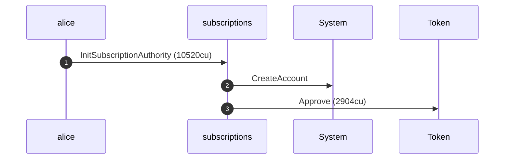

**InitSubscriptionAuthority: sequence diagram, with lifelines**

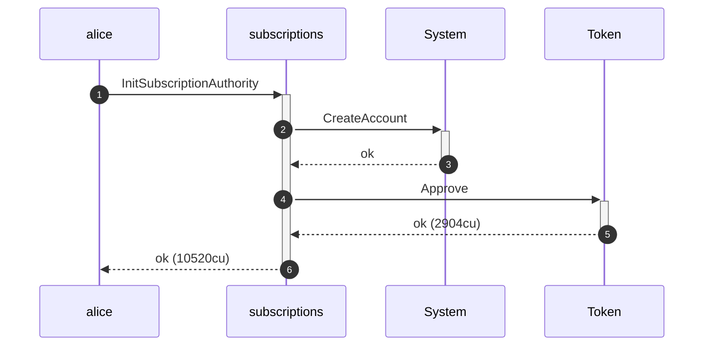

**InitSubscriptionAuthority: authority graph**

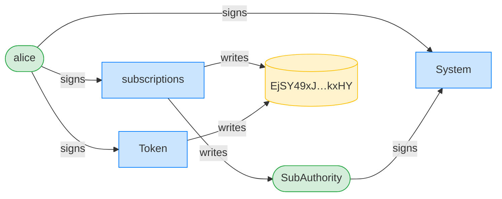

**InitSubscriptionAuthority: ownership graph**

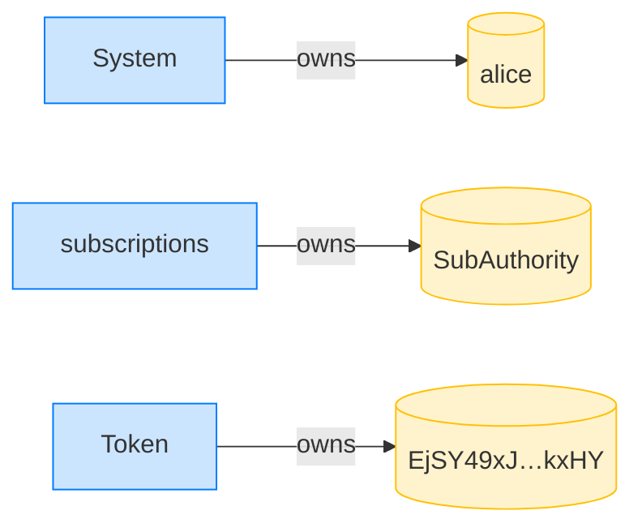

### Alice creates three delegations at nonces 0, 1, 2

**CreateFixedDelegation (nonce 0): structured CPI tree**

```text

── subscriptions::CreateFixedDelegation ────────────────────
Transaction  signers=[alice]
└── subscriptions::CreateFixedDelegation [1] ✓ 3538cu  signer=alice
    └── System::CreateAccount [2] ✓ (no cu)
Compute Units (this run): 3538
Fee: 0 lamports
Legend (2):
  subscriptions = De1egAFMkMWZSN5rYXRj9CAdheBamobVNubTsi9avR44
  alice         = FXddRd8CdAC8SWKT3Ataasn69R7rbTfQZcKg8ejyrUbF
```

**CreateFixedDelegation (nonce 0): sequence diagram**

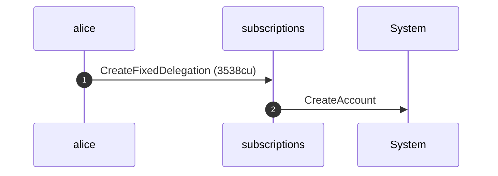

**CreateFixedDelegation (nonce 0): sequence diagram, with lifelines**

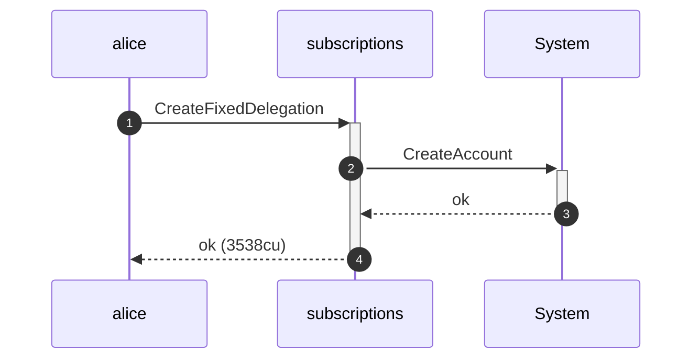

**CreateFixedDelegation (nonce 0): authority graph**

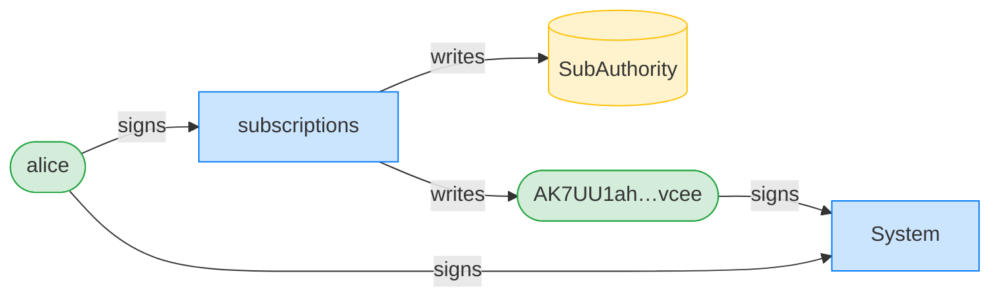

**CreateFixedDelegation (nonce 0): ownership graph**

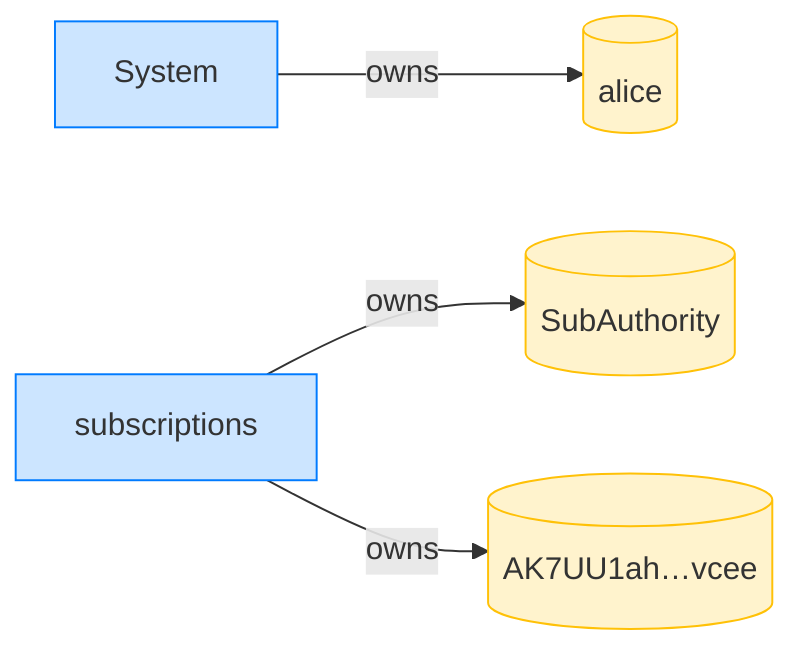

**CreateFixedDelegation (nonce 1): structured CPI tree**

```text

── subscriptions::CreateFixedDelegation ────────────────────
Transaction  signers=[alice]
└── subscriptions::CreateFixedDelegation [1] ✓ 9538cu  signer=alice
    └── System::CreateAccount [2] ✓ (no cu)
Compute Units (this run): 9538
Fee: 0 lamports
Legend (2):
  subscriptions = De1egAFMkMWZSN5rYXRj9CAdheBamobVNubTsi9avR44
  alice         = FXddRd8CdAC8SWKT3Ataasn69R7rbTfQZcKg8ejyrUbF
```

**CreateFixedDelegation (nonce 1): sequence diagram**


**CreateFixedDelegation (nonce 1): sequence diagram, with lifelines**

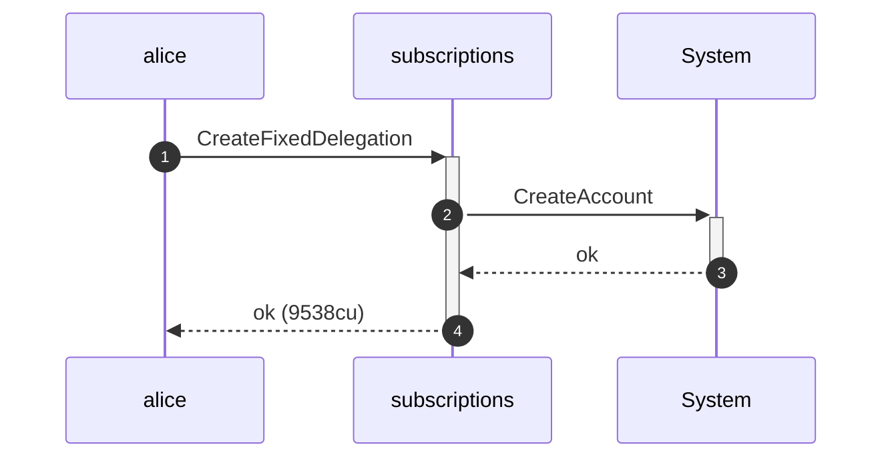

**CreateFixedDelegation (nonce 1): authority graph**


**CreateFixedDelegation (nonce 1): ownership graph**

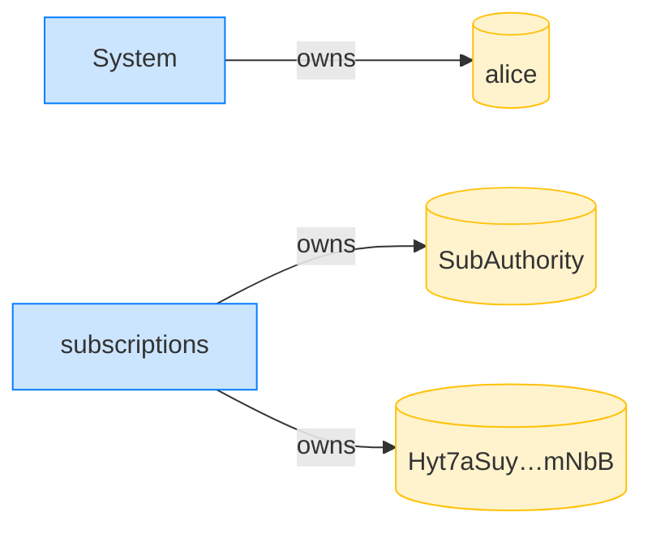

**CreateFixedDelegation (nonce 2): structured CPI tree**

```text

── subscriptions::CreateFixedDelegation ────────────────────
Transaction  signers=[alice]
└── subscriptions::CreateFixedDelegation [1] ✓ 3538cu  signer=alice
    └── System::CreateAccount [2] ✓ (no cu)
Compute Units (this run): 3538
Fee: 0 lamports
Legend (2):
  subscriptions = De1egAFMkMWZSN5rYXRj9CAdheBamobVNubTsi9avR44
  alice         = FXddRd8CdAC8SWKT3Ataasn69R7rbTfQZcKg8ejyrUbF
```

**CreateFixedDelegation (nonce 2): sequence diagram**


**CreateFixedDelegation (nonce 2): sequence diagram, with lifelines**


**CreateFixedDelegation (nonce 2): authority graph**

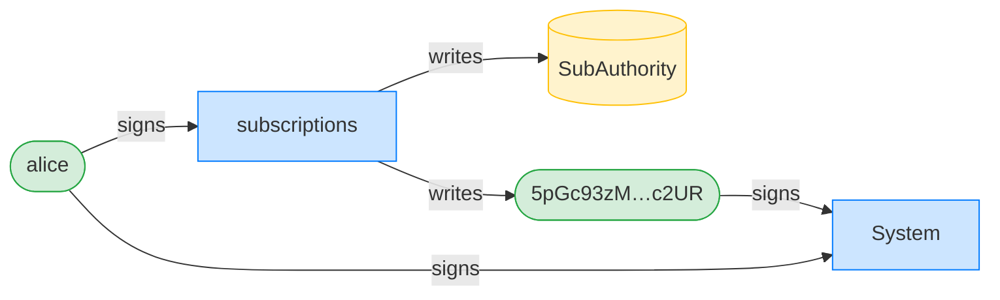

**CreateFixedDelegation (nonce 2): ownership graph**


- [x] nonce 0 lands at the derived PDA: `AK7UU1ahU5RAcxCvQi5JpYJKfnNywjU82wifadH3vcee`
- [x] nonce 1 lands at the derived PDA: `Hyt7aSuykcpic3r1ads6RcmwfjoK1AAVFsEkzmHcmNbB`
- [x] nonce 2 lands at the derived PDA: `5pGc93zMBcerztHmoAAF138oDcNBhWjMMyhSopYHc2UR`
