## Fixed transfer after expiry is refused — PASS

> a pull within the window succeeds; after the clock passes expiry, a further pull is refused

### Stage: Alice's authority and a fixed delegation to Bob

**InitSubscriptionAuthority: structured CPI tree**

```text

── subscriptions::Approve ──────────────────────────────────
Transaction  signers=[alice]
└── subscriptions::InitSubscriptionAuthority [1] ✓ 18020cu  signer=alice
    ├── System::CreateAccount [2] ✓ (no cu)
    └── Token::Approve [2] ✓ 2904cu
Compute Units (this run): 18020
Fee: 0 lamports
Legend (2):
  subscriptions = De1egAFMkMWZSN5rYXRj9CAdheBamobVNubTsi9avR44
  alice         = FXddRd8CdAC8SWKT3Ataasn69R7rbTfQZcKg8ejyrUbF
```

**InitSubscriptionAuthority: sequence diagram**

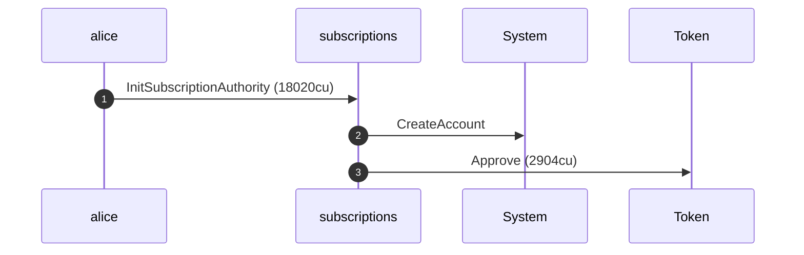

**InitSubscriptionAuthority: sequence diagram, with lifelines**

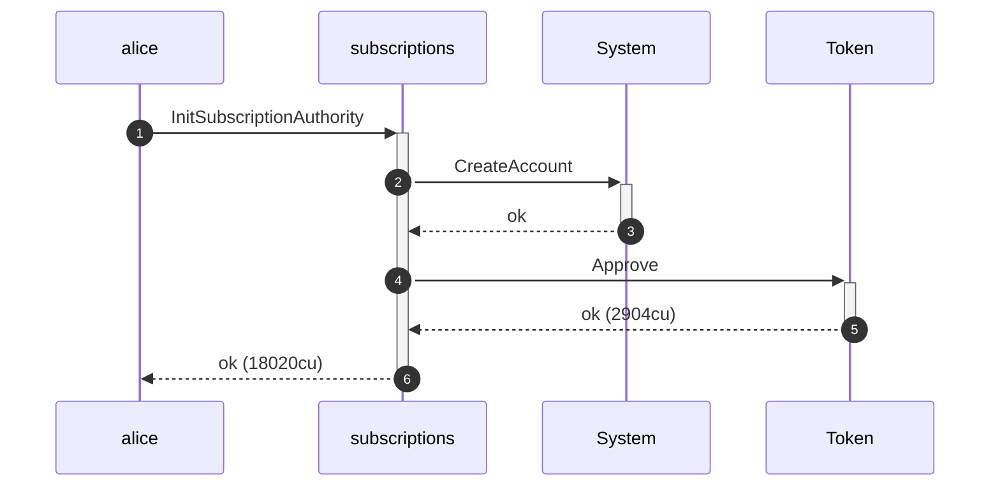

**InitSubscriptionAuthority: authority graph**

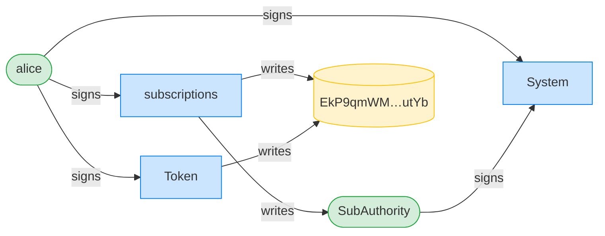

**InitSubscriptionAuthority: ownership graph**

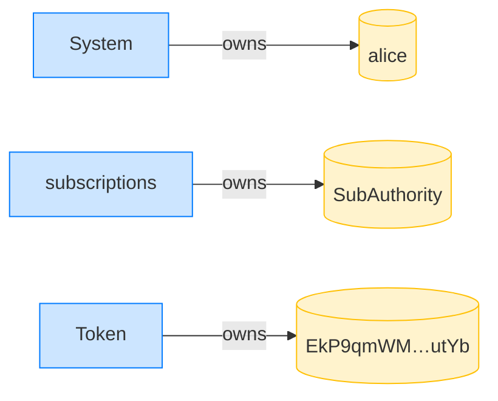

**CreateFixedDelegation: structured CPI tree**

```text

── subscriptions::CreateFixedDelegation ────────────────────
Transaction  signers=[alice]
└── subscriptions::CreateFixedDelegation [1] ✓ 5038cu  signer=alice
    └── System::CreateAccount [2] ✓ (no cu)
Compute Units (this run): 5038
Fee: 0 lamports
Legend (2):
  subscriptions = De1egAFMkMWZSN5rYXRj9CAdheBamobVNubTsi9avR44
  alice         = FXddRd8CdAC8SWKT3Ataasn69R7rbTfQZcKg8ejyrUbF
```

**CreateFixedDelegation: sequence diagram**

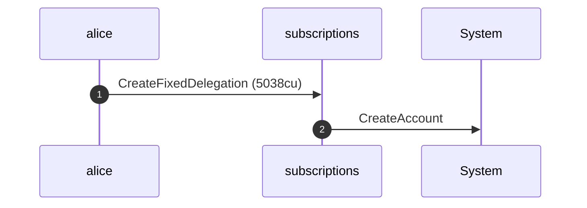

**CreateFixedDelegation: sequence diagram, with lifelines**

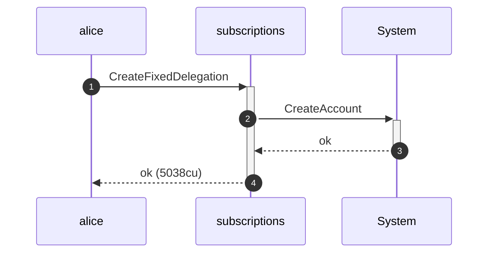

**CreateFixedDelegation: authority graph**

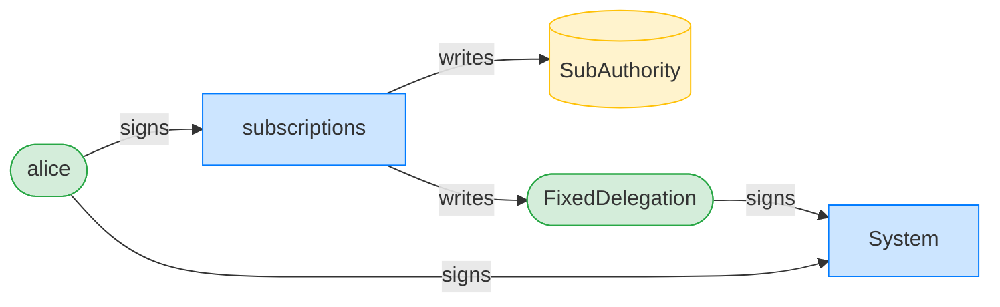

**CreateFixedDelegation: ownership graph**

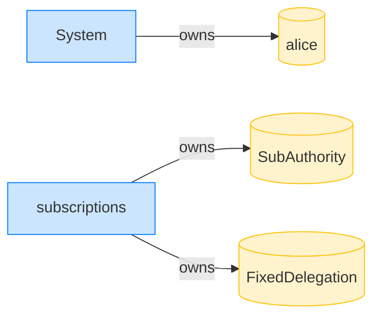

- [x] Bob's ATA starts empty: `0`

### Bob pulls 30 tokens within the window

**TransferFixed (within window): structured CPI tree**

```text

── subscriptions::TransferChecked ──────────────────────────
Transaction  signers=[bob]
└── subscriptions::TransferFixed [1] ✓ 11722cu  signer=bob
    ├── Token::TransferChecked [2] ✓ 6280cu
    └── subscriptions::EmitEvent [2] ✓ 137cu
Compute Units (this run): 11722
Fee: 0 lamports
Legend (2):
  subscriptions = De1egAFMkMWZSN5rYXRj9CAdheBamobVNubTsi9avR44
  bob           = 9S8NPMnzAba71o3tr8dHDzUrfT5NesYFzP56QFpYieMR
```

**TransferFixed (within window): sequence diagram**

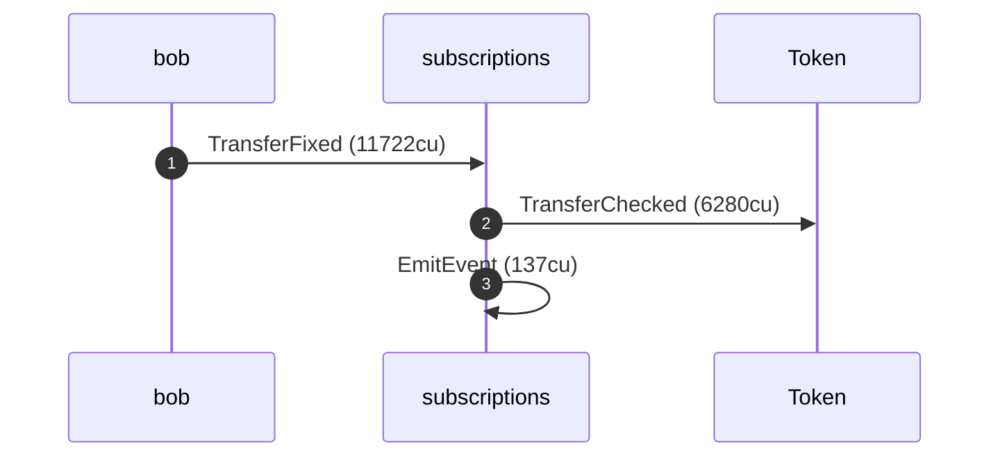

**TransferFixed (within window): sequence diagram, with lifelines**

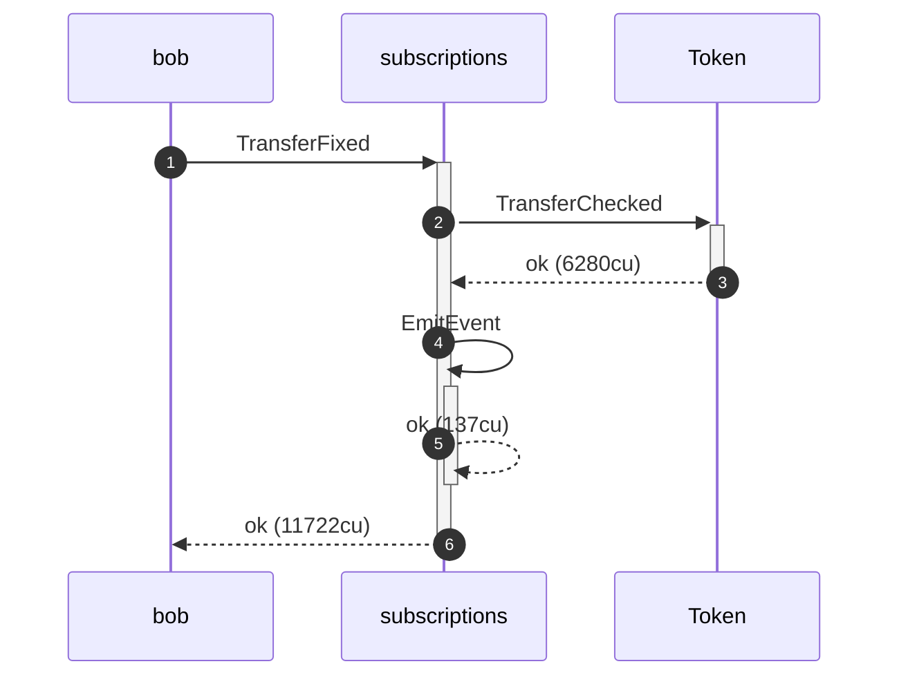

**TransferFixed (within window): authority graph**

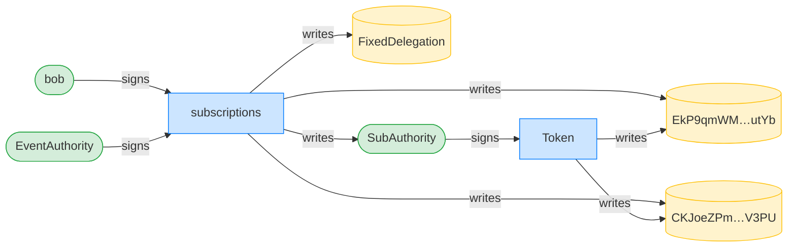

**TransferFixed (within window): ownership graph**

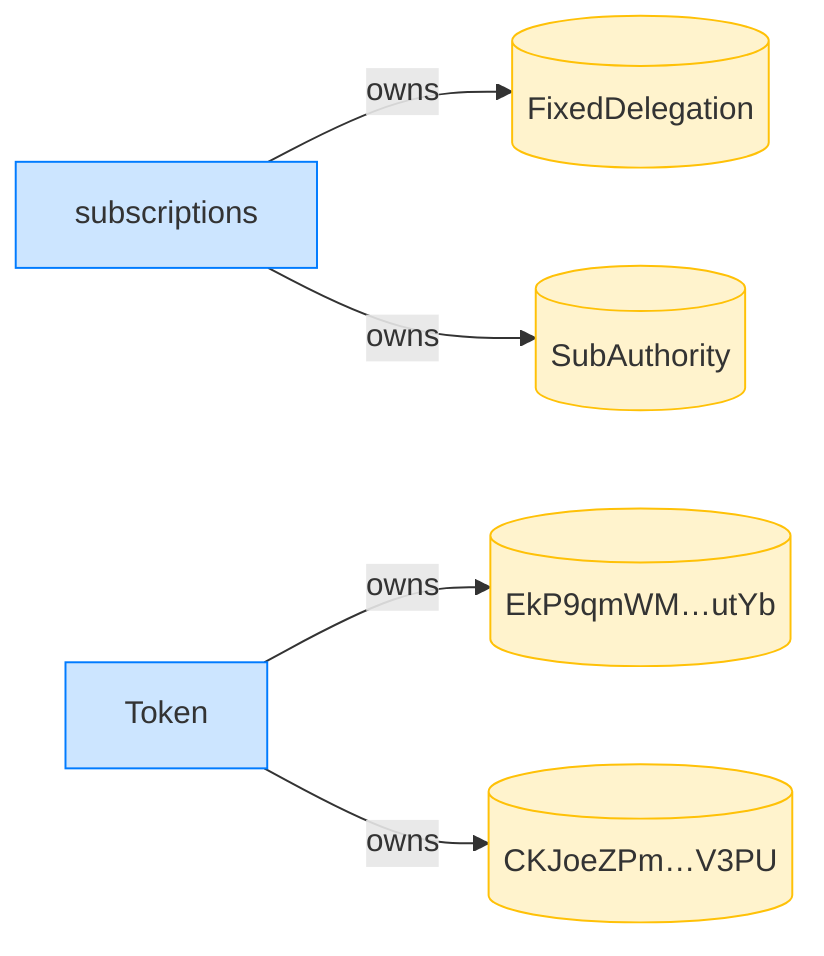

- [x] Bob received 30 tokens: `30000000`

### The clock advances past expiry; a further pull is refused

**TransferFixed (expired): structured CPI tree**

```text

── subscriptions::TransferFixed ────────────────────────────
Transaction  signers=[bob]
└── subscriptions::TransferFixed [1] ✗ 871cu  signer=bob
    └── Error: DelegationExpired (0x80)
Error: custom program error: 0x80
Compute Units (this run): 871
Fee: 0 lamports
Legend (2):
  subscriptions = De1egAFMkMWZSN5rYXRj9CAdheBamobVNubTsi9avR44
  bob           = 9S8NPMnzAba71o3tr8dHDzUrfT5NesYFzP56QFpYieMR
```

- [x] Bob's balance is unchanged: `30000000`
- [x] the remaining allowance is 20 tokens: `20000000`
