## Fixed transfer rejects a non-canonical source — PASS

> an auxiliary (non-ATA) source the authority was Approve'd over cannot be drained via a delegation

### Stage: Alice's authority and a fixed delegation to Bob

**InitSubscriptionAuthority: structured CPI tree**

```text

── subscriptions::Approve ──────────────────────────────────
Transaction  signers=[alice]
└── subscriptions::InitSubscriptionAuthority [1] ✓ 12020cu  signer=alice
    ├── System::CreateAccount [2] ✓ (no cu)
    └── Token::Approve [2] ✓ 2904cu
Compute Units (this run): 12020
Fee: 0 lamports
Legend (2):
  subscriptions = De1egAFMkMWZSN5rYXRj9CAdheBamobVNubTsi9avR44
  alice         = FXddRd8CdAC8SWKT3Ataasn69R7rbTfQZcKg8ejyrUbF
```

**InitSubscriptionAuthority: sequence diagram**

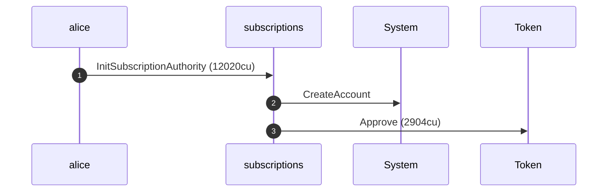

**InitSubscriptionAuthority: sequence diagram, with lifelines**

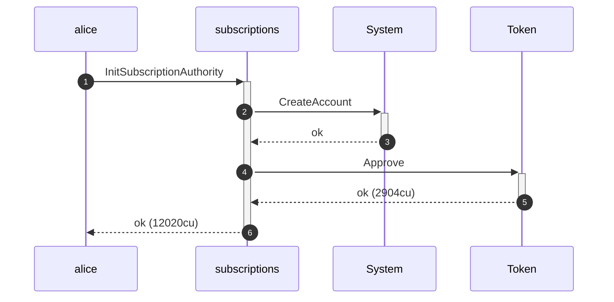

**InitSubscriptionAuthority: authority graph**

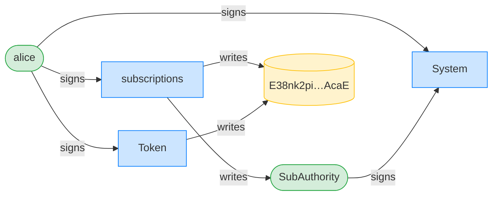

**InitSubscriptionAuthority: ownership graph**

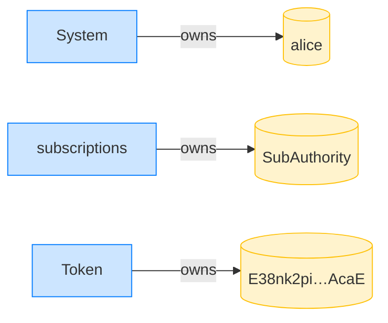

**CreateFixedDelegation: structured CPI tree**

```text

── subscriptions::CreateFixedDelegation ────────────────────
Transaction  signers=[alice]
└── subscriptions::CreateFixedDelegation [1] ✓ 9538cu  signer=alice
    └── System::CreateAccount [2] ✓ (no cu)
Compute Units (this run): 9538
Fee: 0 lamports
Legend (2):
  subscriptions = De1egAFMkMWZSN5rYXRj9CAdheBamobVNubTsi9avR44
  alice         = FXddRd8CdAC8SWKT3Ataasn69R7rbTfQZcKg8ejyrUbF
```

**CreateFixedDelegation: sequence diagram**

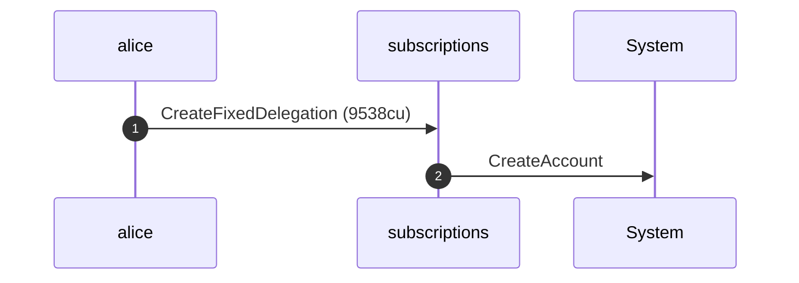

**CreateFixedDelegation: sequence diagram, with lifelines**

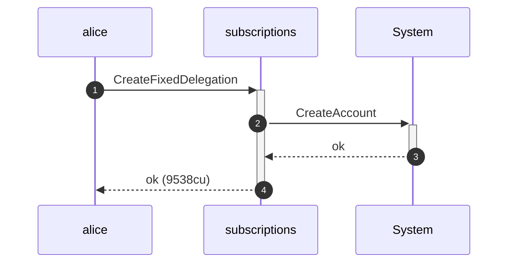

**CreateFixedDelegation: authority graph**

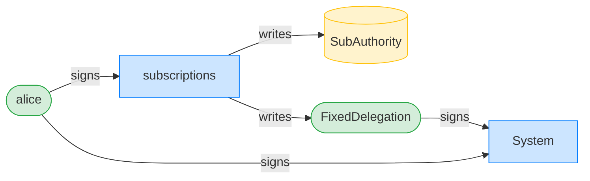

**CreateFixedDelegation: ownership graph**

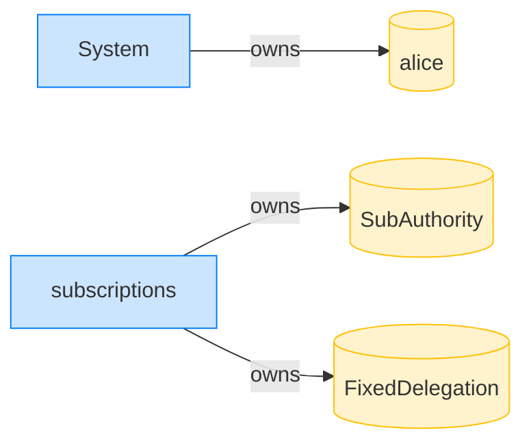

### Alice Approve's the authority over her auxiliary account

**Approve (aux account): structured CPI tree**

```text

── Token::Approve ──────────────────────────────────────────
Transaction  signers=[alice]
└── Token::Approve [1] ✓ 2902cu  signer=alice
Compute Units (this run): 2902
Fee: 0 lamports
Legend (1):
  alice = FXddRd8CdAC8SWKT3Ataasn69R7rbTfQZcKg8ejyrUbF
```

**Approve (aux account): sequence diagram**

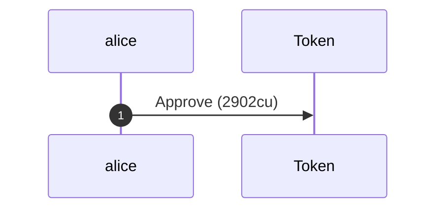

**Approve (aux account): sequence diagram, with lifelines**

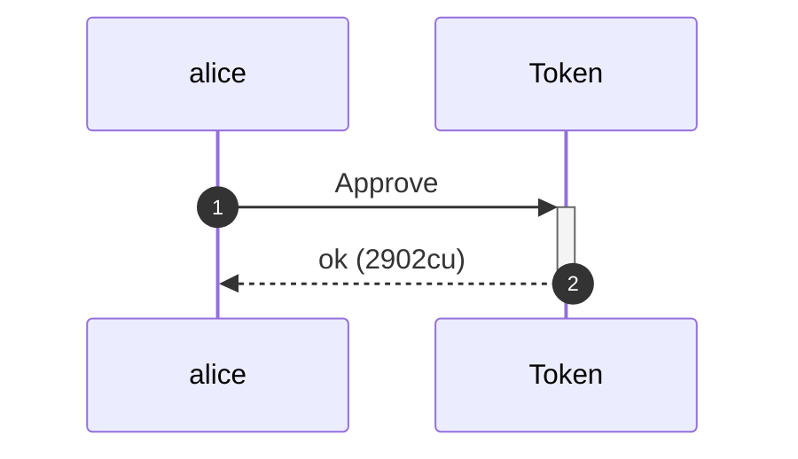

**Approve (aux account): authority graph**

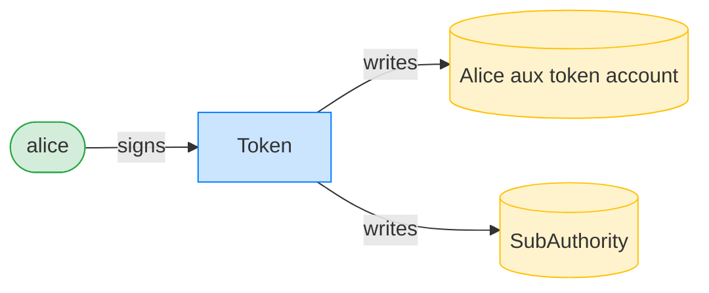

**Approve (aux account): ownership graph**

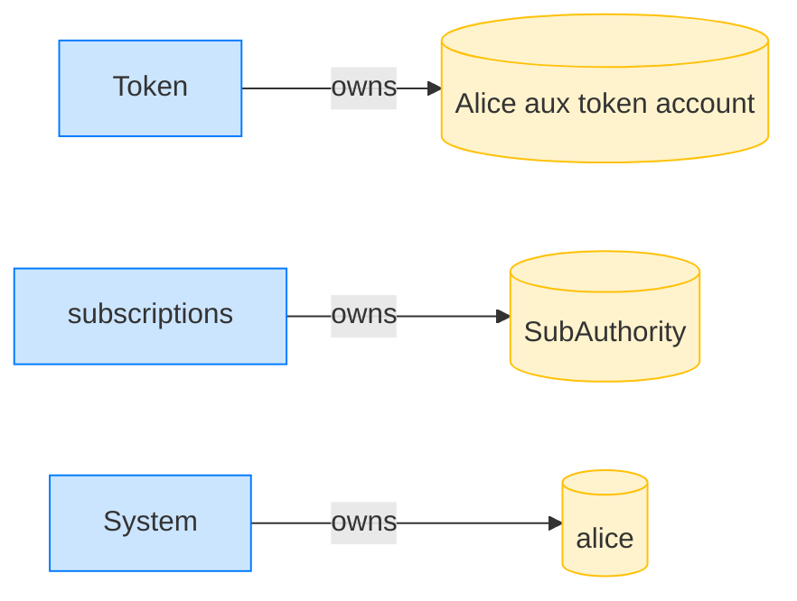

### Bob points the delegation at the auxiliary source; it is refused

**TransferFixed (non-canonical source): structured CPI tree**

```text

── subscriptions::TransferFixed ────────────────────────────
Transaction  signers=[bob]
└── subscriptions::TransferFixed [1] ✗ 2653cu  signer=bob
    └── Error: InvalidAssociatedTokenAccountDerivedAddress (0x6c)
Error: custom program error: 0x6c
Compute Units (this run): 2653
Fee: 0 lamports
Legend (2):
  subscriptions = De1egAFMkMWZSN5rYXRj9CAdheBamobVNubTsi9avR44
  bob           = 9S8NPMnzAba71o3tr8dHDzUrfT5NesYFzP56QFpYieMR
```

- [x] Alice's ATA is untouched: `5000000`
- [x] Alice's aux account is untouched: `100000000`
- [x] Bob's ATA is empty: `0`
- [x] the allowance is intact: `60000000`
