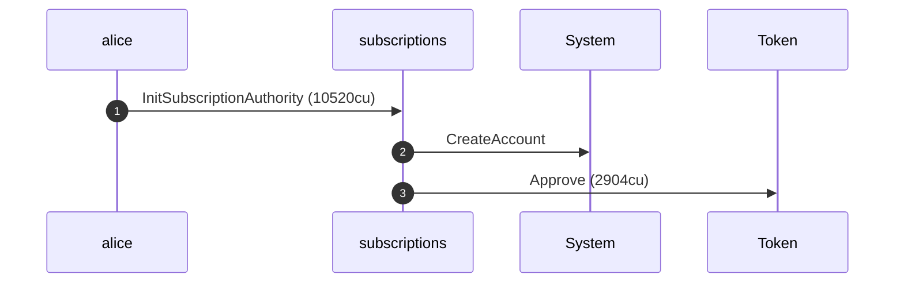
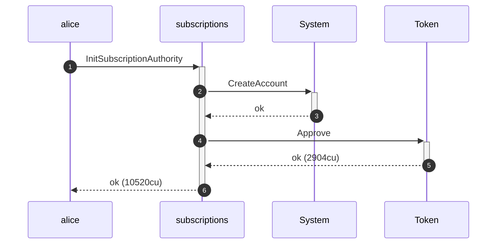
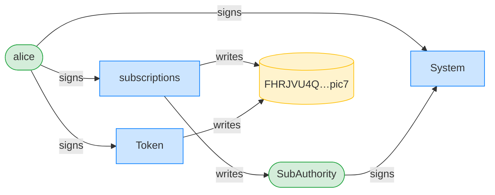
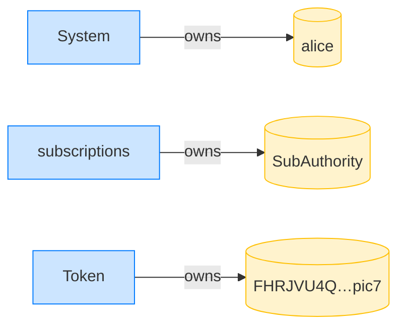

## Initialize a subscription authority — PASS

> Alice initializes her SubscriptionAuthority and delegates her ATA to it

### Alice initializes her subscription authority

**InitSubscriptionAuthority: structured CPI tree**

```text

── subscriptions::Approve ──────────────────────────────────
Transaction  signers=[alice]
└── subscriptions::InitSubscriptionAuthority [1] ✓ 10520cu  signer=alice
    ├── System::CreateAccount [2] ✓ (no cu)
    └── Token::Approve [2] ✓ 2904cu
Compute Units (this run): 10520
Fee: 0 lamports
Legend (2):
  subscriptions = De1egAFMkMWZSN5rYXRj9CAdheBamobVNubTsi9avR44
  alice         = FXddRd8CdAC8SWKT3Ataasn69R7rbTfQZcKg8ejyrUbF
```

**InitSubscriptionAuthority: sequence diagram**



**InitSubscriptionAuthority: sequence diagram, with lifelines**



**InitSubscriptionAuthority: authority graph**



**InitSubscriptionAuthority: ownership graph**



- [x] the account is tagged SubscriptionAuthority: `0`
- [x] the authority's user is Alice: `FXddRd8CdAC8SWKT3Ataasn69R7rbTfQZcKg8ejyrUbF`
- [x] the authority's mint is the USDC mint: `11157t3sqMV725NVRLrVQbAu98Jjfk1uCKehJnXXQs`
- [x] the payer defaults to Alice: `FXddRd8CdAC8SWKT3Ataasn69R7rbTfQZcKg8ejyrUbF`
- [x] the ATA is delegated to the authority: `HnE9P3butoKmUyNCU8ZA6FWRiSyUC8YWyyUXDBskt8SG`
- [x] the delegated amount is u64::MAX: `18446744073709551615`
