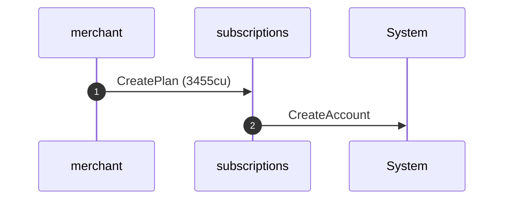
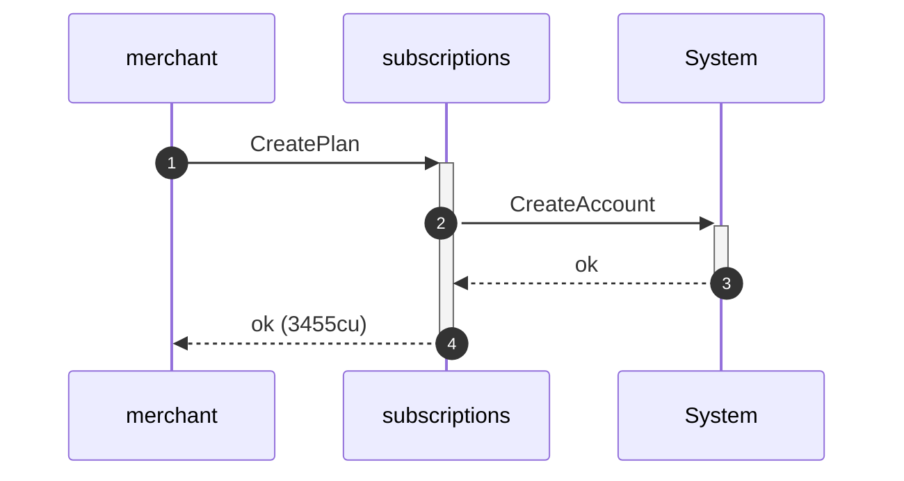
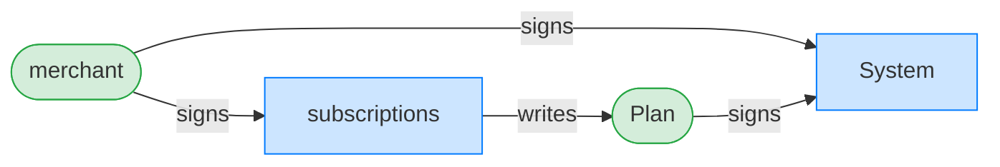
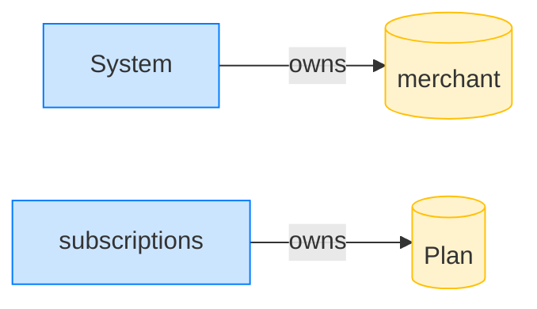
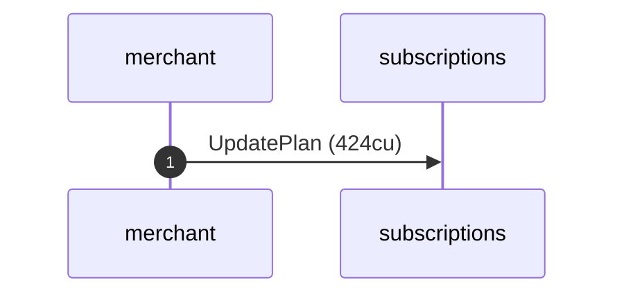
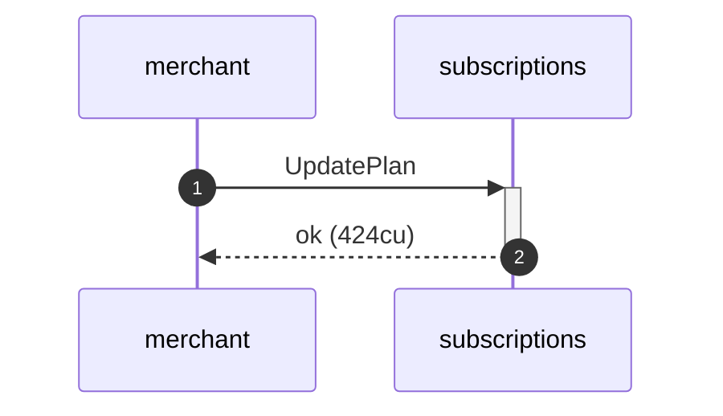
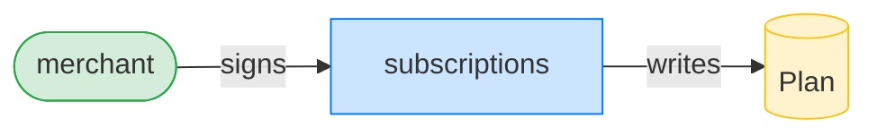

## Removing pullers keeps the owner authorized — PASS

> clearing the puller whitelist leaves the plan owner able to pull; a random key cannot

**CreatePlan: structured CPI tree**

```text

── subscriptions::CreatePlan ───────────────────────────────
Transaction  signers=[merchant]
└── subscriptions::CreatePlan [1] ✓ 3455cu  signer=merchant
    └── System::CreateAccount [2] ✓ (no cu)
Compute Units (this run): 3455
Fee: 0 lamports
Legend (2):
  subscriptions = De1egAFMkMWZSN5rYXRj9CAdheBamobVNubTsi9avR44
  merchant      = J4fPsxKiTTKiXSiN9bgZ5JBrVgTM9c6N8tjhLN8gfdTq
```

**CreatePlan: sequence diagram**



**CreatePlan: sequence diagram, with lifelines**



**CreatePlan: authority graph**



**CreatePlan: ownership graph**



### The merchant clears the puller whitelist

**UpdatePlan (clear pullers): structured CPI tree**

```text

── subscriptions::UpdatePlan ───────────────────────────────
Transaction  signers=[merchant]
└── subscriptions::UpdatePlan [1] ✓ 424cu  signer=merchant
Compute Units (this run): 424
Fee: 0 lamports
Legend (2):
  subscriptions = De1egAFMkMWZSN5rYXRj9CAdheBamobVNubTsi9avR44
  merchant      = J4fPsxKiTTKiXSiN9bgZ5JBrVgTM9c6N8tjhLN8gfdTq
```

**UpdatePlan (clear pullers): sequence diagram**



**UpdatePlan (clear pullers): sequence diagram, with lifelines**



**UpdatePlan (clear pullers): authority graph**



**UpdatePlan (clear pullers): ownership graph**


- [x] the owner can still pull: `true`
- [x] a random key cannot pull: `true`
