## Revoke works after close — PASS

> Alice closes her authority leaving a dangling delegate; revoke still clears it

### Alice initializes her authority, then closes it

**InitSubscriptionAuthority: structured CPI tree**

```text

── subscriptions::Approve ──────────────────────────────────
Transaction  signers=[alice]
└── subscriptions::InitSubscriptionAuthority [1] ✓ 12020cu  signer=alice
    ├── System::CreateAccount [2] ✓ (no cu)
    └── Token::Approve [2] ✓ 2904cu
Compute Units (this run): 12020
Fee: 0 lamports
Legend (2):
  subscriptions = De1egAFMkMWZSN5rYXRj9CAdheBamobVNubTsi9avR44
  alice         = FXddRd8CdAC8SWKT3Ataasn69R7rbTfQZcKg8ejyrUbF
```

**InitSubscriptionAuthority: sequence diagram**

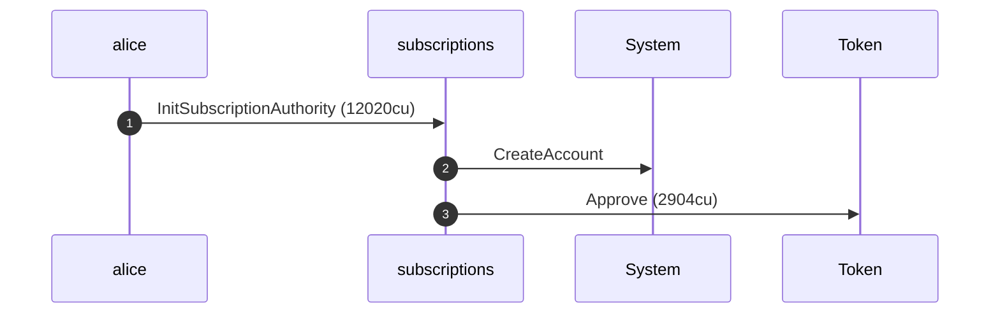

**InitSubscriptionAuthority: sequence diagram, with lifelines**

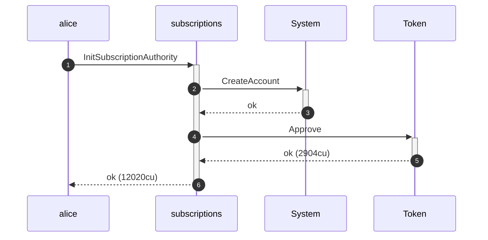

**InitSubscriptionAuthority: authority graph**

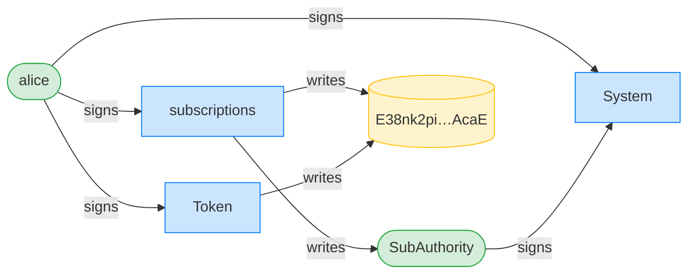

**InitSubscriptionAuthority: ownership graph**

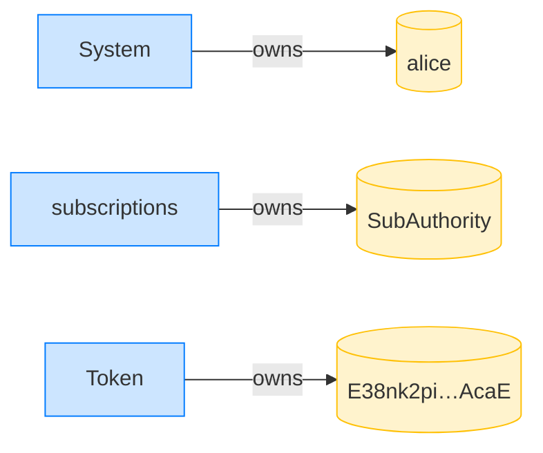

**CloseSubscriptionAuthority: structured CPI tree**

```text

── subscriptions::CloseSubscriptionAuthority ───────────────
Transaction  signers=[alice]
└── subscriptions::CloseSubscriptionAuthority [1] ✓ 1832cu  signer=alice
Compute Units (this run): 1832
Fee: 0 lamports
Legend (2):
  subscriptions = De1egAFMkMWZSN5rYXRj9CAdheBamobVNubTsi9avR44
  alice         = FXddRd8CdAC8SWKT3Ataasn69R7rbTfQZcKg8ejyrUbF
```

**CloseSubscriptionAuthority: sequence diagram**

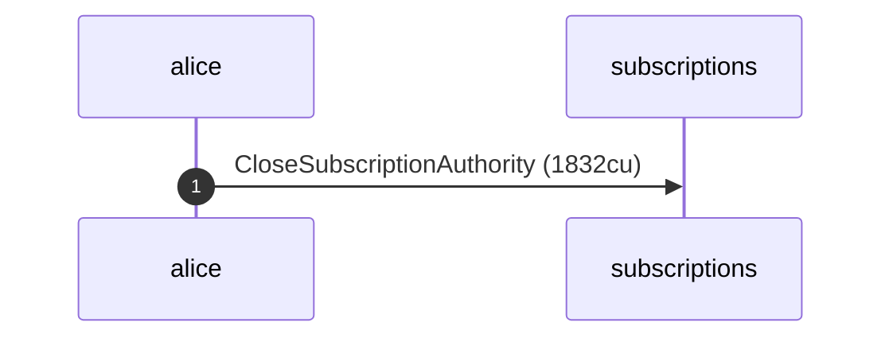

**CloseSubscriptionAuthority: sequence diagram, with lifelines**

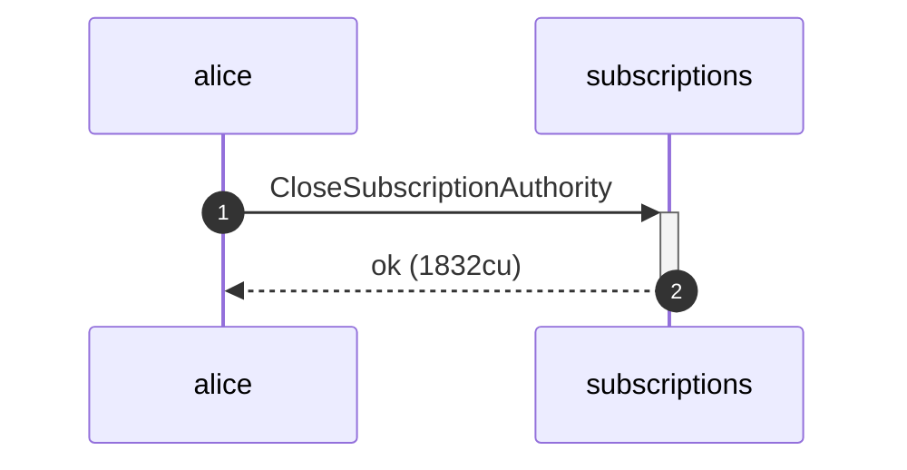

**CloseSubscriptionAuthority: authority graph**

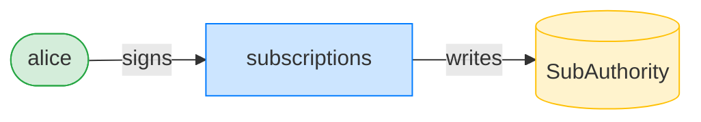

**CloseSubscriptionAuthority: ownership graph**

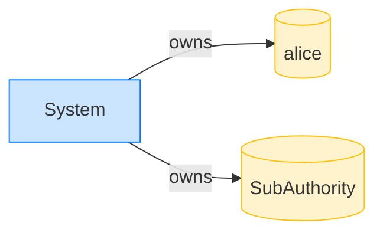

- [x] the delegate dangles after close: `18446744073709551615`

### Alice revokes the dangling delegate after the authority is closed

**RevokeSubscriptionAuthority: structured CPI tree**

```text

── subscriptions::Revoke ───────────────────────────────────
Transaction  signers=[alice]
└── subscriptions::RevokeSubscriptionAuthority [1] ✓ 5666cu  signer=alice
    └── Token::Revoke [2] ✓ 2677cu
Compute Units (this run): 5666
Fee: 0 lamports
Legend (2):
  subscriptions = De1egAFMkMWZSN5rYXRj9CAdheBamobVNubTsi9avR44
  alice         = FXddRd8CdAC8SWKT3Ataasn69R7rbTfQZcKg8ejyrUbF
```

**RevokeSubscriptionAuthority: sequence diagram**

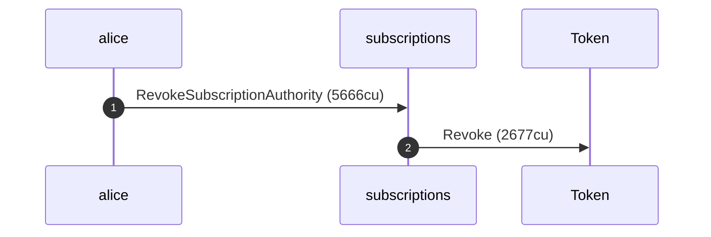

**RevokeSubscriptionAuthority: sequence diagram, with lifelines**

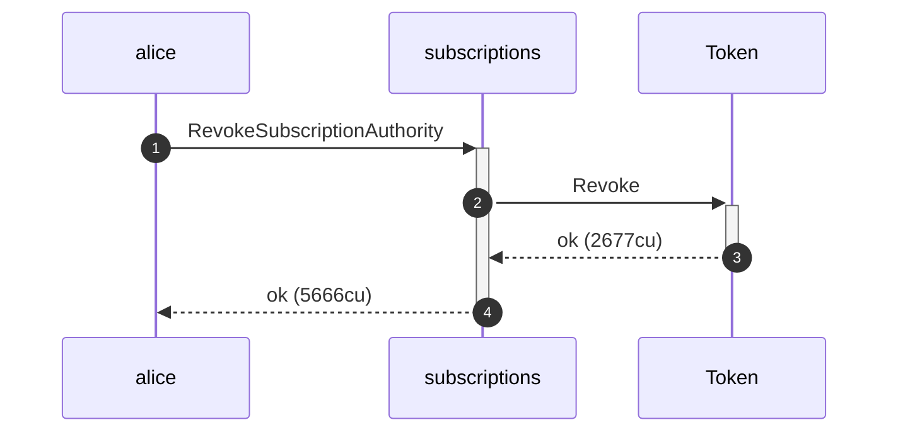

**RevokeSubscriptionAuthority: authority graph**

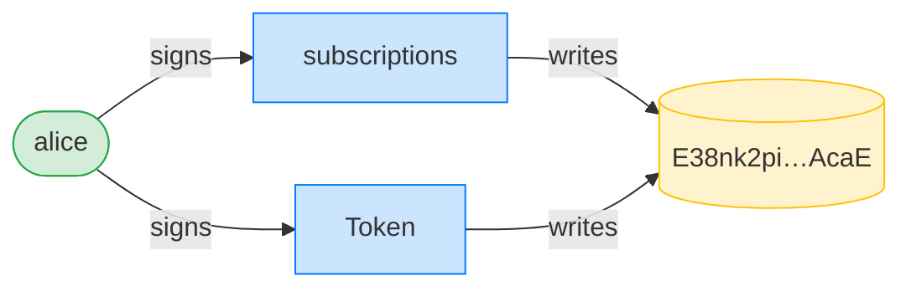

**RevokeSubscriptionAuthority: ownership graph**

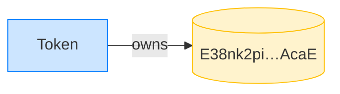

- [x] revoke clears the dangling delegate even after the authority is closed: `true`
- [x] the delegated amount is zeroed: `0`
