## Transfer subscription: multiple pulls within a period — PASS

> two pulls within the same period accumulate up to the period limit

### Stage: Alice's authority, the merchant's plan, Alice subscribed

**InitSubscriptionAuthority: structured CPI tree**

```text

── subscriptions::Approve ──────────────────────────────────
Transaction  signers=[alice]
└── subscriptions::InitSubscriptionAuthority [1] ✓ 9020cu  signer=alice
    ├── System::CreateAccount [2] ✓ (no cu)
    └── Token::Approve [2] ✓ 2904cu
Compute Units (this run): 9020
Fee: 0 lamports
Legend (2):
  subscriptions = De1egAFMkMWZSN5rYXRj9CAdheBamobVNubTsi9avR44
  alice         = FXddRd8CdAC8SWKT3Ataasn69R7rbTfQZcKg8ejyrUbF
```

**InitSubscriptionAuthority: sequence diagram**

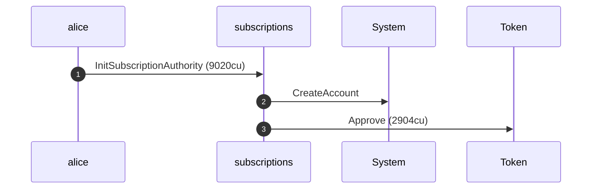

**InitSubscriptionAuthority: sequence diagram, with lifelines**

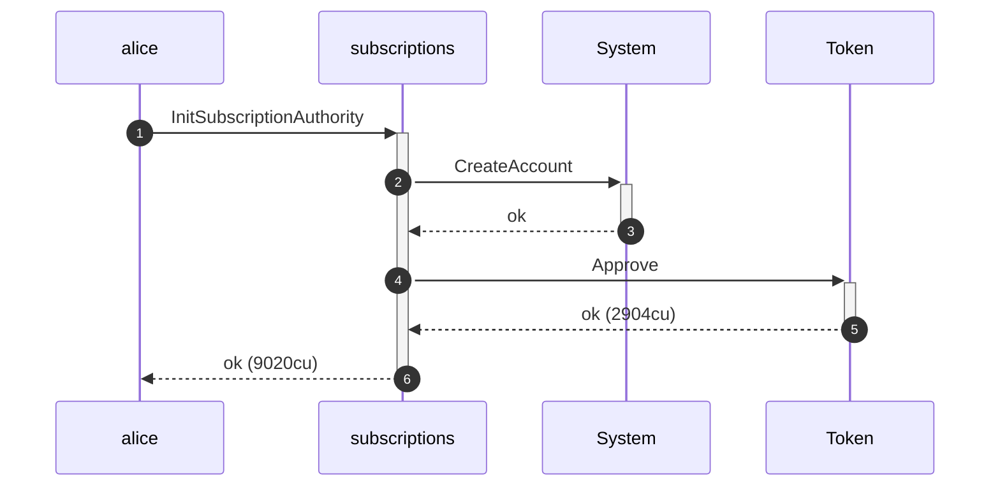

**InitSubscriptionAuthority: authority graph**

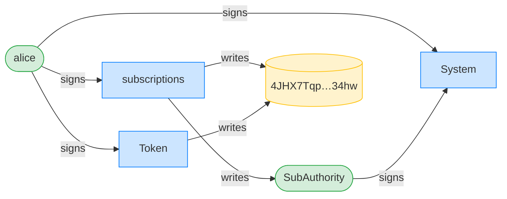

**InitSubscriptionAuthority: ownership graph**

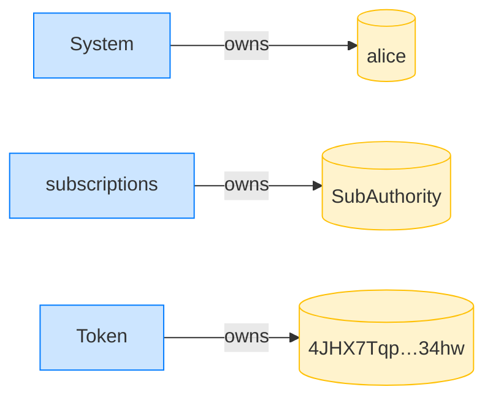

**CreatePlan: structured CPI tree**

```text

── subscriptions::CreatePlan ───────────────────────────────
Transaction  signers=[merchant]
└── subscriptions::CreatePlan [1] ✓ 3468cu  signer=merchant
    └── System::CreateAccount [2] ✓ (no cu)
Compute Units (this run): 3468
Fee: 0 lamports
Legend (2):
  subscriptions = De1egAFMkMWZSN5rYXRj9CAdheBamobVNubTsi9avR44
  merchant      = J4fPsxKiTTKiXSiN9bgZ5JBrVgTM9c6N8tjhLN8gfdTq
```

**CreatePlan: sequence diagram**

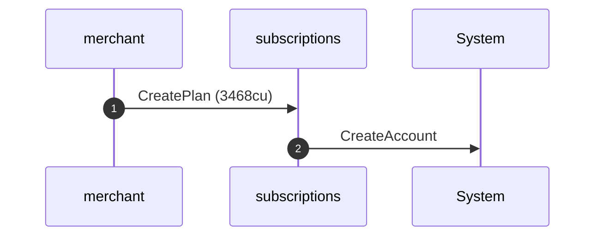

**CreatePlan: sequence diagram, with lifelines**

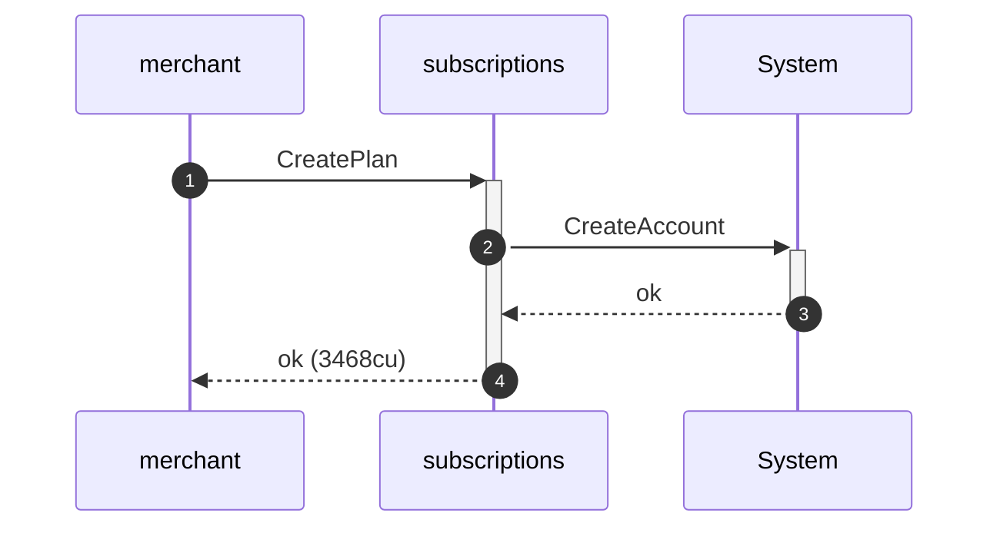

**CreatePlan: authority graph**

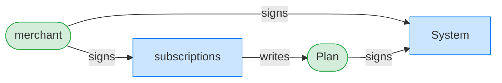

**CreatePlan: ownership graph**

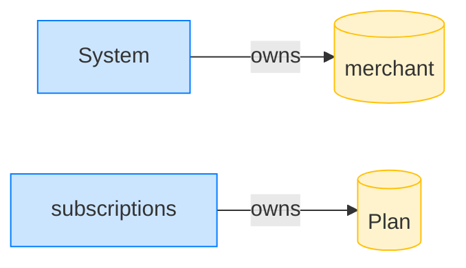

### The merchant pulls 20 tokens (first pull)

**TransferSubscription (first pull): structured CPI tree**

```text

── subscriptions::TransferChecked ──────────────────────────
Transaction  signers=[merchant]
└── subscriptions::TransferSubscription [1] ✓ 12109cu  signer=merchant
    ├── Token::TransferChecked [2] ✓ 6280cu
    └── subscriptions::EmitEvent [2] ✓ 137cu
Compute Units (this run): 12109
Fee: 0 lamports
Legend (2):
  subscriptions = De1egAFMkMWZSN5rYXRj9CAdheBamobVNubTsi9avR44
  merchant      = J4fPsxKiTTKiXSiN9bgZ5JBrVgTM9c6N8tjhLN8gfdTq
```

**TransferSubscription (first pull): sequence diagram**

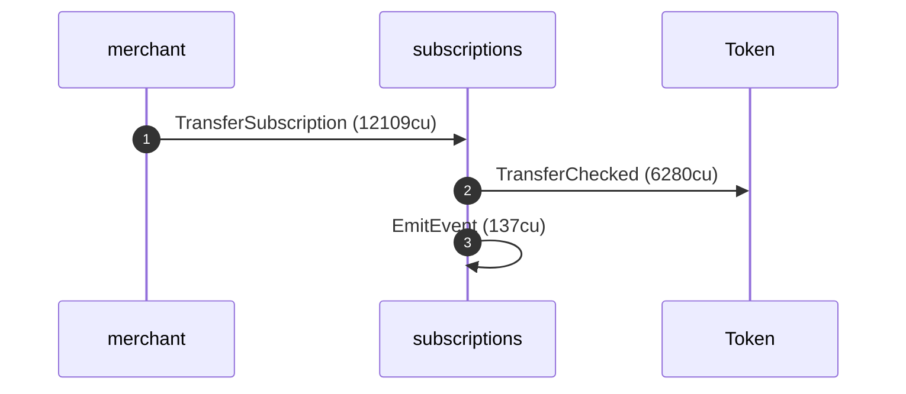

**TransferSubscription (first pull): sequence diagram, with lifelines**

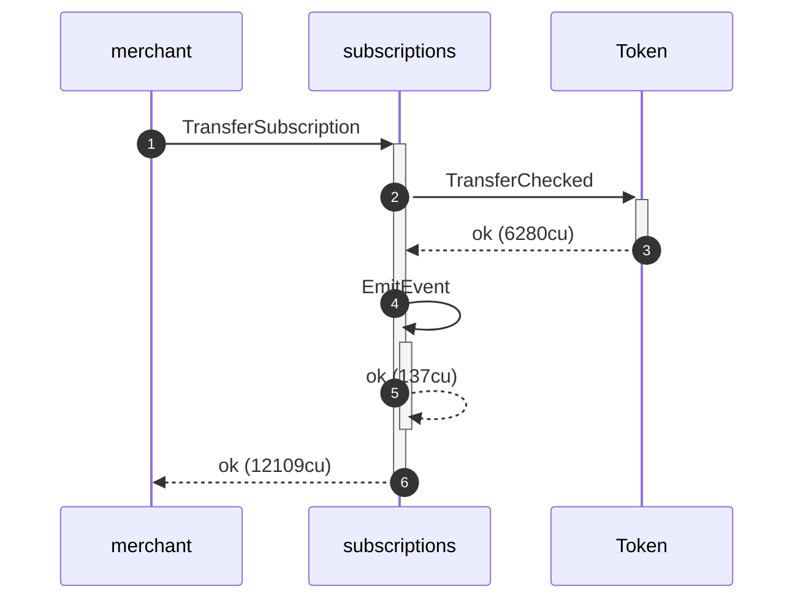

**TransferSubscription (first pull): authority graph**

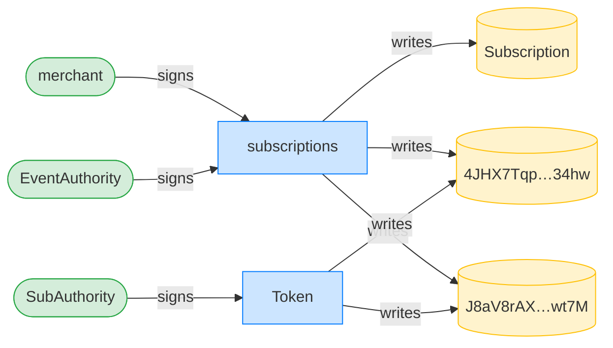

**TransferSubscription (first pull): ownership graph**

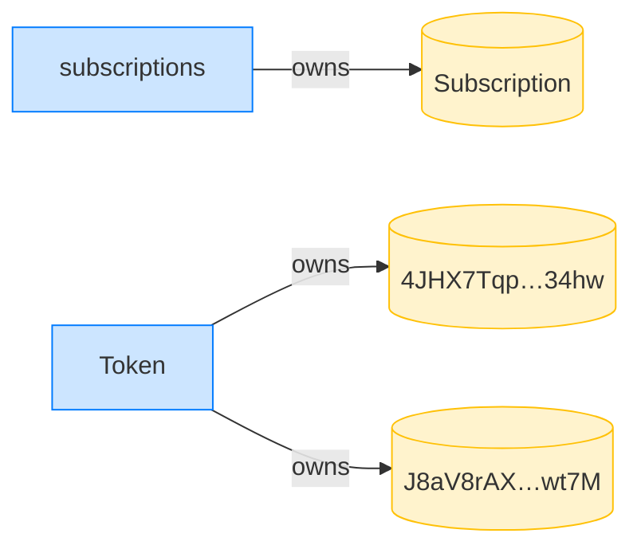

- [x] the merchant has 20 tokens: `20000000`

### The merchant pulls another 20 tokens (second pull)

**TransferSubscription (second pull): structured CPI tree**

```text

── subscriptions::TransferChecked ──────────────────────────
Transaction  signers=[merchant]
└── subscriptions::TransferSubscription [1] ✓ 12109cu  signer=merchant
    ├── Token::TransferChecked [2] ✓ 6280cu
    └── subscriptions::EmitEvent [2] ✓ 137cu
Compute Units (this run): 12109
Fee: 0 lamports
Legend (2):
  subscriptions = De1egAFMkMWZSN5rYXRj9CAdheBamobVNubTsi9avR44
  merchant      = J4fPsxKiTTKiXSiN9bgZ5JBrVgTM9c6N8tjhLN8gfdTq
```

**TransferSubscription (second pull): sequence diagram**


**TransferSubscription (second pull): sequence diagram, with lifelines**


**TransferSubscription (second pull): authority graph**


**TransferSubscription (second pull): ownership graph**


- [x] the merchant has 40 tokens: `40000000`
- [x] the pulled-in-period is 40 tokens: `40000000`
